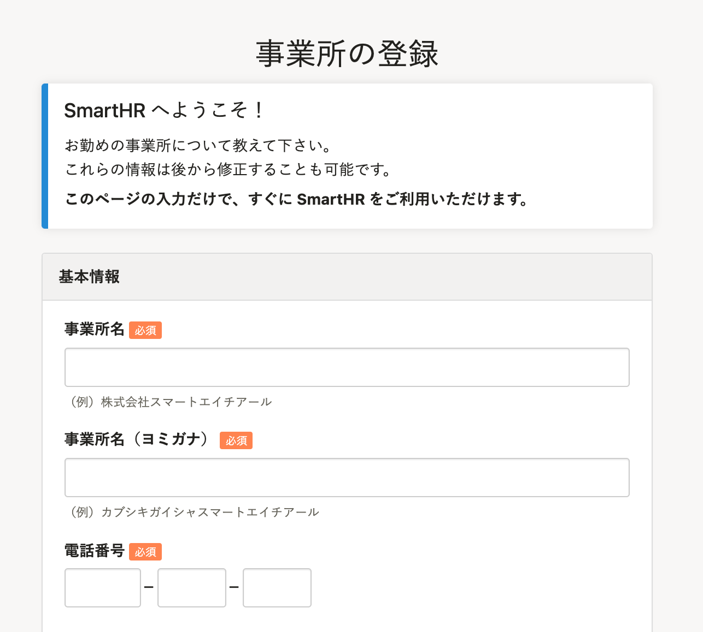
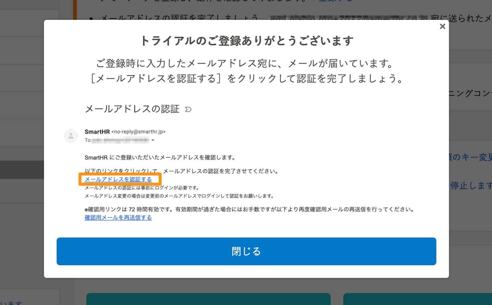
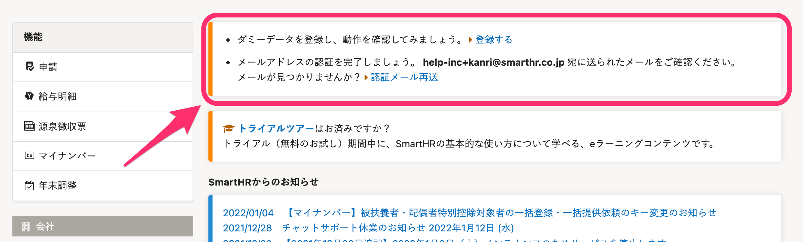

SmartHRの企業アカウントの作成手順を説明します。

# 1.「https://smarthr.jp/signup/」にアクセス

[https://smarthr.jp/signup/](https://smarthr.jp/signup/) にアクセスすると、登録フォームが表示されます。

# 2\. メールアドレス、パスワード、従業員数を入力する

画面右側の登録フォームにメールアドレスを入力し、パスワードを決めたあと、従業員数をプルダウンから選択します。

[利用規約](https://smarthr.jp/terms/)・[プライバシーポリシー](https://smarthr.co.jp/privacy/)に同意のうえ、 **［無料で試してみる］** をクリックしてください。

データベースが作成され、事業所情報の登録画面が表示されます。（データベースの作成は、数十秒〜数分で完了します）

## ［メールアドレスはすでに存在します］というエラーが表示される場合

入力したメールアドレスが別の企業アカウントですでに使われている可能性があります。

企業アカウント作成の際は、SmartHRに登録のないメールアドレスを使用してください。

:::tips
Googleのメールサービスを利用している場合、エイリアス機能を利用できます。
■エイリアス機能とは？
通常のメールアドレスに **＋○○**を付けることによって、新しいメールアドレスを作成できる機能です。
例えば、**help-inc+123@smarthr.co.jp**で登録すると、SmartHR上では別のメールアドレスとして認識されますが、**help-inc@smarthr.co.jp**にメールが届きます。
:::

## 既存の企業アカウントの画面が表示される場合

既存の企業アカウントにログインしたままでは、新しい企業アカウントを作成できません。

既存の企業アカウントからログアウトして作成してください。

# 3\. 事業所情報を入力する

事業所情報を入力し **［登録する］** をクリックすると、企業アカウントが作成されます。

# 4\. メールアドレスの認証を完了する

企業アカウントが作成されると、メールアドレス認証案内のダイアログが表示されるので、内容を確認し **［閉じる］** をクリックします。

SmartHRトップページ上部にある「メールアドレスの認証を完了しましょう」の案内を参考に、メールアドレスの認証を行なってください。

## 認証メールの内容

| **件名** | メールアドレスの認証 |
| --- | --- |
| **本文** |   SmartHR にご登録いただいたメールアドレスを確認します。 以下のリンクをクリックして、メールアドレスの認証を完了させてください。  メールアドレスを認証する  メールアドレスの認証には事前にログインが必要です。  メールアドレス変更の場合は変更前のメールアドレスでログインして認証をお願いします。  ※確認用リンクは72時間有効です。有効期間が過ぎた場合にはお手数ですが以下より再度確認用メールの再送信を行ってください。  確認用メールを再送信する  \-------------------------------------------------  このメールは SmartHR をご利用いただいているお客さまに送信しています。 送信専用アドレスのため、ご返信いただいても、ご返事ができません。 あらかじめご了承ください。   |

SmartHRの利用を開始する際の基本設定については、[SmartHRスクール](https://school.smarthr.jp/meruhuomatsutonokasutamaizu-course)も活用してください。
