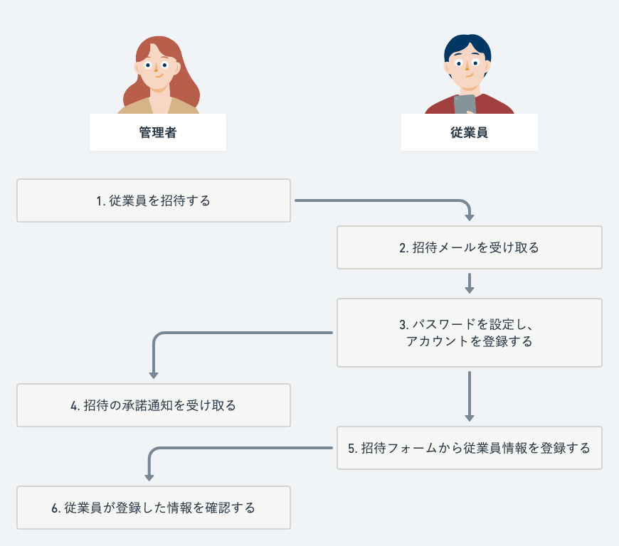
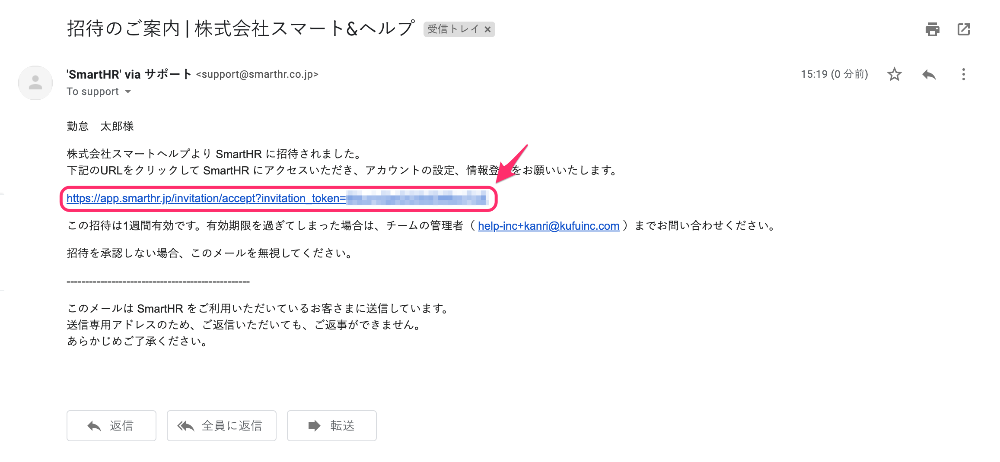
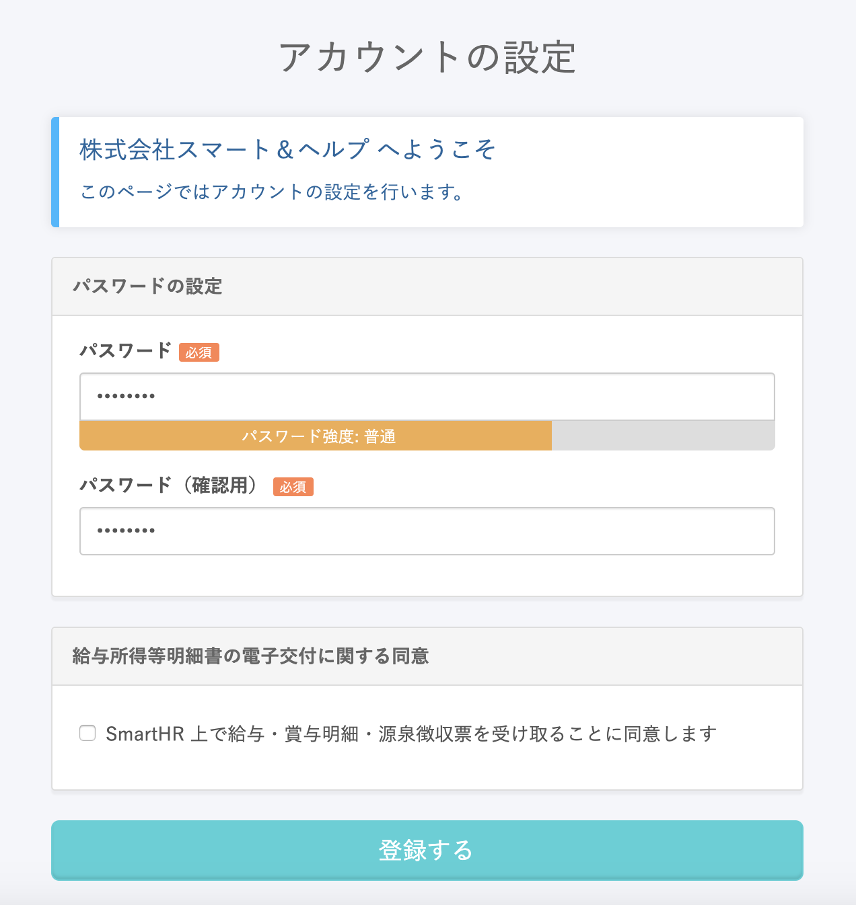
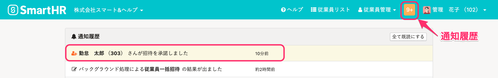
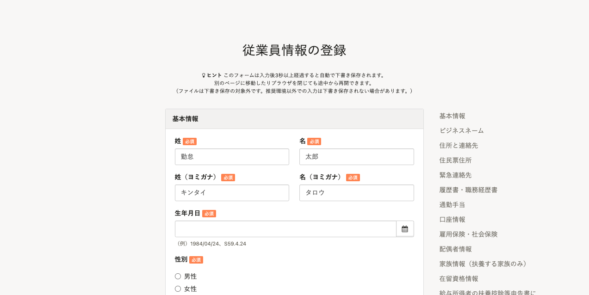
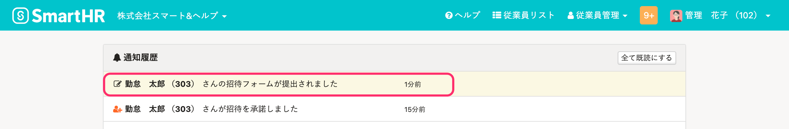
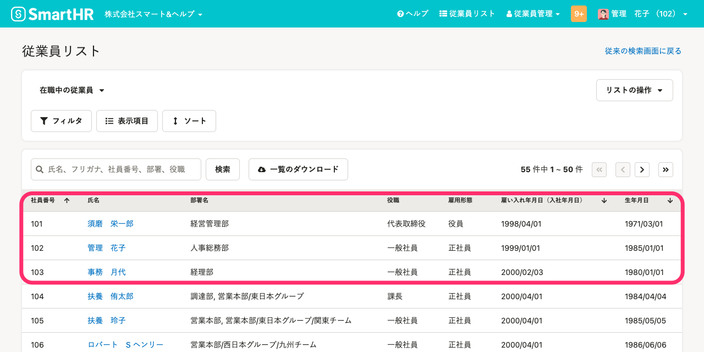

従業員をSmartHRに招待した後の流れは以下のとおりです。

招待フォームを設定していない場合は、「5. 招待フォームから従業員情報を登録する」と「6. 従業員が登録した情報を確認する」はありません。

管理者向けの手順は、[招待・入社手続きの進捗を確認する](https://knowledge.smarthr.jp/hc/ja/articles/900005113826)を参照してください。

従業員向けの手順は、[SmartHRから招待が届いたら？](https://knowledge.smarthr.jp/hc/ja/articles/360026266053)を参照してください。

:::alert
従業員が招待を承諾した通知や、招待フォームを提出した通知は、**管理者権限のアカウントでのみ受け取れます。**
カスタム権限のアカウントでは、従業員の操作に関する通知を受け取れません。
:::

# 1\. 管理者の操作｜従業員を招待する

「[従業員情報を追加・登録する」](https://knowledge.smarthr.jp/hc/ja/articles/360026266493)「[招待の際、従業員招待フォームを選択する」](https://knowledge.smarthr.jp/hc/ja/articles/360026265253)を参考に、従業員を招待します。

# 2\. 従業員の操作｜招待メールを受け取る

管理者が従業員をSmartHRに招待すると、SmartHR から従業員宛にメールが送られます。

従業員は受信したメールのURLをクリックし、アカウントの設定へ進みます。

:::alert
招待が承認されないまま90日経過すると、発行されたアカウントは自動的に削除されます。
:::

# 3\. 従業員の操作｜パスワードを設定し、アカウントを登録する

従業員は任意のパスワードを入力し、アカウントを設定します。

# 4\. 管理者の操作｜招待の承諾通知を受け取る

従業員によるアカウント設定が完了すると、［ **○○さんが招待を承諾しました］** というメッセージが通知履歴に表示されます。

:::alert
通知履歴に招待の承諾に関するメッセージが表示されますが、この時点では、招待フォームからの基本情報や住所、連絡先などの登録は完了していません。
:::

# 5\. 従業員の操作｜招待フォームから従業員情報を登録する

従業員は招待フォームから、SmartHRに必要な情報を入力し、管理者に提出します。

# 6\. 管理者の操作｜従業員が登録した情報を確認する

従業員情報の登録が完了すると、 **［○○さんの招待フォームが提出されました］** というメッセージが通知履歴に表示されます。

管理者は、従業員リストから従業員情報を確認してください。

以上で従業員の招待・登録が完了します。
