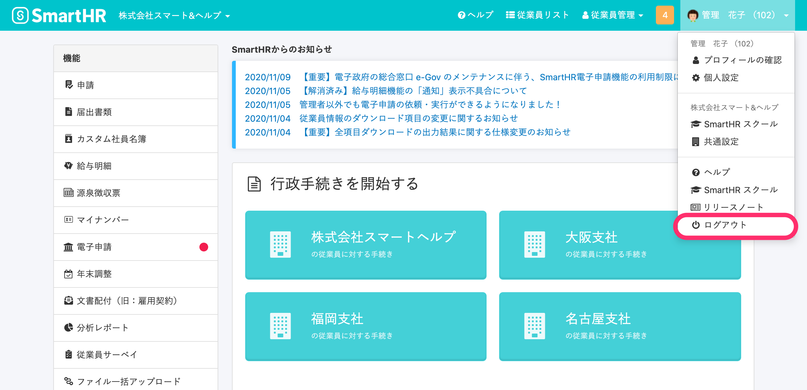

:::alert
共有端末でのクラウドサービスの利用は、場合によっては不具合が生じる可能性があり、推奨しておりません。
共有端末を利用したことに関する情報漏洩・不利益などの一切の損害については、弊社では責任を負いかねますのでご了承ください。
やむを得ず共有端末でSmartHRを利用する場合は、下記の対策を取るなど、ご注意ください。
:::

# 離席をする際はログアウトする

操作後に離席をする際は、画面右上のメニューから **\[ログアウト\]** をクリックし、ログイン画面が表示されたことを確認してから離席してください。

一定時間操作がない場合に自動でログアウトする設定も、合わせてお使いください。

:::related
[自動ログアウトする時間を設定する](https://knowledge.smarthr.jp/hc/ja/articles/360026105594)
:::

# シークレットモードを利用する

ブラウザの機能であるシークレットモードやプライベートモードなどを利用すると、ブラウザを閉じた際に履歴やCookieを残さないようにできます。

共有端末でSmartHRを利用する際は、シークレットモード・プライベートモードをお使いください。

:::related
[シークレット ブラウジング｜Google Chrome ヘルプ](https://support.google.com/chrome/answer/95464?co=GENIE.Platform%3DDesktop&hl=ja)
[Microsoft Edge で InPrivate ブラウズを使う｜Microsoft サポート](https://support.microsoft.com/ja-jp/microsoft-edge/microsoft-edge-%E3%81%A7-inprivate-%E3%83%96%E3%83%A9%E3%82%A6%E3%82%BA%E3%82%92%E4%BD%BF%E3%81%86-cd2c9a48-0bc4-b98e-5e46-ac40c84e27e2)
:::

# オートコンプリート機能をオフにする

ブラウザのオートコンプリート（自動入力）機能が有効になっていると、前に使っていた方が入力した氏名や住所などの情報が表示されてしまう場合があります。

:::related
[フォームに自動入力する｜Google Chrome ヘルプ](https://support.google.com/chrome/answer/142893?co=GENIE.Platform%3DDesktop&hl=ja)
[Microsoft Edge で情報を自動的に入力する｜Microsoft サポート](https://support.microsoft.com/ja-jp/microsoft-edge/microsoft-edge-%E3%81%A7%E6%83%85%E5%A0%B1%E3%82%92%E8%87%AA%E5%8B%95%E7%9A%84%E3%81%AB%E5%85%A5%E5%8A%9B%E3%81%99%E3%82%8B-81da697c-9910-d9b8-d50a-1712d96f3db8)
:::

# ブラウザの履歴を消す

ブラウザの履歴でも、画面遷移などの情報が見える場合があります。

:::related
[Chrome の閲覧履歴を削除する｜Google Chrome ヘルプ](https://support.google.com/chrome/answer/95589?co=GENIE.Platform%3DDesktop&hl=ja&oco=0)
[Microsoft Edge の閲覧履歴を表示または削除する｜Microsoft サポート](https://support.microsoft.com/ja-jp/microsoft-edge/microsoft-edge-%E3%81%AE%E9%96%B2%E8%A6%A7%E5%B1%A5%E6%AD%B4%E3%82%92%E8%A1%A8%E7%A4%BA%E3%81%BE%E3%81%9F%E3%81%AF%E5%89%8A%E9%99%A4%E3%81%99%E3%82%8B-00cf7943-a9e1-975a-a33d-ac10ce454ca4)
:::
