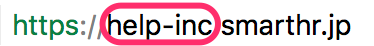

# どんなもの？

**サブドメイン**は、SmartHRのシステムが自動生成した貴社専用URLの一部です。

# どこでわかるの？

サブドメインを確認するには、現在ログインしているSmartHRのURLを参照ください。

URLの **\*\*\*** 部分が **サブドメイン**となります。

**https://\*\*\*.smarthr.jp/**

例： https://help-inc.smarthr.jpの場合は、**help-inc**になります。

:::tips
サブドメインは、マルチログイン機能やAPI連携を行う際に利用します。
:::

管理者権限のアカウントであれば、サブドメインを変更できます。変更方法は、以下のページをご覧ください。

[サブドメインを変更する](https://knowledge.smarthr.jp/hc/ja/articles/360026264313)
