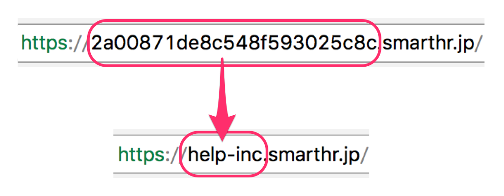
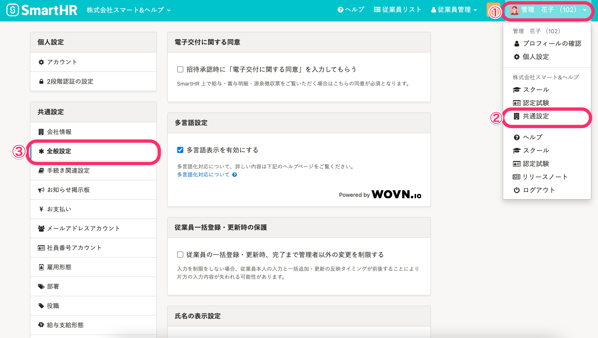
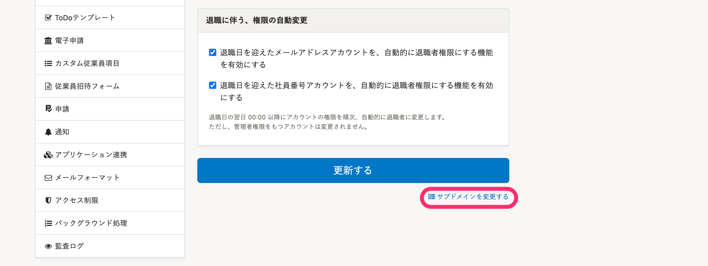
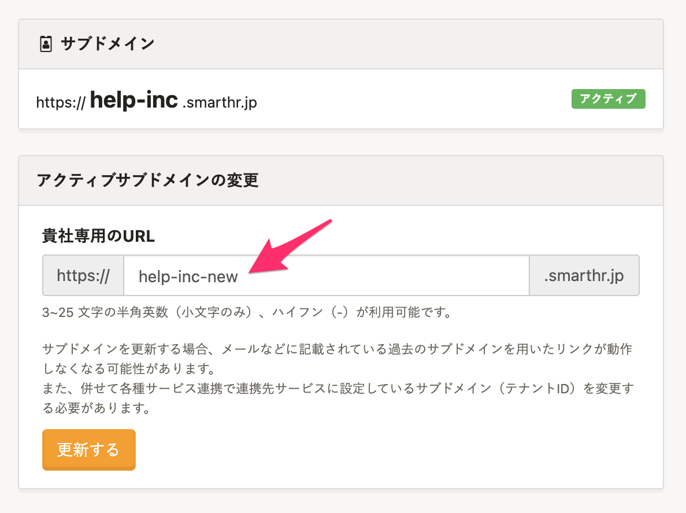
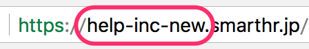
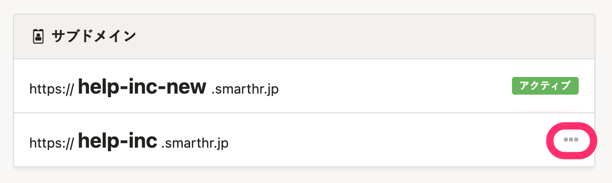
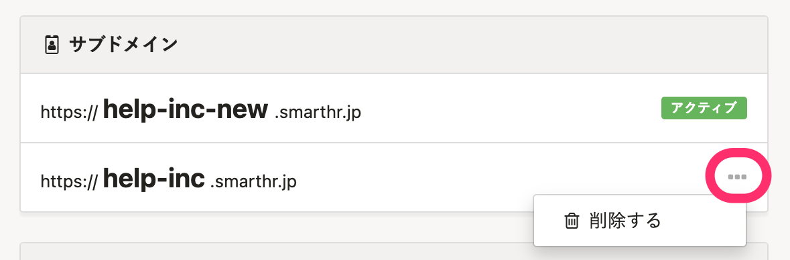

企業アカウントを作成すると、貴社専用のURLが付与されます。

そのURLの一部である、サブドメインはシステム側で自動生成されますが、管理者権限のアカウントであれば、共通設定から変更できます。

【例】

:::tips
サブドメインについては下記のページをご覧ください。
[サブドメインとは](https://knowledge.smarthr.jp/hc/ja/articles/360026264893)
:::
:::alert
他社システムなどと連携をしている場合は、アクセストークンの再発行と再設定が必要になります。詳しくは下記のページをご覧ください。
[アクセストークンの発行方法](https://knowledge.smarthr.jp/hc/ja/articles/360026266033)
:::

# 変更手順

## 1\. 画面右上のアカウント名 >［共通設定］>［全般設定］をクリック

画面右上のアカウント名 > **［共通設定］** をクリックし、画面左にある **［全般設定］** をクリックすると、全般設定画面が表示されます。

## 2\. ［サブドメインを変更する］をクリック

画面右下の **［サブドメインを変更する］** をクリックすると、サブドメインの設定画面が表示されます。

## 3\. 変更したいサブドメインを入力

 **［アクティブサブドメインの変更］** \> **［貴社専用のURL］** に、変更したいサブドメインを入力し **［更新する］** をクリックすると、確認メッセージが表示されます。

## 4\. メッセージを確認し［OK］をクリック

表示されたメッセージを確認し **［OK］** をクリックすると、サブドメインが変更されます。

## 5\. サブドメインが変更されたことを確認

ブラウザのアドレスバー等で、サブドメインが変更されていることをご確認ください。

:::tips
- 3〜25文字の半角英数（小文字のみ）、ハイフン（-）が利用可能です。
-  **［アクティブ］** がついていないサブドメインが、1つ前に設定していたサブドメインになります。

- 1つ前に設定していたサブドメインまでが保持されます。（他の企業が指定できません）
- 1つ前に設定していたサブドメインのURLにアクセスしても、自動で現サブドメインのURLにリダイレクト（転送）されます。
:::

# 削除する場合

 **［アクティブ］** になっているサブドメインは削除できません。1つ前に設定していたサブドメインのみ削除可能です。

# 1つ前のドメインに切り替える場合

切り替え（1つ前のドメインに戻す）機能はありません。

切り替える場合は、1つ前のドメインを削除後、 [変更手順](#toc--1)に沿って変更してください。
