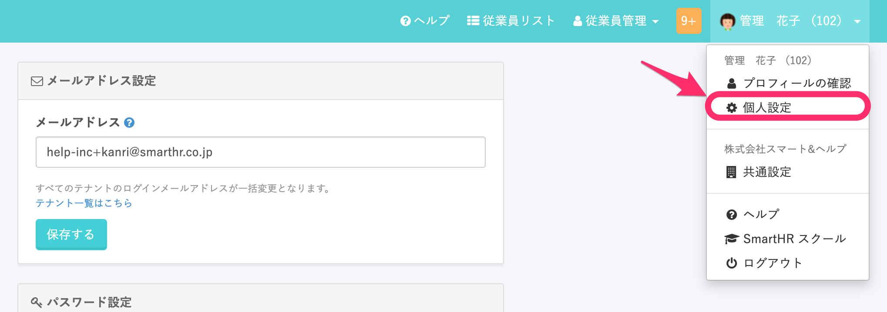
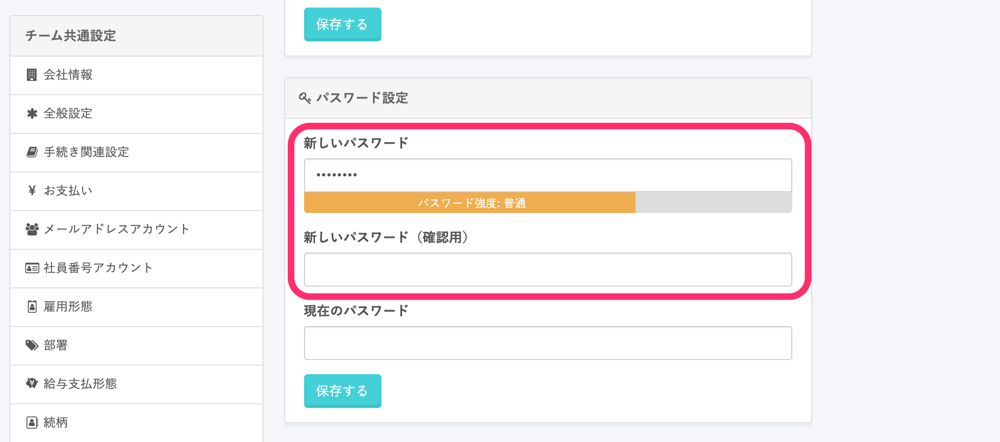
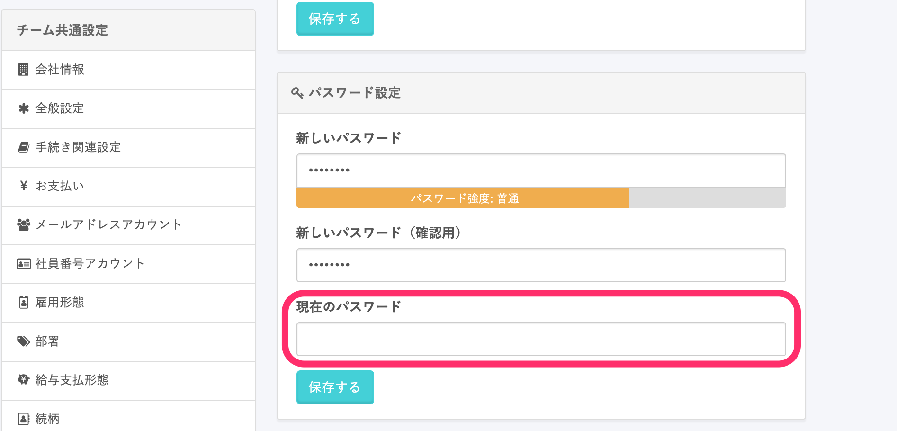
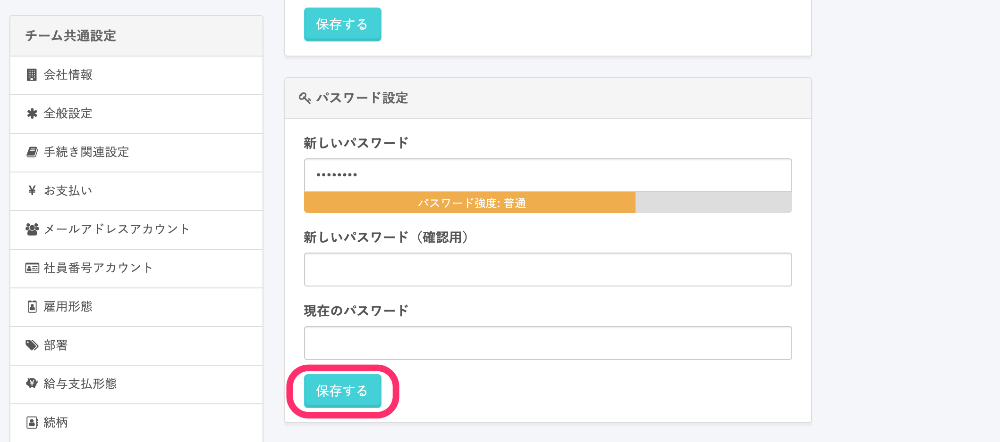
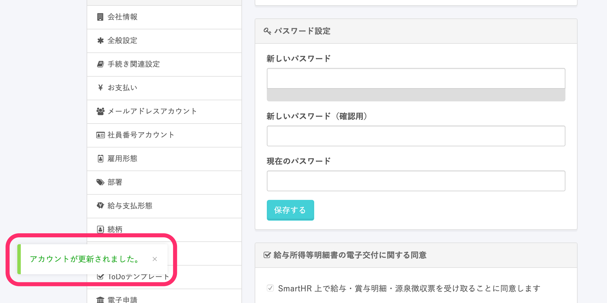

ログイン中のアカウントのパスワードは、 **\[個人設定\]** で変更できます。

パスワードを忘れてしまった場合のリセット手順については、以下の記事をご覧ください。

[パスワードを忘れてしまったら？](https://knowledge.smarthr.jp/hc/ja/articles/360026265593)

# 1\. 画面右上の \[アカウント名\] >  \[個人設定\] をクリック

画面右上の **\[アカウント名\] > \[個人設定\]** をクリックすると、プロフィールの変更ページが表示されます。

# 2\. 新しいパスワードを入力

パスワード設定欄の **\[新しいパスワード\]** に、変更後のパスワードを入力します。

入力が完了したら **\[新しいパスワード（確認用）\]** にも同じパスワードを入力します。

# 3\. 現在のパスワードを入力

確認用のパスワードを入力し終えたら、 **\[現在のパスワード\]** に、これまで使用していたパスワードを入力します。

# 4\. \[保存する\] をクリック

現在のパスワードを入力し終えたら、 **\[保存する\]** をクリックします。

画面左下に **\[アカウントが更新されました\]** と表示されれば、パスワード変更は完了です。

