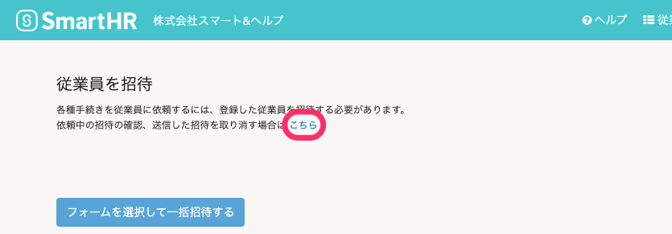
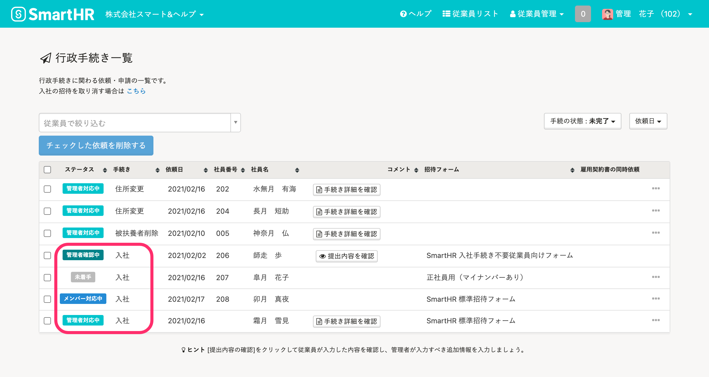

従業員をSmartHRに招待した後や、従業員に入社手続きを依頼した後の進捗を確認する方法を説明します。

# SmartHRへの招待の進捗を確認する

SmartHRに招待した従業員が、アカウントの設定や従業員情報の入力を完了しているかどうかは、 **［アカウント発行中の従業員］** 画面から確認します。

## 1\. ［従業員管理］>［SmartHR に招待］をクリック

画面上部の **［従業員管理］** をクリックし、 **［SmartHR に招待］** をクリックすると、 **［従業員を招待］** 画面が表示されます。

## 2\. ［こちら］をクリック

 **［依頼中の招待の確認、送信した招待を取り消す場合は こちら］** の **［こちら］** をクリックします。

## 3\. ［アカウント発行中の従業員］画面で進捗を確認

招待された従業員の操作によって、画面の表示が変わります。

下記を参考に、招待・入社手続きの進捗を確認します。

| 招待された従業員の操作 | 入社手続きを「伴わない」招待 | 入社手続きを「伴う」招待 |
| --- | --- | --- |
| パスワードを設定 （招待フォームがある場合） |    **［アカウント承認］** が **［承認済］** になる   |    **［アカウント承認］** が **［承認済］** になる   |
| パスワードを設定 （招待フォームがない場合） |    **［アカウント承認］** が **［承認済］** になる、 **［従業員招待ステータス］** が **［-］** になる   |   \-   |
| 従業員情報を登録 （招待フォームを提出） |   画面に表示されなくなる   |    **［従業員招待ステータス］** が **［回答済］** になる   |
| 入社手続きを提出 |   \-   |   画面に表示されなくなる   |

:::alert
招待が承認されないまま90日以上経ったアカウントは非アクティブアカウントとみなされ、自動的に削除されます。
:::

# 入社手続きの進捗を確認する

従業員の入社手続きの進捗は、 **［手続き一覧］** 画面で確認します。

「従業員が入社手続きを開始したかどうか」などを確認できます。

## 1.［手続き一覧］の「一覧を見る」をクリック

SmartHR トップページの **［手続き一覧］** の **「一覧を見る」** をクリックします。

## 2\. 入社手続きの［ステータス］を確認

 **［手続き一覧］** 画面で、入社手続きの **［ステータス］** を確認します。

各ステータスの説明は、以下のとおりです。

| ステータス名 | 説明 | 管理者がやること |
| --- | --- | --- |
| 未着手 | 従業員が入社手続きの情報を入力していない状態 | 従業員に入力を促しましょう |
| メンバー対応中 | 従業員が入力内容を確認している状態 | 従業員に手続きの提出を促しましょう |
| 管理者確認中 | 従業員が手続きを提出した状態 |  **［提出内容を確認］** をクリックし、手続きを進めましょう |
| 修正依頼中 | 管理者が修正依頼を送り、従業員が未対応な状態 | 従業員に修正対応を促しましょう |
| 管理者対応中 | 入社手続きが作られた状態 |  **［手続き詳細を確認］** をクリックし、手続きを完了させましょう |
| 完了済み | 手続きのタスク ( ToDo ) がすべて完了となった状態 | なし |

ステータスの遷移や、ステータスが変わらない理由は以下のページをご覧ください。

:::related
[入社の手続き依頼をした後のステータスはどう遷移する？](https://knowledge.smarthr.jp/hc/ja/articles/360026103554)
[入社手続き依頼のステータスが「未着手」「メンバー対応中」から変わらないのはなぜ？](https://knowledge.smarthr.jp/hc/ja/articles/360038108613)
:::
