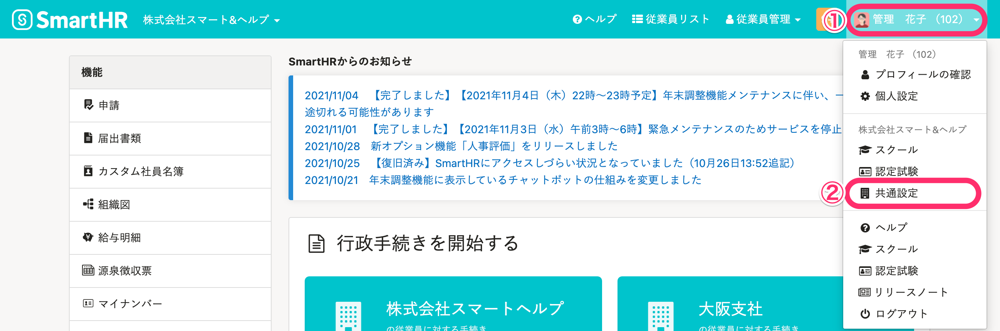
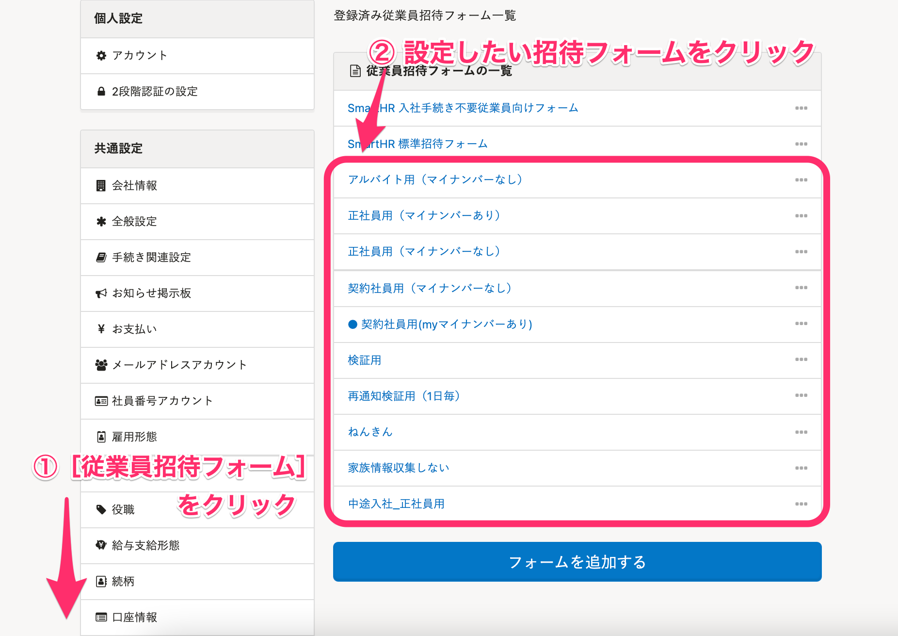
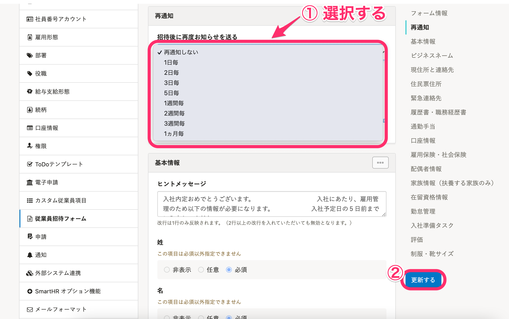

下記の手続きが完了していない従業員に対して、自動で再通知を行うことができます。

- 招待未承諾
- 招待フォーム未入力
- マイナンバー未提出
- 入社手続き依頼未完了

再通知の設定を行なうときは、**招待フォームごと**に行ないます。

システム標準の従業員招待フォームである、 **［SmartHR 入社手続き不要従業員向けフォーム］** と **［SmartHR 標準招待フォーム］** は再通知の設定はできません。

[［SmartHR 入社手続き不要従業員向けフォーム］と［SmartHR 標準招待フォーム］について](https://knowledge.smarthr.jp/hc/ja/articles/900004732746)

# 1\. 画面右上のアカウント名 >［共通設定］をクリック

 **画面右上のアカウント名 >［共通設定］** をクリックしてください。

# 2.［共通設定］>［従業員招待フォーム］をクリック

画面左に表示される **［共通設定］** の［ **従業員招待フォーム］** をクリックし、設定したい招待フォームを選択します。

# 3.［再通知］欄で［招待後に再度お知らせを送る］のプルダウンをクリック

 **［再通知］** 欄にて、 **［招待後に再度お知らせを送る］** のプルダウンから、任意の日数を選択します。

# 再通知のタイミング

従業員が手続きを完了するまで、設定した日数毎にメールを通知します。

通知の時間帯は、9:00〜10:00ころです。

:::tips
「1ヶ月毎」を設定した場合、**30日毎に**通知します。
例えば、7/1に招待した合、7/31、8/30の9:00〜10:00ころに再通知します。
:::

# 再通知のメール内容

従業員の対応状況によりメールの内容が変わります。

詳しくは下記のページをご覧ください。

[【一覧】招待フォームの再通知で届くメールの内容](https://knowledge.smarthr.jp/hc/ja/articles/360026105434)
