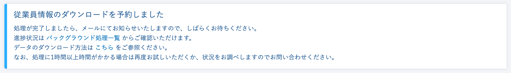
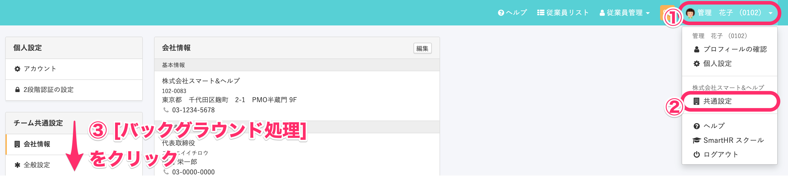
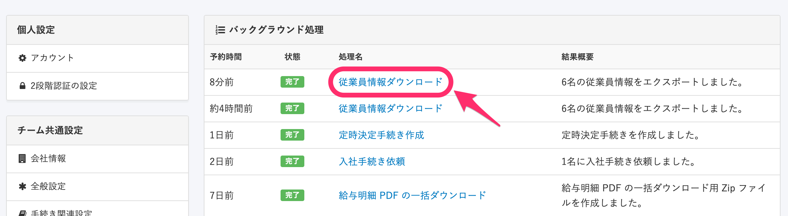
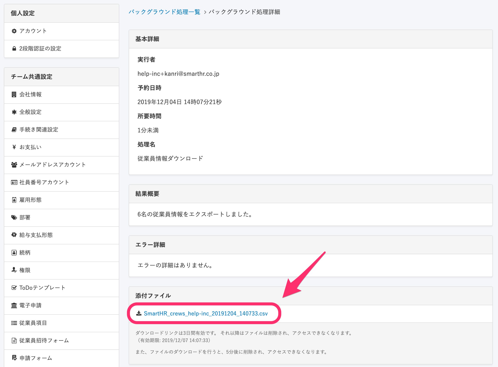

上記のように予約されたダウンロード（エクスポート）のデータは、 **「処理完了後に届くメール内のリンク」** もしくは **「バックグラウンド処理詳細画面」** よりダウンロードすることが可能です。

# メール内のリンクからダウンロードする方法

## 1\. メールを確認する

バックグラウンド処理が完了し、データのダウンロードができるようになると、処理を実行したアカウントのメールアドレス宛にメールが届きます。

件名：バックグラウンド処理による <処理名> の結果が出ました | <企業名>

## 2\. メール内のリンクをクリック

メール内にあるリンクをクリックすると、ダウンロードが開始します。

| **件名** | バックグラウンド処理による <処理名> の結果が出ました \| <会社名> |
| --- | --- |
| **本文** |   \[従業員メールアドレス\] 様  いつもSmartHRをご利用いただきありがとうございます。  従業員情報ダウンロードのバックグラウンド処理の結果が出ました。  以下のリンクをクリックしてファイルをダウンロードしてください。  - **Smarthr\_crews\_help-inc\_20XX0101\_111111.csv.**  ※ このリンクは3日間有効です。それ以降はファイルは削除され、アクセスできなくなります。  （有効期限: 2019/01/04 11:10:26）  また、ファイルのダウンロードを行うと、5分後に削除され、アクセスできなくなります。  エラーにより処理が完了できていない場合がございますので  下記のURLにアクセスし、結果を必ずご確認ください。  https://~.smarthr.jp/admin/job\_histories?jp/admin/job\_histories?   |

# バックグラウンド処理詳細画面からダウンロードする方法

## 1\. 画面右上のアカウント名 > \[共通設定\] > \[バックグラウンド処理\] をクリック

**画面右上のアカウント名 > \[共通設定\] > \[バックグラウンド処理\]** をクリックします。

## 2\. \[処理名\] リンクをクリック

一覧からダウンロードしたいデータの **\[処理名\]リンク** をクリックします。

## 3\. \[添付ファイル\] に表示されているリンクをクリック

詳細画面が表示されますので **\[添付ファイル\]** に表示されているリンクをクリックすると、ダウンロードが開始します。

:::alert
- ダウンロードリンクの有効期限は3日間となります。期限をすぎるとファイルは削除され、アクセスできなくなります。
- ファイルのダウンロードを行うと、5分後に削除され、アクセスできなくなります。
- メールとバックグラウンド処理、どちらからダウンロードを行った場合でも、ダウンロードから5分経過した場合は、両方のダウンロードリンクが無効になります。
アクセスできなくなった場合は、再度ダウンロード（エクスポート）の予約からご対応をお願いします。
:::
