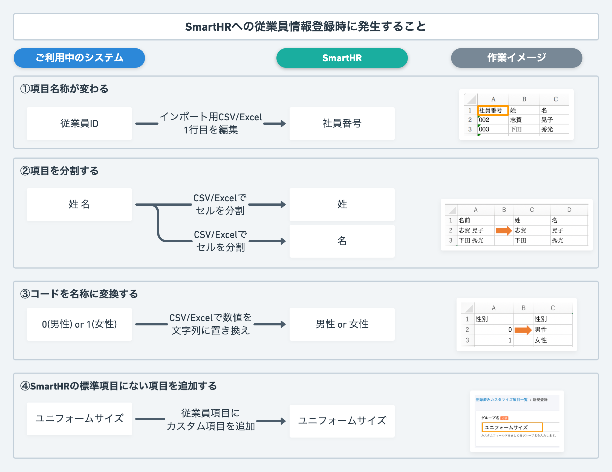
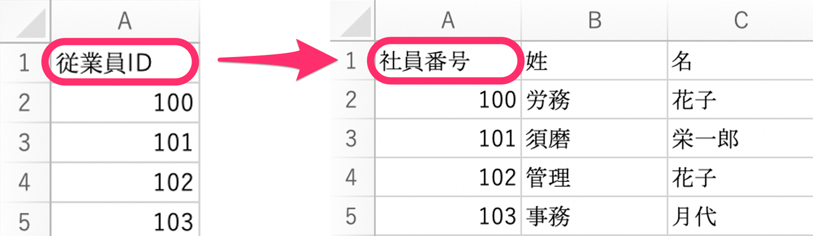
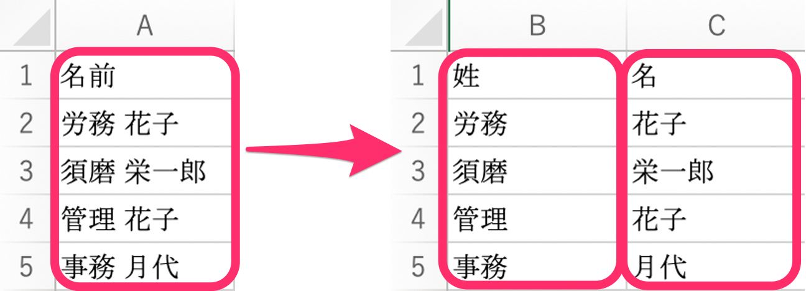
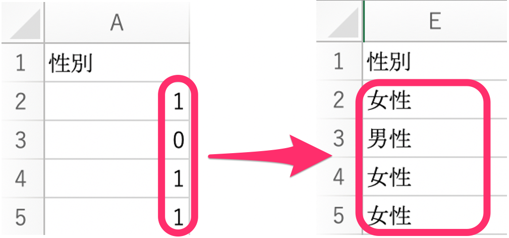
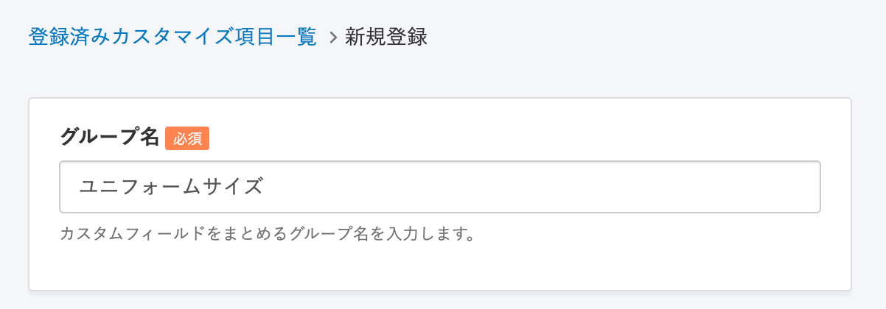

SmartHRにデータを移行する際、ご利用中のシステムから書き出したCSVを、SmartHRのフォーマットに合わせて変換する必要がある場合があります。

本ページでは、従業員情報を登録する際によくある変換方法をご紹介します。

# 変換方法

## ・項目の名称を変える

ご利用中のシステムで使用されている項目名が、SmartHRで使用する項目名と異なる場合は、インポート用のCSVやExcelの1行目を編集してください。

例：項目名が「従業員ID **」** となっている場合、**\[社員番号\]** に変更する

## ・項目を分割する

ご利用中のシステムでは1つの項目として登録されている情報が、SmartHRでは2つの項目に分かれている場合、インポート用のCSVやExcelのセルを分割して入力してください。

例：「名前」として1つの項目になっている場合、**\[姓\]** と **\[名\]** に分けて入力する

## ・コード（フラグ）を名称に変換する

ご利用中のシステムから出力したデータが「0」や「1」など数値になっている場合、SmartHRに登録されている名称に合わせて文字列に置き換えてください。

例：性別が「0 (男性)」「1 (女性)」となっている場合、**\[男性\]** または **\[女性\]** に置き換える

## ・SmartHRの標準項目にない項目を追加する

ご利用中のシステムで使用されている項目が、SmartHRの標準項目にない場合、事前に従業員項目にカスタム項目を追加する必要があります。

例：「ユニフォームサイズ」という項目がないため、カスタム項目として新規登録する

カスタム項目の追加方法について詳しくは、下記のページをご覧ください。

[従業員情報項目のカスタマイズ方法](https://knowledge.smarthr.jp/hc/ja/articles/360026265513)
