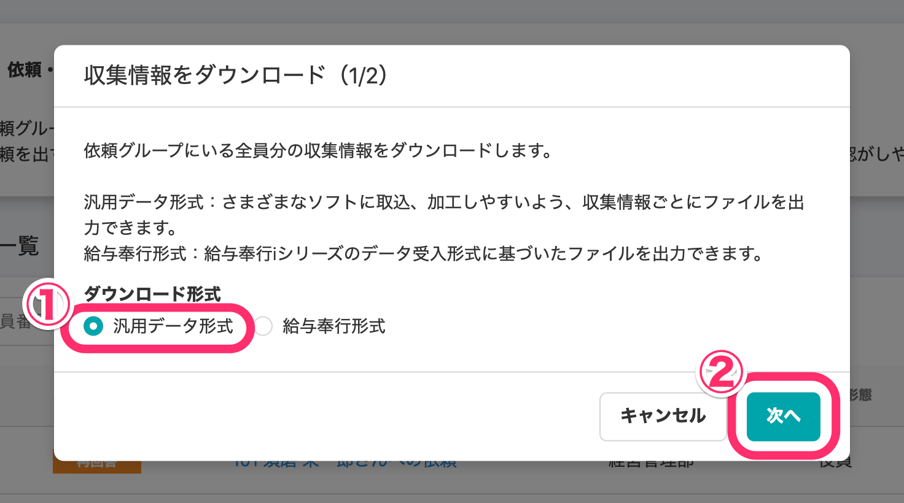

2021年2月4日（木）に、従業員情報の所得税の欄にある **\[寡婦・ひとり親\]** 項目の選択肢から **\[特別の寡婦\]** と **\[寡夫\]** を廃止します。

現在 **\[特別の寡婦\]** または **\[寡夫\]** として登録されている場合、2月4日以降は **\[未選択\]** の状態に変更します。

このページでは、現在の **\[寡夫・ひとり親\]** 項目の状態の確認方法と、従業員情報の更新方法を説明します。

# \[寡夫・ひとり親\] 項目の状態を確認する

現在 **\[寡夫・ひとり親\]** 項目が **\[特別の寡婦\]** または **\[寡夫\]** として登録されている場合、2021年2月4日以降は **\[未選択\]** の状態になります。

## 一括で確認する

従業員リスト画面で **\[一覧のダウンロード\]** をクリックすると、**\[従業員情報のダウンロード\]** の画面が表示されます。

**\[ダウンロード項目\]** を **\[すべての項目\]** にして **\[ダウンロード\]** ボタンをクリックすると、バックグラウンド処理が開始され、ファイルがダウンロードできるようになります。

:::related
[従業員情報、家族情報の登録データをダウンロードする](https://knowledge.smarthr.jp/hc/ja/articles/360026106394)
:::

ダウンロードしたファイルの **\[寡婦・ひとり親\]** の列をご確認ください。

## 個別に確認する

個別の従業員情報画面の **\[所得税\]** の欄の **\[寡婦・ひとり親\]** の項目をご確認ください。

# \[寡婦・ひとり親\] 項目の内容を更新する

2020年の年末調整で収集した情報を使うと、2月4日以降の分類に対応した内容での更新が可能です。

## 1\. 年末調整機能の依頼一覧で \[ダウンロード▼\] > \[全員分の収集情報をダウンロード\] の順にクリック

依頼一覧の **\[ダウンロード▼\]** メニューから **\[全員分の収集情報をダウンロード\]** をクリックすると、ダウンロード形式を選択するダイアログが表示されます。

## 2\. \[汎用データ形式\] を選択して \[次へ\] をクリック

ダウンロード形式は **\[汎用データ形式\]** にチェックをつけ、**\[次へ\]** をクリックすると出力する項目を設定する画面が表示されます。

## 3\. \[ダウンロード対象項目\] と \[ダウンロード対象年度\] を選択して \[ダウンロード\] をクリック

**\[ダウンロード対象項目\]** は **\[従業員本人の情報\]** を選択し、 **\[ダウンロード対象年度\]** は **\[来年（2021年）\]** を選択して、 **\[ダウンロード\]** をクリックするとバックグラウンド処理後、ファイルがダウンロードできます。

## 4\. ダウンロードしたファイル内の \[来年 寡婦控除\] の内容を修正

年末調整機能でダウンロードした収集情報では、 **\[来年 寡婦控除\]** の列が、SmartHRの従業員情報における **\[寡婦・ひとり親\]** の項目にあたります。

従業員情報として取り込む前に、以下の3点の変更が必要です。

- **\[来年 寡婦控除\]** 列の **\[ひとり親控除\]** となっている部分を **\[ひとり親\]** に変更。
- **\[来年 寡婦控除\]** の列見出しを **\[寡婦・ひとり親\]** に変更
- **\[来年 寡婦控除理由\]** の列見出しを **\[寡婦・ひとり親の理由\]** に変更

## 5\. 従業員情報を一括で更新

一括更新に必要な列は、**\[社員番号\]** と **\[寡婦・ひとり親\]** **\[寡婦・ひとり親の理由\]** です。

一括更新の詳しい手順は、下記のページをご覧ください。

:::related
[複数の従業員情報・家族情報を一括で更新する](https://knowledge.smarthr.jp/hc/ja/articles/360026265333)
:::
:::tips
年末調整の収集情報がない場合は、更新用のファイルを新たに作成することで、一括更新が可能です。
:::

# 過去の従業員情報を確認する

項目削除後に、それ以前の情報を確認する場合は、従業員リスト画面から、日付を指定して履歴を閲覧してください。

詳しい手順は、下記のページの **\[日付を指定して履歴を閲覧する方法\]** をご覧ください。

:::related
[従業員情報の変更履歴を閲覧する](https://knowledge.smarthr.jp/hc/ja/articles/360026262633)
:::
