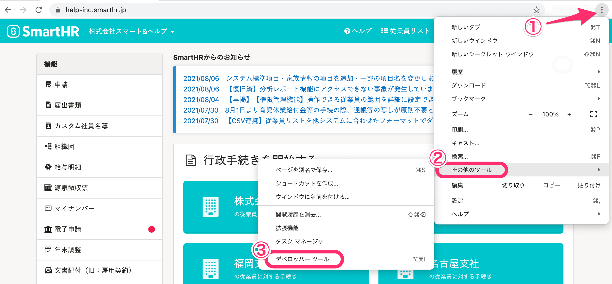
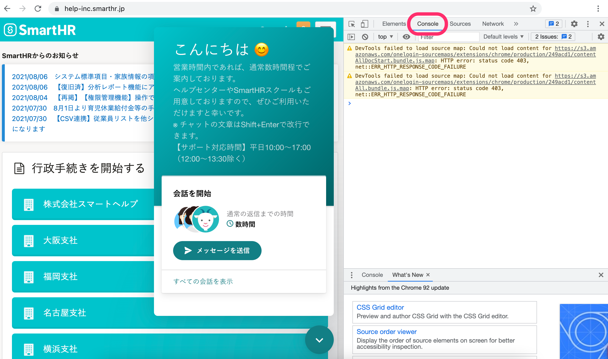

チャットの表示エラーや不具合などでお問い合わせいただいた際に、コンソールのエラー画面の撮影をお願いすることがあります。

こちらのページでは、Google Chromeのデベロッパーツールで、コンソールエラーを確認する方法を説明します。

# 1\. デベロッパーツールを表示

チャット画面を開いた状態で、ブラウザの右上にある **［︙］** メニュー から、 **［その他のツール］>［デベロッパーツール］** をクリックすると、デベロッパーツール画面が表示されます。

# 2\. ［Console］タブをクリック

デベロッパーツール画面のツールバーにある **［Console］** のタブをクリックすると、コンソール内容が表示されます。

コンソール内容のスクリーンショットを撮影し、チャットサポートに送ってください。

