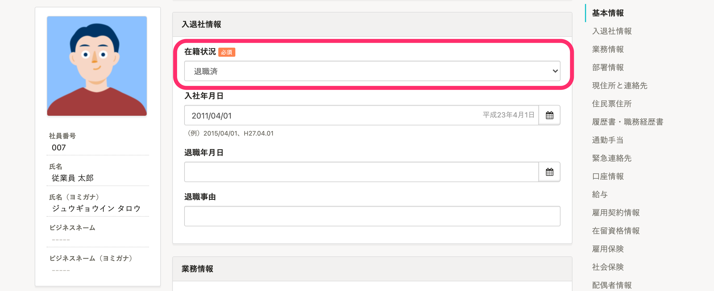

従業員が退職する際に、管理者がSmartHR上で行なう操作を説明します。

# 退職の手続きが必要な場合

トップページの **［退職の手続き］** から退職する従業員を選択し、退職の手続きを作成します。手続きを作成すると、関連書類が作成されます。

手続きを作成する際に **［退職日］** に入力した日付の翌日になると、該当従業員の **［在職状況］** が自動で **［退職済］** に変更されます。

:::related
[退職の手続きを作成する](https://knowledge.smarthr.jp/hc/ja/articles/360026103514)
:::

# 退職の手続きが不要な場合

退職する従業員の従業員情報画面で、 **［在籍状況］** を **［退職済］** に変更します。

退職日が先の場合は、 **［退職年月日］** に退職予定の日付を入力すると、入力した日付の翌日に **［在籍状況］** が自動で **［退職済］** に変更されます。

# 退職する従業員のアカウント権限を「退職者」権限に変更する

退職する従業員のアカウント権限を変更する手順は、下記のヘルプページをご覧ください。

- [メールアドレスアカウントに退職者権限を適用する](https://knowledge.smarthr.jp/hc/ja/articles/360026106034)
- [社員番号アカウントに退職者権限を適用する](https://knowledge.smarthr.jp/hc/ja/articles/360051434473)

退職者権限で利用できる機能は、下記のヘルプページをご覧ください。

[システム標準権限が利用できる機能と操作できる範囲](https://knowledge.smarthr.jp/hc/ja/articles/360026266513)

## 退職後も従業員がSmartHRを利用できるようにする

退職後も、給与明細や源泉徴収票の閲覧など限定した範囲でSmartHRを利用できます。

:::related
[Q. 退職した従業員は、引き続きSmartHRにログインできますか？](https://knowledge.smarthr.jp/hc/ja/articles/360026264913)
:::

退職後の従業員がSmartHRにログインできないようにするには、アカウントを削除してください。

:::related
[メールアドレスアカウントを削除する](https://knowledge.smarthr.jp/hc/ja/articles/360026107594)
[社員番号アカウントを削除する](https://knowledge.smarthr.jp/hc/ja/articles/360026263033)
:::
:::tips
退職後も限定的にSmartHRを利用できますが、 **［在籍状況］** が **［退職済］** の従業員に対しては利用料金が発生しません。
[Q. 退職者に対しても利用料金は発生する？](https://knowledge.smarthr.jp/hc/ja/articles/360026266813)
:::
