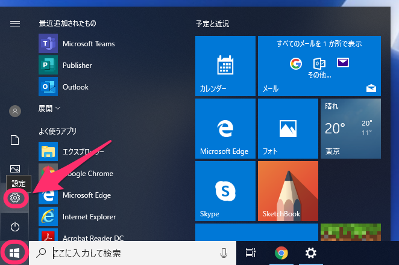
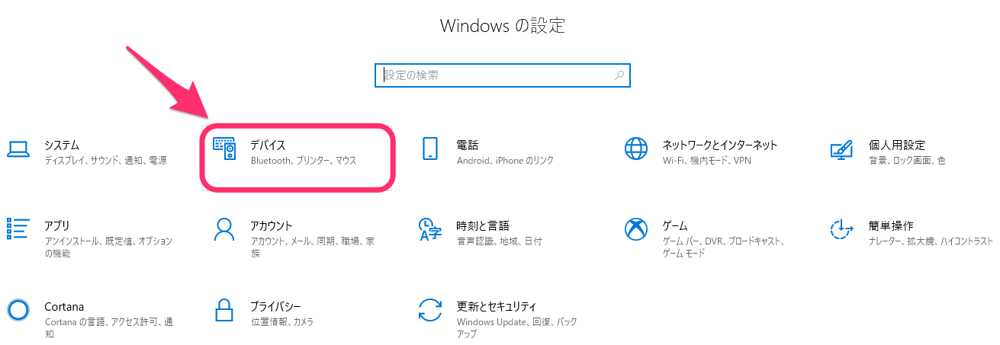
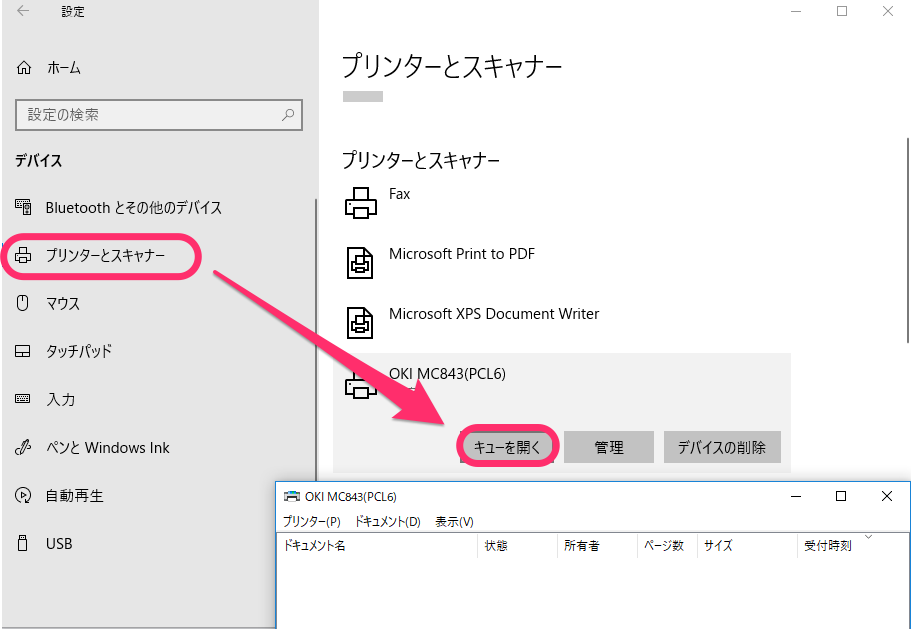
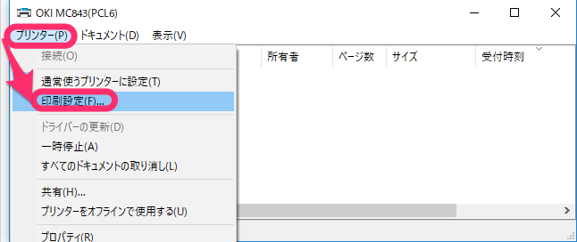
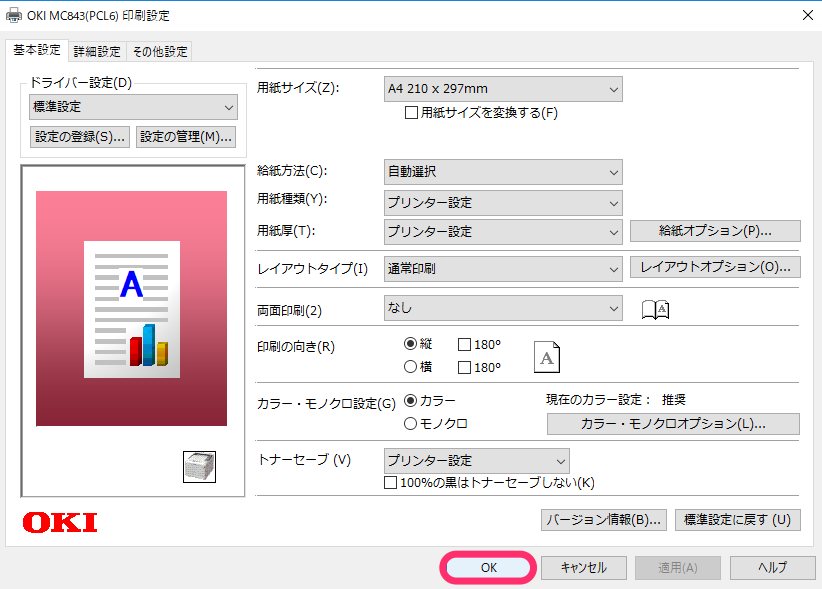
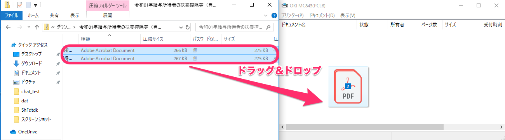
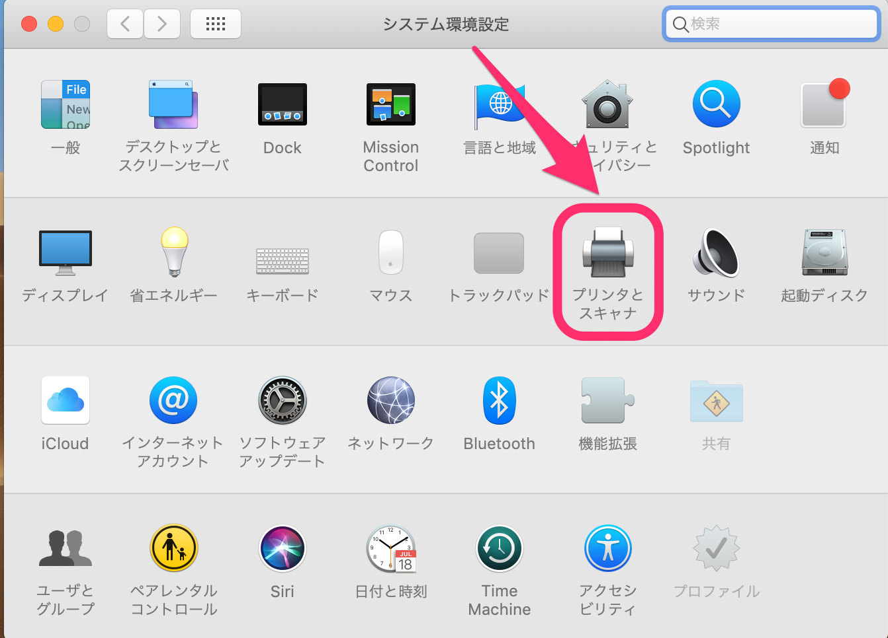
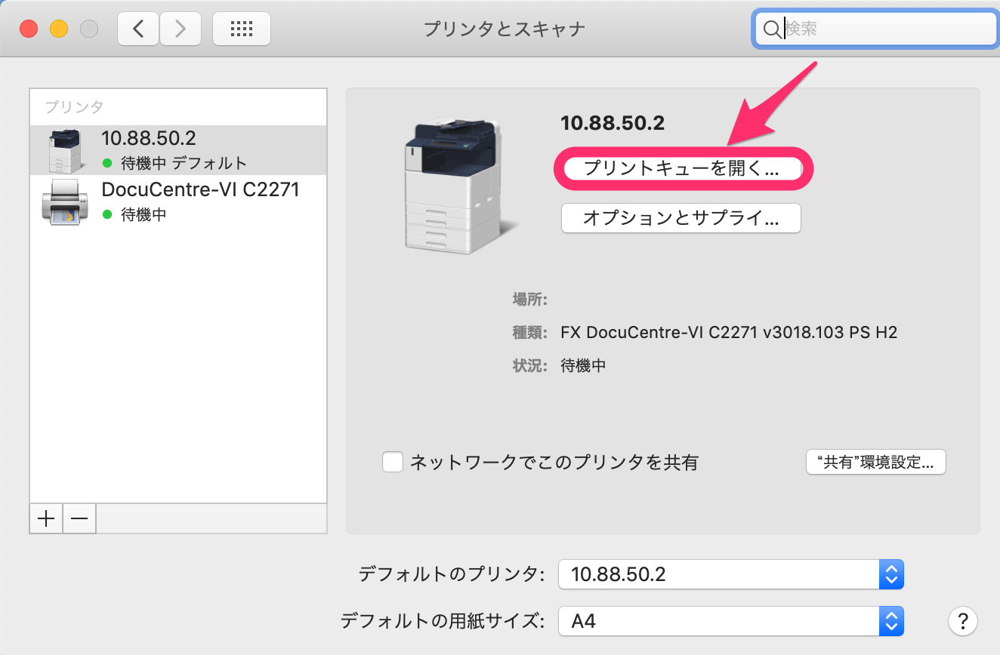
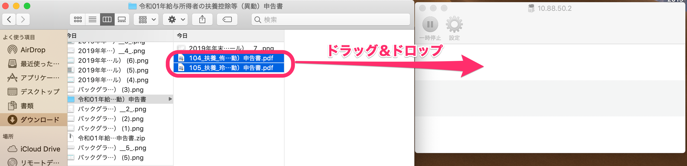

Windows 10とMacを利用する場合について、それぞれの手順を説明します。

:::alert
このページに記載している内容は、サポート対象外です。
ご不明な点がある場合は、それぞれのサポート元へお問い合わせください。
[SmartHRサポートポリシー](https://knowledge.smarthr.jp/hc/ja/articles/360044805593#toc--4)
:::

# Windows 10で複数のPDFファイルを一括で印刷する場合

PDFファイルをAdobe Acrobat Reader DCを使って開く環境の場合

## 1\. Windowsメニュー > \[設定\] をクリック

## 2\. \[デバイス\] をクリック

## 3\. \[プリントとスキャナー\] > \[キューを開く\]をクリック

****

## 4\. \[プリンター\] > \[印刷設定\] をクリック

## 5\. 印刷設定し、\[OK\] をクリック

## 6\. PDFファイルを選択してプリントキューへドラッグ＆ドロップ

印刷したいPDFファイルを複数選択し、プリンターの画面へドラッグ＆ドロップします。

## 7\. メッセージが表示されるので、\[はい\] をクリック

複数のPDFファイルが印刷されます。

# Macで複数のPDFファイルを一括で印刷する場合

## 1\. \[システム環境設定\] > \[プリンタとスキャナ\] をクリック

## 2\. \[プリントキューを開く\] をクリック

## 3\. PDFファイルを選択してプリントキューへ移動

印刷したいPDFフィルを複数選択し、プリントキューへドラッグ＆ドロップすると順次印刷されます。

