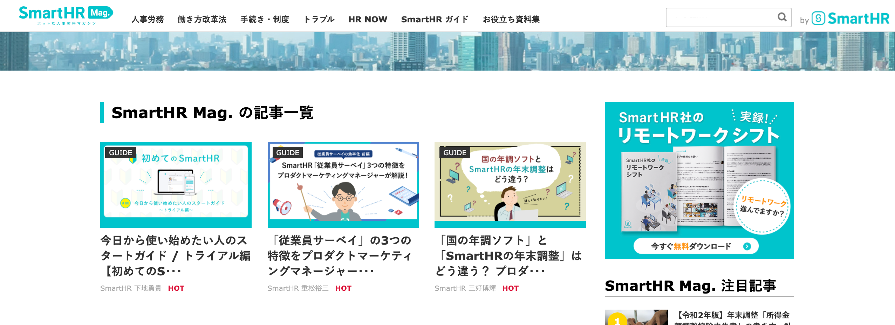
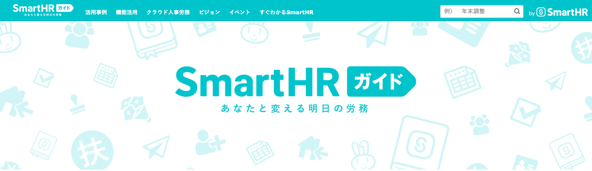

人事労務の担当者さま、SmartHRの管理者さまに向けた、SmartHRの各種コンテンツを紹介します。

「改正内容のポイントを押さえたい」「SmartHRの機能理解を深めたい」場合にご活用ください。

# 人事労務メディア「SmartHR Mag.」

****

SmartHR Mag.はクラウド人事労務ソフト「SmartHR」からスピンオフして生まれた、人事労務のお役立ち情報に特化したメディアです。

コンセプトは「ホットな人事労務マガジン」。

「人事労務業界を盛り上げたい！ 」ホットな気持ちを持った社会保険労務士や弁護士などの専門家の皆さまとタッグを組み、人事労務に携わる方にとって必要な情報を、わかりやすく届けるべく運営しています。

情熱を持って日本社会を支えている人事労務のみなさんが、よりイキイキと輝けるようにするべく、背中を押すようなコンテンツをお届けしています。

:::related
[SmartHR Mag.](https://mag.smarthr.jp/)
:::

# SmartHR ガイド

SmartHR ガイドは、「あなたと変える明日の労務」をコンセプトに、クラウド人事労務ソフト「SmartHR」による人事労務効率化のヒントを紹介するメディアです。

当メディアは、既にSmartHRをご利用いただいている方だけでなく、現在SmartHRの導入をご検討中の方や、そもそもSmartHRを知らないという方にも情報をお届けします。

具体的には、文字通り“ガイドブック”となるべく、SmartHRの詳しい機能活用はもちろん、導入企業における活用事例など、SmartHRを導入し使いこなしていくための情報を発信。

また、SmartHRが描く今後のサービス展望やビジョンも公開。長きにわたりSmartHRをご利用いただく上で、最大限活用していくための大きな手がかりとなるはずです。

より良い明日を目指す皆さまが、働き方改革の第一歩を踏み出せるよう、SmartHR ガイドが先導することをここにお約束します。

:::related
[SmartHR ガイド](https://mag.smarthr.jp/guide/)
:::

# SmartHR スクール

SmartHRの仕組みや使い方を、動画やテキストを見ながら学べる学習型コンテンツです。

導入前の準備から、機能の理解や運用方法まで、人事労務に携わる皆さまをサポートします。

SmartHRのアカウントをお持ちであれば、どなたでも無料でご利用いただけます。

:::related
[SmartHR スクール](https://school.smarthr.jp/)
:::
