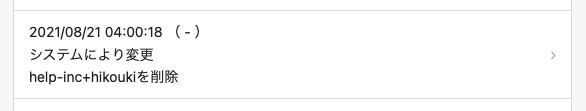

# A. 招待が承認されないまま90日経過したアカウントは自動で削除されます。

 **［SmartHRに招待］** もしくは、メールアドレスアカウント > **［招待する］** から招待を送ったあと、90日以上経っても従業員からの承認がないメールアドレスアカウントは、自動的に削除されます。

なお、従業員情報は削除されません。

:::related
[SmartHR の招待が承認されないまま90日以上放置されているメールアドレスに関するお知らせ](https://smarthr.jp/update/17001)
:::
:::tips
自動削除は **［共通設定］>［監査ログ］>［アカウント］** に、 **［システムにより変更］** として記録が残ります。

[監査ログとは](https://knowledge.smarthr.jp/hc/ja/articles/360026107494)
:::
