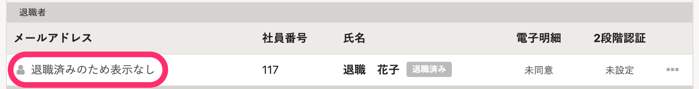
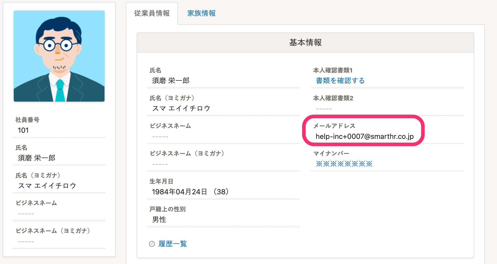

# A. 個人情報保護のため、退職済みの従業員のアドレスは非表示になります

従業員情報の **［在籍状況］** を **［退職済］** に変更すると、退職済みの従業員に紐づくアカウントのログイン・通知用メールアドレスは、 **［退職済みのため表示なし］** と表示されます。

管理者は、退職者のログイン・通知用メールアドレスを閲覧したり更新したりできなくなります。

メールアドレスアカウント一覧以外の、下記の画面やダウンロードしたCSVファイルでも、同様に非表示になります。

- メールアドレスアカウント一覧
- メールアドレスアカウントの編集画面
- 社員番号アカウント一覧（メールアドレスが設定されている場合）
- SAML SSOアカウント一覧
- SAML SSOアカウントの編集画面
- マルチログインアカウントの招待の管理画面

メールアドレスが非表示になるほかに、下記の制限も入ります。

## メールアドレスアカウントの権限を一括更新できなくなる

退職済みの従業員のアカウント権限は、一括更新できません。

アカウント更新用のテンプレートファイル（CSVファイル）に、退職済みの従業員情報は含まれません。

CSVファイルに退職済み従業員の情報を追加して更新しようとした場合は、エラーになります。

## アカウントのメールアドレスを変更したときの通知が管理者に届かなくなる

通知の設定で **［従業員がログインメールアドレスを変更した時］** を **［通知する］** に設定している場合でも、退職済みの従業員がログイン・通知用メールアドレスを変更したときは、管理者に通知が届きません。

:::tips
従業員情報の **［メールアドレス］** は、退職済みの従業員でも閲覧・更新できます。

:::
