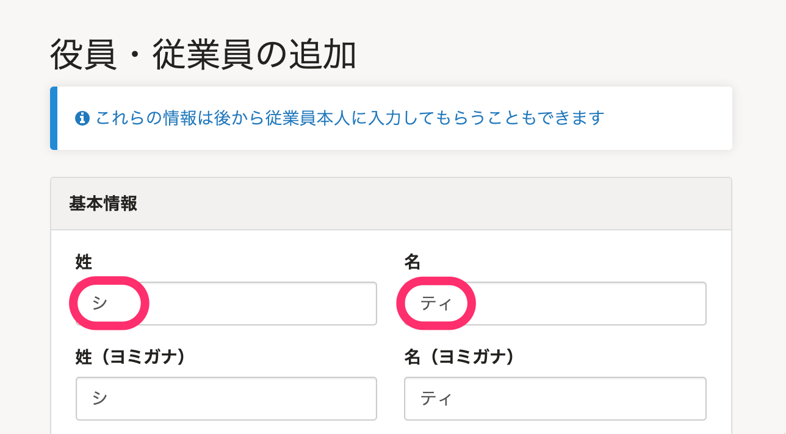
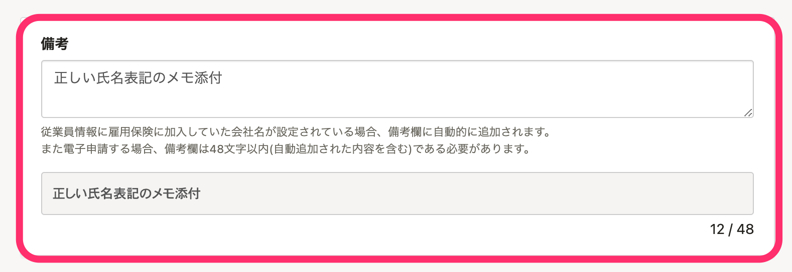
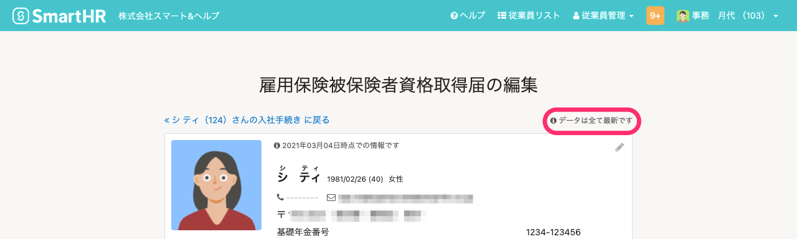
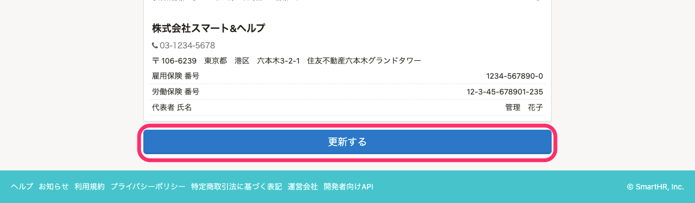
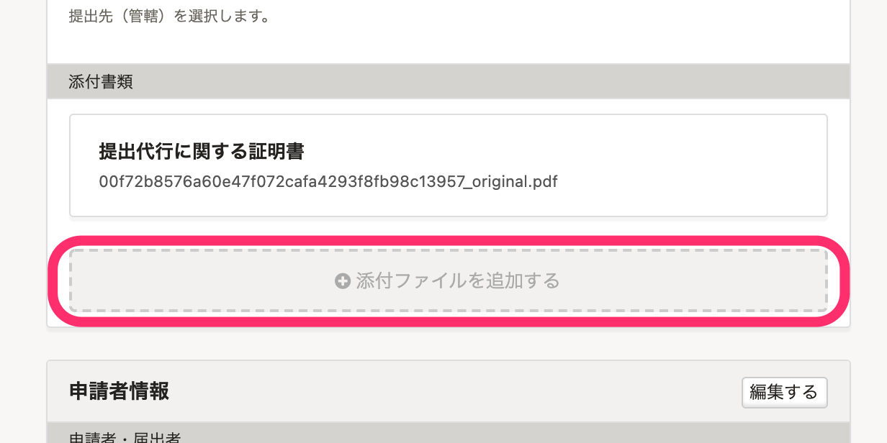
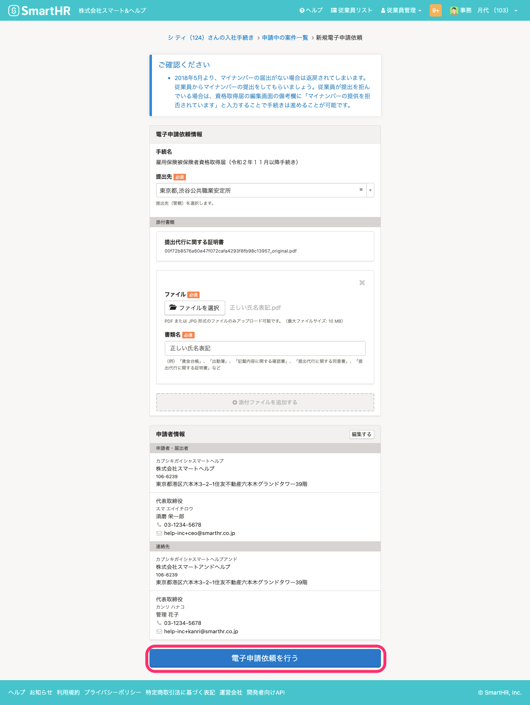

# A. 名を姓名欄に分けて入力してください。

SmartHRでは姓の入力が必須のため、名を姓名欄に分けて入力してください。

たとえばミャンマーやインドネシアなどの国籍で、姓がなく名のみの場合は、以下のように入力します。

## 届出書類を電子申請する場合

姓がなく名だけの従業員である旨を記載したPDF またはJPEG 形式のファイルを添付します。

:::alert
この情報は2021年3月に弊社で各事務センターに確認をして得た回答を元に作成しています。
管轄や窓口担当者によって対応が変わる可能性がありますので、詳しくは管轄の事務センターにお問い合わせください。
:::

### 1\. PDFファイルを作成する

本来の名を伝える申し送りを記載したPDFファイルを作成します。

### 2\. \[備考\] 欄にメモを添付したことを記入する

各種手続きを開始し、**届出書類編集画面**の **\[備考\]** 欄に、メモを添付する旨を記載します。

### 3\. 届出書類を更新する

**届出書類編集画面**の右上の表示が  **「データは全て最新です」**  になったことを確認のうえ、画面下の **\[更新する\]** をクリックします。

### 4\. PDFをアップロードし、電子申請依頼を実行する

手続き画面の **\[電子申請依頼\]** ボタンをクリックして、**新規電子申請依頼画面**を表示します。

**\[電子申請依頼情報\]** の **\[添付書類\]** 項目の **\[+添付ファイルを追加する\]** をクリックし、申し送り用PDFファイルをアップロードします。

新規電子申請依頼画面下部にある **\[電子申請依頼を行う\]** をクリックします。

