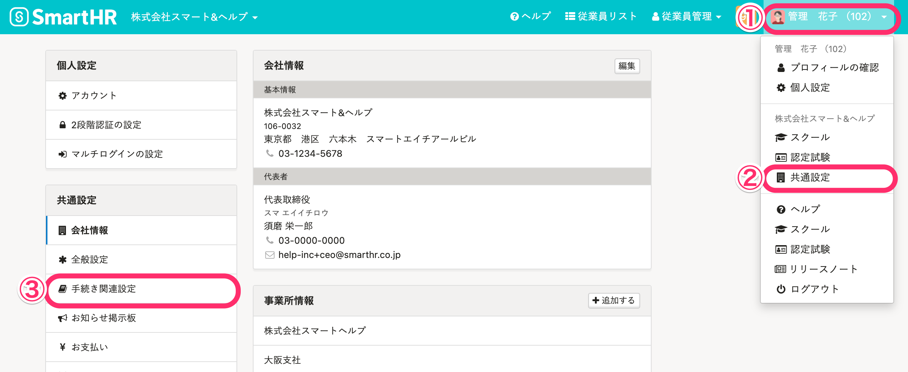
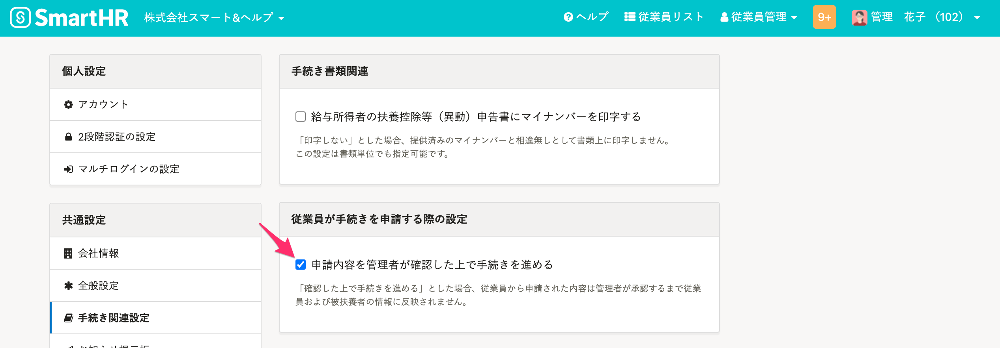

# A. 手続きと申請機能、それぞれで設定が必要です。

手続きと申請機能、それぞれの設定について説明します。

## 手続き

### 1\. アカウント名 >［共通設定］>［手続き関連設定］をクリック

画面右上にあるアカウント名 > **［共通設定］** \> **［手続き関連設定］** をクリックすると、手続き関連の設定画面が表示されます。

### 2.［申請内容を管理者が確認した上で手続きを進める］にチェックを入れる

 **［従業員が手続きを申請する際の設定］** にある **［申請内容を管理者が確認した上で手続きを進める］** にチェックをいれると設定できます。

## 申請機能

承認経路に管理者が設定されている場合は、申請を承認できます。

設定方法は、下記のページをご覧ください。

[承認経路を管理する](https://knowledge.smarthr.jp/hc/ja/articles/360053832734)
