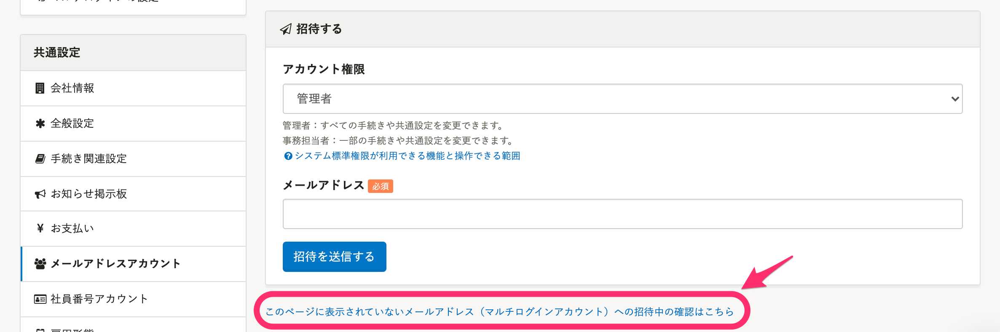
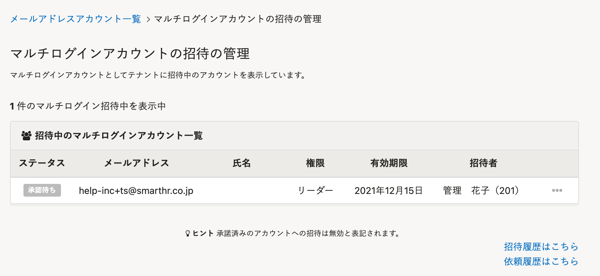

# A. マルチログインアカウントになっています

従業員が過去にSmartHR利用企業の従業員だった場合など、招待に使用したメールアドレスが他の企業アカウントに登録されていると、自動的にマルチログインアカウントとして扱われます。

その場合、メールアドレスアカウント一覧には表示されません。

## 招待中のマルチログインアカウントの確認方法

メールアドレスアカウント画面中央にある **［このページに表示されていないメールアドレス（マルチログインアカウント）への招待中の確認はこちら** ］のリンクをクリックすると、 **［マルチログインアカウントの招待の管理］** 画面が表示されます。

マルチログインアカウントとして、招待中のアカウントが表示され、 **［承認待ち］** のステータスが確認できます。

従業員が招待を承認すると、メールアドレスアカウント一覧に表示されるようになります。

招待中のマルチログインアカウントの管理方法は、下記のページを参照してください。

[マルチログインアカウントとは](https://knowledge.smarthr.jp/hc/ja/articles/360026262853#toc--4)

:::tips
従業員側でマルチログインアカウントの承認をする際、既存の企業アカウントにログインした状態でアクセスする必要があります。
[Q. 招待メール内のリンクをクリックした際、ログイン画面が表示されてしまったら？](https://knowledge.smarthr.jp/hc/ja/articles/360026263333)
:::
