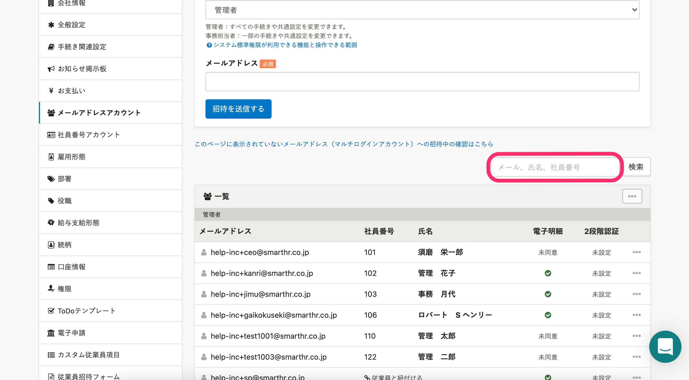
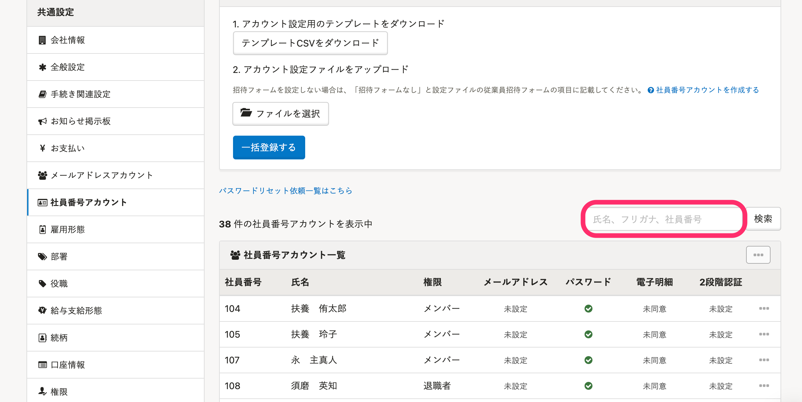
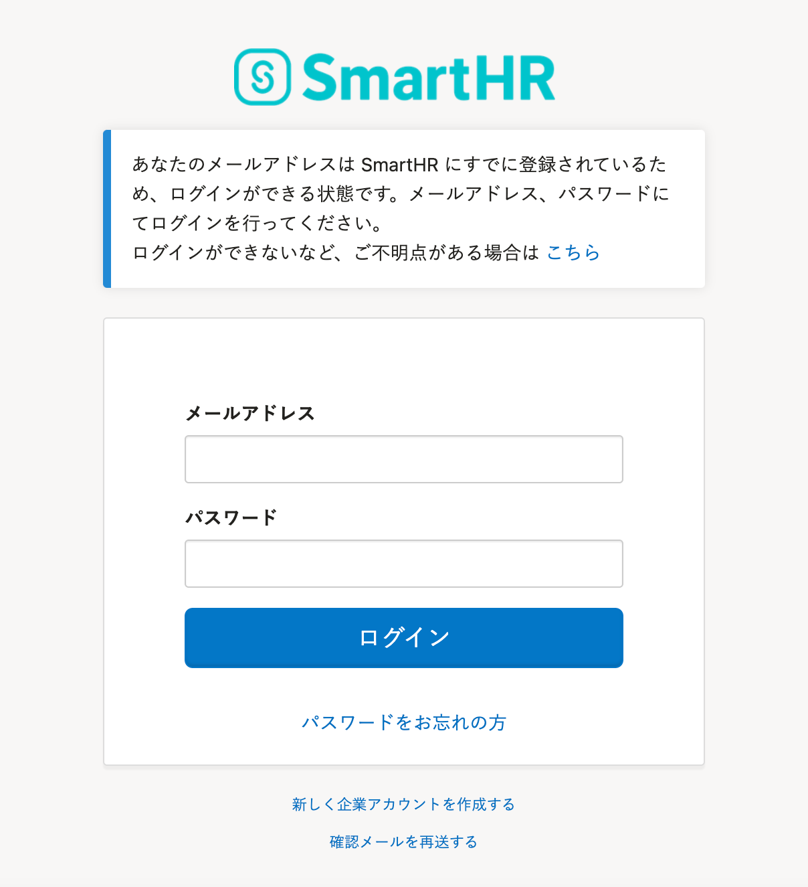

# 原因1：メールアドレスアカウントに既に登録されている

すでにメールアドレスアカウントに登録されていることが原因です。

トップページ右上のアカウント名 > **［共通設定］** \> **［メールアドレスアカウント］** の **［一覧］** を開きます。

検索欄にメールアドレスを入力し **［検索］** をクリックすると、すでに登録されているか確認できます。

# 対応方法

対応方法は、下記のヘルプページをご覧ください。

[メールアドレスアカウントの重複でエラーになってしまったら？](https://knowledge.smarthr.jp/hc/ja/articles/360026265033)

# 原因2：社員番号アカウントの連絡先にメールアドレスが登録されている

すでに社員番号アカウントの連絡先として同じアドレスを登録されていることが原因です。

トップページ右上のアカウント名 > **［共通設定］** \> **［社員番号アカウント］** の **［社員番号アカウント一覧］** から確認してください。

検索ボックスにメールアドレスを入力し **［検索］** をクリックすると、登録が確認できます。

# 対応方法

## すでに登録されているユーザーアカウントが不要な場合

すでに登録されている社員番号アカウントを削除すると、同じメールアドレスで従業員を招待できます。

社員番号アカウントの削除方法は、下記のヘルプページをご覧ください。

[社員番号アカウントを削除する](https://knowledge.smarthr.jp/hc/ja/articles/360026263033)

## すでに登録されているユーザーアカウントが必要な場合

退職して入社し直す際など、過去の従業員情報や給与明細を確認する必要がある場合にアカウントを残す必要があります。

その場合は、2つの従業員情報に同一のメールアドレスを登録することはできないため、管理者か従業員が下記の対応を行なってください。

### 管理者側の対応

管理者が、従業員の別のメールアドレスを使用して招待メールを送ってください。

### 従業員側の対応

従業員自身で社員番号アカウントにログインしたあと、通知用メールアドレスを別のものに変更してください。

[ログイン・通知用メールアドレスを設定（変更）する](https://knowledge.smarthr.jp/hc/ja/articles/360026263093)

# 原因3：マルチログインアカウント

メールアドレスがマルチログインアカウントとなっていることが原因です。

:::related
[マルチログインアカウントとは](https://knowledge.smarthr.jp/hc/ja/articles/360026262853)
:::

# 対応方法

すでにSmartHR上に登録済みのメールアドレスとパスワードでログインしてください。

 **［マルチログイン招待の確認］** 画面が表示されるので、 **［承認する］** をクリックして登録してください。

手順は、下記のヘルプページをご覧ください。

[Q. 招待メール内のリンクをクリックした際、ログイン画面が表示されてしまったら？](https://knowledge.smarthr.jp/hc/ja/articles/360026263333)
