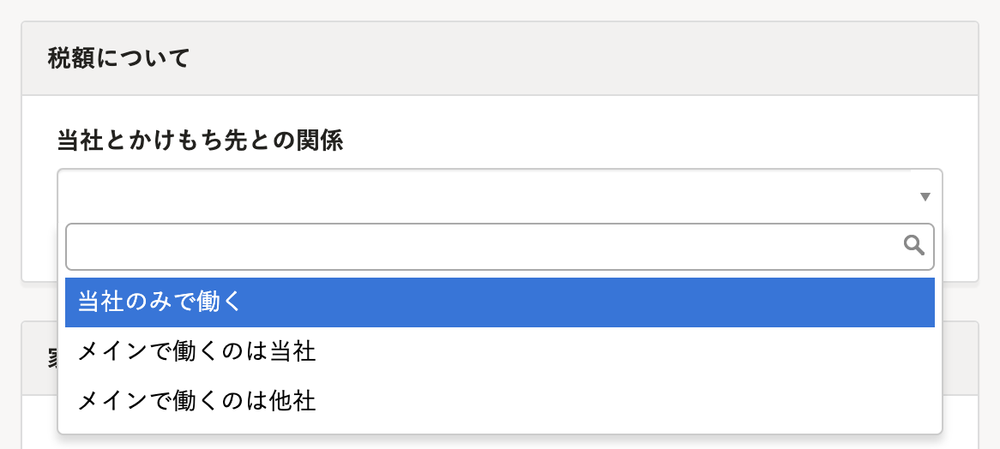
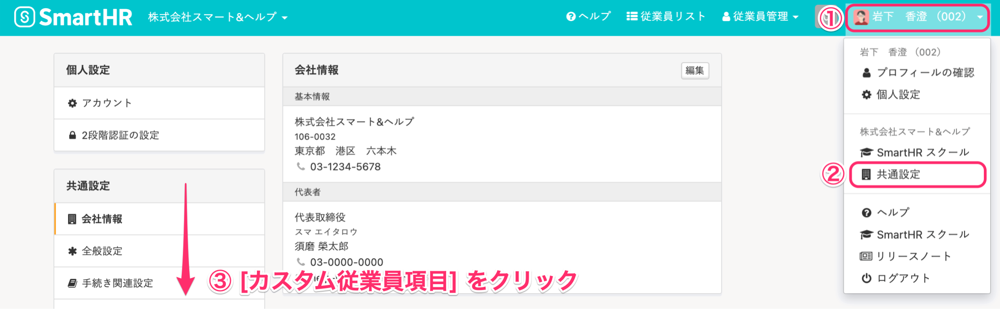
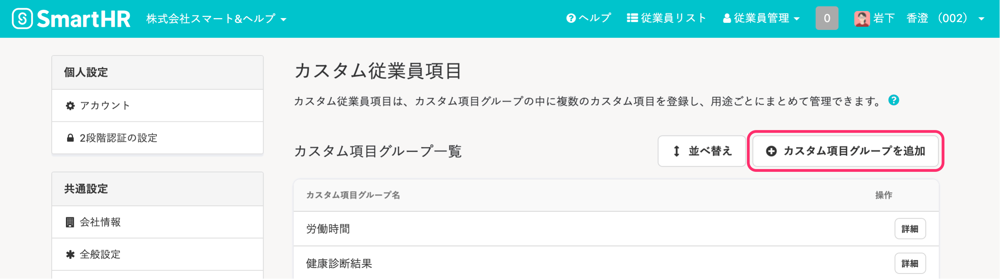
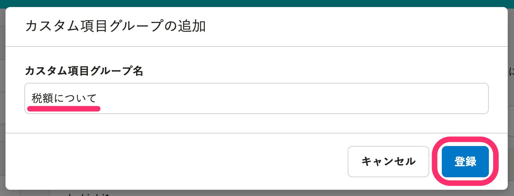
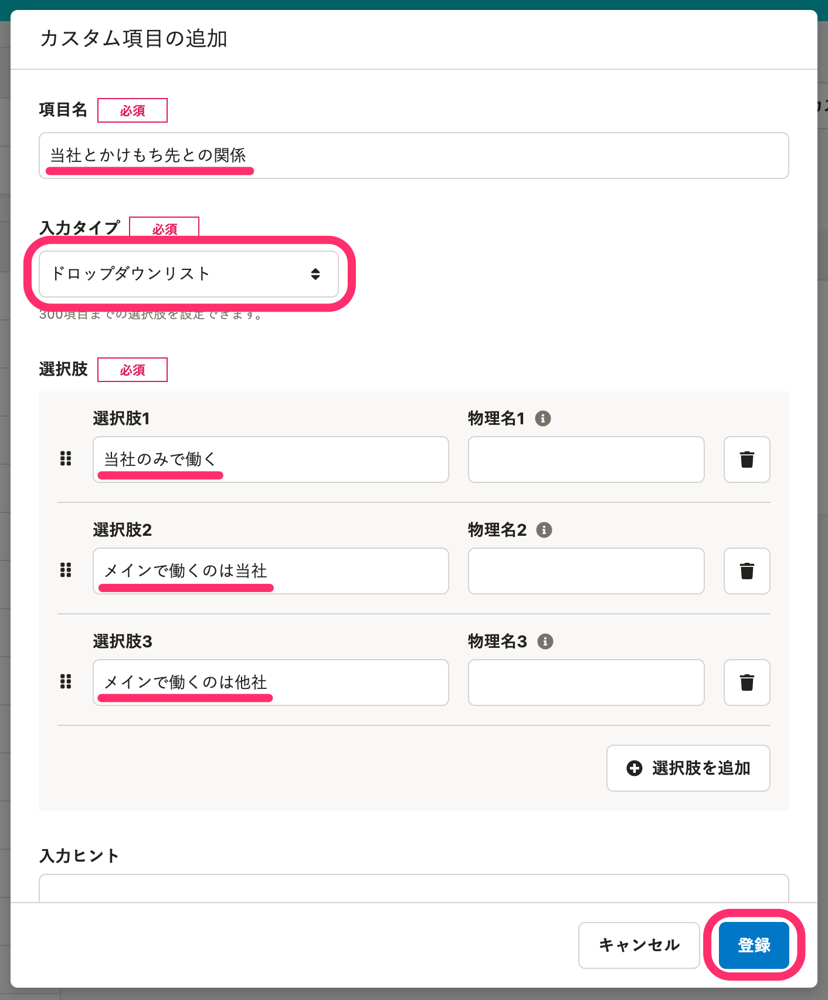
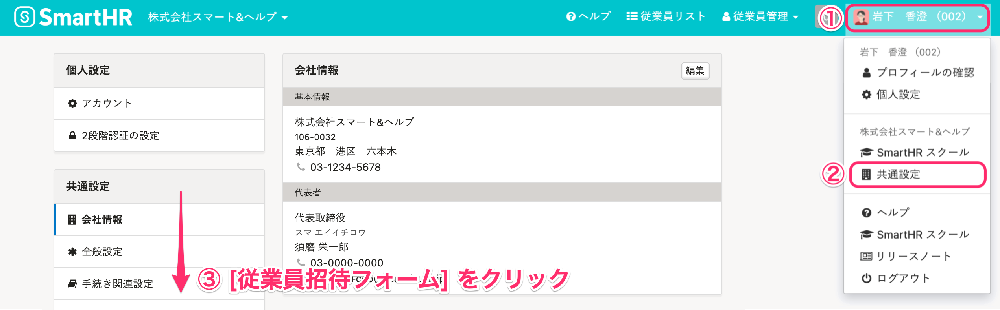
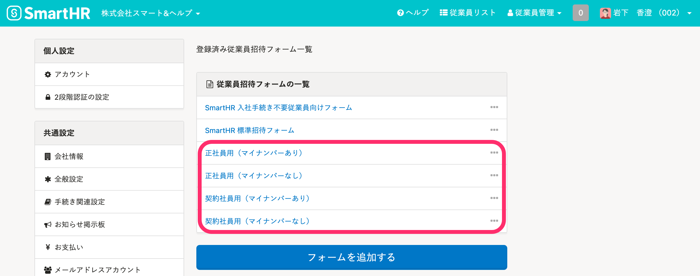
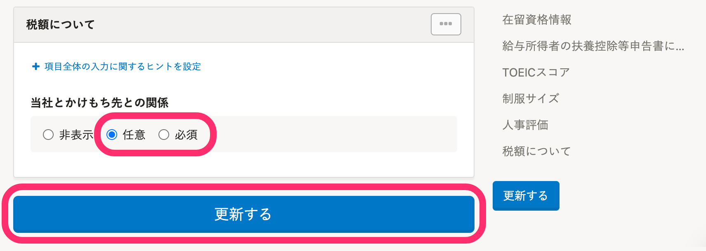

2022年2月24日（木）、所得税の課税区分（甲欄・乙欄等）をシステム標準従業員項目に追加しました。

:::related
[所得税の課税区分（甲欄・乙欄）を従業員から収集できるようになります](https://smarthr.jp/update/33147)
:::

カスタム従業員項目を別途追加しなくても情報を収集できますが、これまでどおりカスタム従業員項目を使って所得税の課税区分（甲欄・乙欄等）を管理することもできます。

# カスタム従業員項目で管理するケース

システム標準従業員項目を使わずに、カスタム従業員項目で所得税の課税区分（甲欄・乙欄等）を管理するケースは次のとおりです。

- **2022年2月24日（木）より前に、カスタム従業員項目で所得税の課税区分（甲欄・乙欄等）を管理している**
    - これまでカスタム従業員項目として収集していた情報は、引き続き使用できます。
- **システム標準従業員項目とは異なる、独自の項目名や選択肢で管理したい**

:::alert
システム標準従業員項目の課税区分との重複を避けたい場合は、システム標準従業員項目の課税区分を［非表示］に設定してください。
設定方法は、[従業員関連の閲覧・作成・更新・削除の権限を設定する](https://knowledge.smarthr.jp/hc/ja/articles/1500001368101)を参照してください。
:::

# 所得税の情報を収集するためのカスタム従業員項目を設定する

このページを参考にカスタム従業員項目で「甲乙の希望を聞く項目」を追加し、追加した項目を **［従業員招待フォーム］** に表示させる設定をしてください。

## 注意点

**\[従業員招待フォーム\]** に追加する項目では、扶養控除等申告書の作成対象となるかどうかの設定はできません。

そのため、あくまで管理者さまが扶養控除等申告書の作成対象となるかどうかを判断することとなります。

## \[カスタム従業員項目\] を追加する

### 1\. \[アカウント名\] > \[共通設定\] > \[カスタム従業員項目\] をクリック

画面右上の **\[アカウント名\] > \[共通設定\] > \[カスタム従業員項目\]** をクリックすると、**\[カスタム従業員項目\]** 画面が表示されます。

### 2\. \[+カスタム項目グループを追加\] をクリック

**\[+カスタム項目グループを追加\]** をクリックすると、**\[カスタム項目グループの追加\]** 画面が表示されます。

### 3\. \[カスタム項目グループ名\] を入力し、\[登録\] をクリック

追加したい項目のグループ名を入力して **\[登録\]** をクリックすると、カスタム項目グループが登録されます。

例えば「税額について」と入力してください。

### 4\. \[+グループに項目を追加\] をクリックし、カスタム項目を登録

甲乙の希望を聞く項目を、ドロップダウンリストで作成します。

下図のように **\[項目名\]** を入力し、**\[入力タイプ\]** として **\[ドロップダウンリスト\]** を指定します。

**\[選択肢\]** として甲乙の希望を聞く項目を入力し、**\[登録\]** をクリックしてください。

## \[従業員招待フォーム\] を設定する

### 1\. \[アカウント名\] > \[共通設定\] > \[カスタム従業員項目\] をクリック

画面右上の **\[アカウント名\] > \[共通設定\] > \[従業員招待フォーム\]** をクリックしてください。

### 2\. 項目を表示させる \[従業員招待フォーム\] をクリック

追加した項目を表示させる **\[従業員招待フォーム\]** をクリックすると、項目の表示を設定する画面が表示されます。

### 3\. 「任意」 または「必須」 を指定し、\[更新する\] をクリック

追加した項目はデフォルトで 「非表示」 に設定されているので、「任意」 または「必須」 を選択してください。

**\[更新する\]** ボタンをクリックすると、**\[従業員招待フォーム\]** に表示されます。

:::tips
追加した項目を、従業員に閲覧・更新させたい場合、権限の設定が必要です。
詳しくは [\[カスタム従業員項目\] の閲覧・更新権限を設定する](https://knowledge.smarthr.jp/hc/ja/articles/360026265513/#toc--7)をご覧ください。
:::

# カスタム従業員項目で収集していた情報をシステム標準従業員項目に移行する

カスタム従業員項目のデータをファイルに書き出し、システム標準従業員項目にデータを取り込む必要があります。

システム標準従業員項目に移したあとでカスタム従業員項目が不要な場合は、カスタム従業員項目を削除してください。

:::alert
- カスタム従業員項目を削除すると、従業員情報に登録されているデータも削除されます。
- カスタム従業員項目で収集していたデータをシステム標準従業員項目に移行する場合、過去の履歴情報を引き継いだり、過去に登録した日付を維持しての登録ができないため、注意してください。
:::
