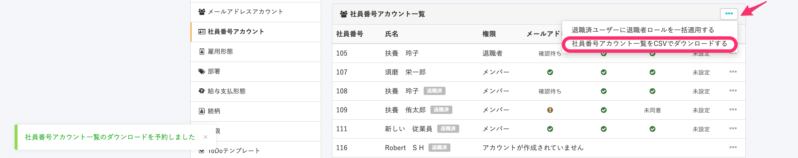

従業員のアカウント設定状況を把握するには、管理者画面でメールアドレスアカウント、または社員番号アカウントのステータスを確認します。

# メールアドレスアカウントの場合

## 1\. 画面右上のアイコン［共通設定］［メールアドレスアカウント］をクリック

ログイン後、 **画面右上のアイコン［共通設定］** をクリックします。

次に、画面の左に表示される **［共通設定］** の **［メールアドレスアカウント］** をクリックしてください。

## 2\. ステータスを確認する

メールアドレスアカウントの一覧で、確認したい従業員アカウントのステータスを確認します。

メールアドレスアカウント一覧の左にある **人型アイコン** は、従業員がパスワードを設定した後の状態を示します。

## ステータスの見方

**紙飛行機アイコン** は、招待中の従業員がパスワード設定を行なっていない状態を指します。

電子明細と2段階認証の列に **緑色のチェックマーク** がついている場合、該当の項目に同意、または設定していることを指します。

## ステータスをCSVファイルで確認する

なお、招待状況や2段階認証の状態、電子明細への同意は、ユーザー一覧のCSVファイルでも確認できます。

ユーザー一覧のCSVファイルをダウンロードするには、メールアドレスアカウント画面の **［一覧］** 項目の右にある、 **［...］メニュー**  で **［ユーザー一覧をCSVでダウンロードする］** をクリックしてください。

:::tips
従業員のメールアドレスアカウントにエラーが発生していた場合は、以下の記事をご覧ください。
[メールが届かない原因とエラーの確認方法](https://knowledge.smarthr.jp/hc/ja/articles/360026264593)
:::

# 社員番号アカウントの場合

## 1\. 画面右上のアイコン［共通設定］>社員番号アカウントをクリック

社員番号アカウントの状況を確認する際は、ログイン後  **画面右上のアイコン［共通設定］** をクリックします。

次に、画面の左に表示される **［共通設定］** の **［社員番号アカウント］** をクリックしてください。

## 2\. ステータスを確認する

 **［社員番号アカウント］** をクリックすると表示される画面で、従業員のメールアドレス・パスワード・電子明細・2段階認証の設定状況を確認できます。

 

## ステータスの見方

各フィールドに緑色のチェックマークが表示されている場合、従業員によるパスワードや電子明細の設定が完了していることを示します。

従業員側での設定が済んでいない場合、「未設定」または「未同意」が表示されます。

メールアドレスのステータス「確認待ち」は、従業員自身が設定したメールアドレスを認証していないときに表示されます。

:::tips
従業員のメールアドレスアカウントがバウンス状態になっていた場合は、以下記事をご覧ください。
[社員番号アカウントのメールのエラーを解除する](https://knowledge.smarthr.jp/hc/ja/articles/360036957333)
:::

## ステータスをCSVファイルで確認する

メールアドレス・パスワード・電子明細・2段階認証の設定状況は、社員番号アカウント一覧のCSVファイルでも確認できます。

### 1\. ［...］メニュー［社員番号アカウント一覧］をクリック

社員番号アカウント一覧のCSVファイルをダウンロードするには、社員番号アカウント画面の **［社員番号アカウント一覧］** 項目の右にある、 **［...］メニュー >［社員番号アカウント一覧をCSVでダウンロードする］** をクリックしてください。

画面左下に **［社員番号アカウント一覧のダウンロードを予約しました］** というメッセージが表示され、ダウンロードが予約されます。

### 2\. ［バックグラウンド処理］をクリック

画面左のメニューにある **［バックグラウンド処理］** をクリックします。

### 3\. ［社員番号アカウント一覧のダウンロード］をクリック

 **［処理名］** 欄にある **［社員番号アカウント一覧のダウンロード］** をクリックすると、 **［バックグラウンド処理詳細］** 画面に遷移します。

### 4\. ［添付ファイル］のリンクをクリック

画面の下部にある **［添付ファイル］** 項目に記載のリンクをクリックすると、社員番号アカウント一覧のCSVファイルがダウンロードされます。

