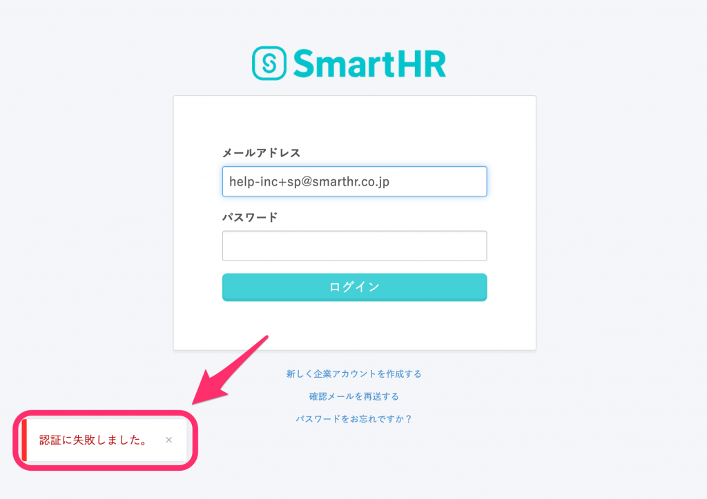
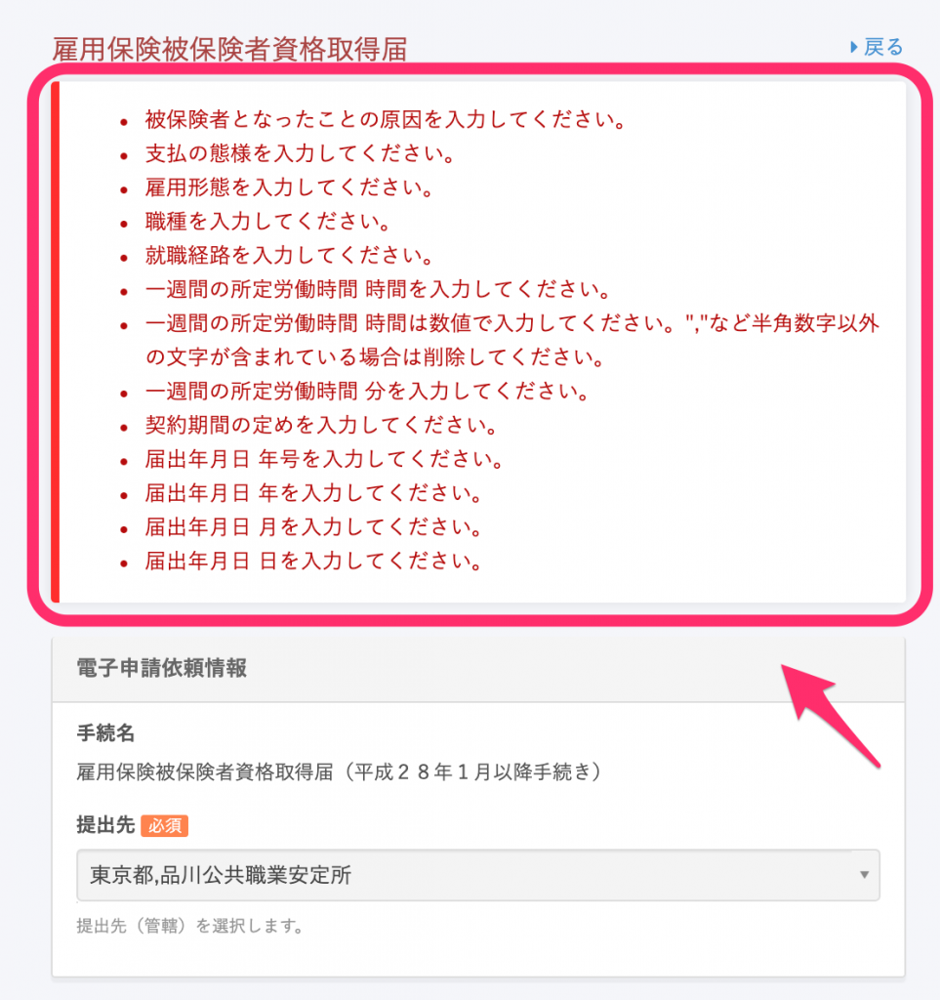
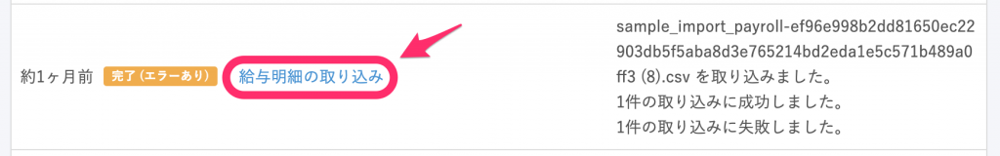
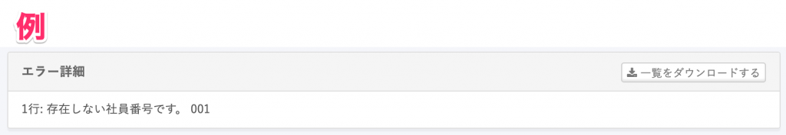

エラーが発生した場合の対応方法をご案内します。

# 操作中の画面に表示される場合

画面左下、もしくは上部にエラーメッセージが表示されます。

表示されたメッセージを確認し、エラーが発生している箇所の修正をお願いします。

# バックグラウンド処理の結果にエラーが表示される場合

従業員情報の一括更新やSmartHRへの招待、給与明細の登録など、バックグラウンド処理を行った場合は、 **\[共通設定\] > \[バックグラウンド処理\]** から結果の詳細を確認できます。

**\[完了（エラーあり）\]** もしくは **\[失敗\]** と表示されている場合は、バックグラウンド処理一覧の **\[処理名\]** をクリックし、詳細ページをご確認ください。

詳細ページの **\[エラー詳細\]** 欄に表示されているエラーの箇所を修正後、再度一括更新や招待などをお試しください。

# よくあるエラーの対応方法

## 従業員情報の一括登録

| エラーメッセージ | 原因・対処法 |
| :-- | :-- |
| 次の社員番号が重複しています | ファイル内に、同じ社員番号が指定されている行が複数あります。重複しないよう、削除・修正をしてください。 社員番号が何も表示されていない場合は、CSVファイルの社員番号欄にスペースなどの空白記号が入っている行が存在する可能性があります。 不要な空白行はすべて削除し、完全な空欄にしてください。 |
| 次の年金整理番号が重複しています | ファイル内に、同じ年金整理番号が指定されている行が複数あります。重複しないよう、削除・修正をしてください。 年金整理番号が何も表示されていない場合は、CSVファイルの年金整理番号欄にスペースなどの空白記号が入っている行が存在する可能性があります。 不要な空白行はすべて削除し、完全な空欄にしてください。 |
| ◯◯を入力してください。 | 姓・名や住所などの必須項目が不足している場合に表示されます。 必要な情報を含んだファイルでご登録ください。 |
| 存在しない◯◯です。 | 指定した部署や雇用形態などがマスターとして登録されていません。 適用日を指定している場合は、指定したマスターデータが適用日時点で存在しません。適用日時点で存在するマスターデータを指定してください。 適用日時点の情報がわからない場合は、個別に適用日を指定して従業員情報を登録してください。 [適用日を指定して従業員情報を登録する](https://knowledge.smarthr.jp/hc/ja/articles/360026262253) |
| 項目名に問題があるため、ファイルの取り込みに失敗しました。 | CSVファイルやExcelファイルの項目名に問題がある場合に表示されます。  **［エラー詳細］** の内容を確認し、修正したファイルを再度アップロードしてください。 |
| メールアドレスの値が不正です | メールアドレスが、メールアドレス形式に合ったものではない場合に表示されます。 正しいメールアドレスが入力されているか、改めてご確認ください。 |
| 適用日を指定する場合はプラン変更が必要です | 一括登録の際、適用日を指定する機能はスタンダードプラン、もしくはプロフェッショナルプランでのみご利用いただけます。 スモールプランからの変更をご検討いただく場合は、下記のページをご覧ください。 [スタンダードプランについてのお問合せ](https://smarthr.jp/standardplan_contact) |

## 給与明細の取り込み

| エラーメッセージ | 原因・対処法 |
| :-- | :-- |
| 次の社員番号が重複しています | ファイル内に、同じ社員番号が指定されている行が複数あります。重複しないよう、削除・修正をしてください。 社員番号が何も表示されていない場合は、CSVファイルの社員番号欄にスペースなどの空白記号が入っている行が存在する可能性があります。 不要な空白行はすべて削除し、完全な空欄にしてください。 |
| 存在しない社員番号です | SmartHRの従業員情報として存在しない社員番号が指定されています。 入力内容を見直し、正しい社員番号に修正してください。 |

## 源泉徴収票の取り込み

### CSVファイルを取り込む方法

| エラーメッセージ | 原因・対処法 |
| :-- | :-- |
| 次の社員番号が重複しています。 | ファイル内に、同じ社員番号が指定されている行が複数あります。重複しないよう、削除・修正をしてください。 社員番号が何も表示されていない場合は、CSVファイルの社員番号欄にスペースなどの空白記号が入っている行が存在する可能性があります。 不要な空白行はすべて削除し、完全な空欄にしてください。 |
| 存在しない社員番号です。 | SmartHRの従業員情報として存在しない社員番号が指定されています。 入力内容を見直し、正しい社員番号に修正してください。 |
| ◯◯を入力してください。 | 氏名や住所などの必須項目が不足している場合に表示されます。 必要な情報を含んだファイルでご登録ください。 |

### PDFと従業員を紐付ける方法

| エラーメッセージ | 原因・対処法 |
| :-- | :-- |
| 同じ社員番号のファイルは同時にアップロードできません。 | ファイル名に記載されている社員番号が同じPDFが複数アップロードされました。ファイル名を確認・修正してください。 |

## マイナンバーの一括登録

| エラーメッセージ | 原因・対処法 |
| :-- | :-- |
| 次の社員番号が重複しています | ファイル内に、同じ社員番号が指定されている行が複数あります。重複しないよう、削除・修正をしてください。 社員番号が何も表示されていない場合は、CSVファイルの社員番号欄にスペースなどの空白記号が入っている行が存在する可能性があります。 不要な空白行はすべて削除し、完全な空欄にしてください |
| 次の被扶養者が重複しています | 同じ続柄の被扶養者が2名以上存在しています。 続柄が重複しないよう、変更してください。 |
| 存在しない社員番号です | SmartHRの従業員情報として存在しない社員番号が指定されています。 先に従業員情報と社員番号を登録してから、マイナンバーの登録をお願いします。 |
| マイナンバーに不正な値が指定されました | 数字以外の文字が含まれていたり、12桁ではない場合などに表示されます。 マイナンバーは半角数字12 桁の数字で入力してください。 |
| 入力した数値に誤りがあります | マイナンバー12桁の中に誤った数字が含まれている場合に表示されます。 番号確認書類を元に、改めてご確認ください。 |
| インポートに失敗しました。マイナンバーの入力は必須です | マイナンバーが空欄の行が存在する場合に表示されます。 マイナンバーを取り込まない従業員の行は、マイナンバー欄を空欄にするのではなく、行ごと削除してください。 |
| 既にマイナンバーは登録されています | 指定した従業員のマイナンバーが登録済みの場合に表示されます。 何らかの事情でマイナンバーの変更が必要な場合は、登録済みのマイナンバーを削除した後、登録の操作をしてください。 |

## マイナンバーの一括提供依頼

| エラーメッセージ | 原因・対処法 |
| :-- | :-- |
| 次の社員番号が重複しています | ファイル内に、同じ社員番号が指定されている行が複数あります。重複しないよう、削除・修正をしてください。 社員番号が何も表示されていない場合は、CSVファイルの社員番号欄にスペースなどの空白記号が入っている行が存在する可能性があります。 不要な空白行はすべて削除し、完全な空欄にしてください。 |
| 次の被扶養者が重複しています | 同じ続柄の被扶養者が2名以上存在しています。 続柄が重複しないよう、変更してください。 |
| 存在しない社員番号です | SmartHRの従業員情報として存在しない社員番号が指定されています。 入力内容を見直し、正しい社員番号に修正してください。 |

## メールアドレスアカウントの権限一括更新

| エラーメッセージ | 原因・対処法 |
| --- | --- |
| 〇〇の権限は存在しません。 | ファイル内の \[権限\] 項目に、SmartHRに登録されていない権限名が入力されています。 \[共通設定\] > \[権限\] に登録されている権限（ロール）の名前と合っているか、スペースが入っていないか等、ご確認ください。 半角・全角、大文字・小文字も区別されます。 |
| CSVによる管理者権限への更新はできません。 | ファイル内の \[権限\] 項目に、\[管理者\] と入力されています。 管理者以外の権限名を入力するか、CSVを使用せず個別にアカウントを編集して管理者権限を選択してください。 |
| 〇〇は管理者権限と紐付いているためCSVによる更新はできません。 | 管理者アカウントのメールアドレスが入力されています。 \[メールアドレスアカウント\] の画面からCSVを使用せず個別にアカウントを編集してください。 |
| 〇〇は操作可能範囲外の従業員です | 変更可能な部署の範囲外の従業員を指定している可能性があります。 指定したメールアドレスに誤りがないか、\[共通設定\] > \[権限\] 画面の操作可能範囲、もしくは従業員に紐づく部署をご確認ください。 |
| 〇〇の権限は実行者のアカウントのため変更できません。 | ファイル内の \[メールアドレス\] に自身の情報が入力されています（CSVによる自分自身の権限変更はできません）。 権限の変更が必要な場合は、別のアカウントで変更権限を持っている担当者さまよりご対応をお願いします。 |
| 次のメールアドレスが重複しています。 | ファイル内に、同じメールアドレスが指定されている行が複数あります。 重複しないよう、削除・修正をしてください。 |
| 〇〇のメールアドレスアカウントは存在しません。 | メールアドレスアカウントとして登録されていないメールアドレスが入力されています。 登録済みのメールアドレスと合っているか、スペースが入っていないか等、ご確認ください。 (ダウンロードしたテンプレートの内容は、\[権限\] 以外変更せずにアップロードしてください。) |
