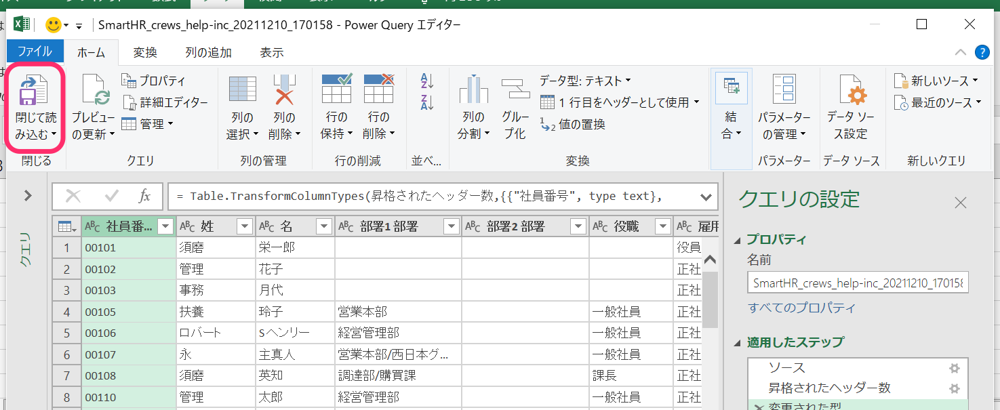
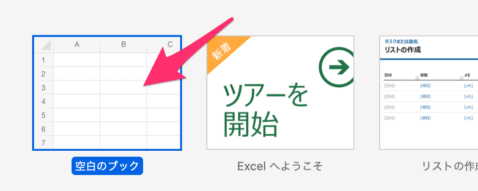

:::alert
このページに記載している内容は、サポート対象外です。
ご不明な点がある場合は、それぞれのサポート元へお問い合わせください。
[SmartHRサポートポリシー](https://knowledge.smarthr.jp/hc/ja/articles/360044805593#toc--4)
:::

# A. 列のデータ形式を「文字列」に指定してください。

従業員の一括登録や部署の一括追加などで使用する、SmartHRからダウンロードしたCSVファイルをExcelで開くと、「0」が消えてしまう場合や、数値が日付として表示される場合があります。

社員番号や部署コードを「00001」のように採番しているケースでは、CSVファイルを編集する際にSmartHR上では登録されている**0が消えてしまい、CSVファイルを使った設定がエラーになることがあります。**

先頭の「0」が消えてしまう事象は、「整数ではない数列は最初の0が消えてしまう」というExcelの仕様が原因です。

以下に回避方法をまとめました。

## Windows版 Excel 2016の場合

### 1\. メニュー［データ］>［テキストファイル］をクリック

新しいスプレッドシートを用意し、メニュー **［データ］>［テキストファイル］** をクリックします。

 **［テキストファイル］** をクリックすると、ファイルを選択するウィンドウが表示されます。

### 2\. ファイルを選択して［インポート］をクリック

読み込むCSVファイルを選んだら、ウィンドウ下にある **［インポート］** をクリックしてください。

### 3\. テキスト ファイル ウィザードの内容を確認し、「先頭行をデータの見出しとして使用する」を選択して［次へ］をクリック

### 4\. 区切り文字の「タブ」「カンマ」にチェックを入れ、［次へ］をクリック

### 5.「0」を消したくない列に対して、列のデータ形式「文字列」を選択し、［完了］をクリック

データのプレビューで「0」を消したくない列が選択されていることを確認し、列のデータ形式は **［文字列］** を選択し、 **［完了］** をクリックします。

:::tips
列を選択しているかどうかは、文字色と背景色で判断してください。
- 列の選択ができている場合：文字色が**白**、背景色が**黒**で表示されています。
- 列の選択ができていない場合：文字色が**黒**、背景色が**白**で表示されています。

列の選択ができていない場合、列を選択するには **［列名］** をクリックしてください。
:::

### 6\. 取り込んだデータを配置する場所を指定し、［OK］をクリック

取り込んだデータを配置するシートと行・列を指定して **［OK］** をクリックすると、データが正しく取り込まれます。

## Windows版 Excel Office365の場合

### 1\. Excelで新規シートを作成

Excelを開き、 **［空白のブック］** をクリックして新規シートを作成します。

### 2.［データ］メニュー >［テキストまたはCSVから］をクリック

画面上部にある **［データ］** メニューを選択後、 **［テキストまたはCSVから］** をクリックします。

### 3\. CSVファイルを選択し、［インポート］をクリック

データの取り込み画面が表示されるので、CSVファイルを選択して **［インポート］** をクリックします。

### 4.［データの変換］をクリック

CSVファイルをインポートすると、ファイルの内容が表示されます。

画面右下にある **［データの変換］** をクリックしてください。

### 5\. 社員番号が含まれる列が選択されていることを確認

社員番号が含まれる列が選択されていると、列全体が薄緑色で表示されます。

列が選択されていない場合は、列名の **［社員番…］** をクリックして、列全体を選択してください。

### 6.［変更された型］をクリック

画面右下の **［適用したステップ］** にある **［変更された型］** をクリックします。

### 7\. カーソルを「社員番号が含まれる列」にあわせて右クリックし、［型の変更］>［テキスト］を選択

カーソルを社員番号が含まれる列にあわせて右クリックし、表示されるメニューから **［型の変更］>［テキスト］** を選択します。

この操作によって「数値（整数）」として扱われていた情報を「テキスト」として扱うよう指定します。

### 8.［現在のものを置換］をクリック

 **［型の変更］>［テキスト］** をクリックすると、 **［列タイプの変更］** ダイアログが表示されます。

 **［現在のものを置換］** をクリックすると、テキスト化したデータが反映されます。

### 9.［閉じて読み込む］をクリック

 **［閉じて読み込む］** をクリックすると、設定した内容が適用され、社員番号の先頭の「0」が表示されます。

## Excel for Macの場合

### 1\. Excelで新規シートを作成

Excelを開き、 **［空白のブック］** をクリックして新規シートを作成します。

### 2.［ファイル］>［インポート］の順にクリック

メニュー項目 **［ファイル］>［インポート］** の順にクリックします。

### 3.［CSVファイル］を選択し、［インポート］をクリック

インポートダイアログが表示されるので、 **［CSVファイル］** を選択し、 **［インポート］** をクリックします。

インポートするファイルを選択し、 **［データ取り出し］** をクリックします。

### 4\. ［区切り記号付き］を選択し、［次へ >］をクリック

テキスト ファイル ウィザードの内容を確認し、区切るデータの形式は **［区切り記号付き］** を選択し、 **［次へ >］** をクリックします。

### 5\. ［タブ］［カンマ］を選択し、［次へ >］をクリック

区切り文字は **［タブ］** と **［カンマ］** を選択し、 **［次へ >］** をクリックします。

### 6\. 選択したデータのプレビューで、［社員番号］の列が選択されていることを確認

選択したデータのプレビューで、 **［社員番号］** の列が選択されていることを確認します。

列が選択されている場合、文字色が**白**、背景色が**黒**で表示されています。

列が選択されていない場合は文字色が**黒**、背景色が**白**で表示されているので、列をクリックして選択してください。

### 7\. 列のデータ形式は［文字列］を選択し、［完了］をクリック

列のデータ形式は **［文字列］** を選択し、 **［完了］** をクリックします。

 **［文字列］** を選択すると、選択したデータのプレビューで列のデータ形式が **［標準］** から **［文字列］** に変更されたことが確認できます。

### 8\. 取り込んだデータを配置する場所を指定し、［OK］をクリック

取り込んだデータを配置するシートと行・列を指定して、右下にある **［OK］** をクリックすると、データが正しく取り込まれます。

