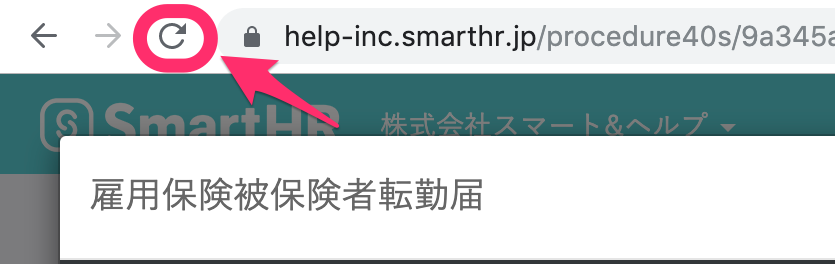

添付画像やPDF形式の書類をプレビューする画面が真っ白になってしまったり、プレビューではなく保存されてしまう場合は、以下の対処法をお試しください。

# ページをリロードする

プレビュー画面が真っ白になる場合、手続きページをブラウザ上でリロードしてみてください。

リロード後にもう一度書類を開くと、正常に表示されることがあります。

# 時間を置いてもう一度試す

プレビュー画面が真っ白になってしまった場合、ファイルが表示されるまで時間がかかっていることが原因のケースも考えられます。

その場合、一度時間を置いて再度お試しいただくと解消されます。

# Adobe Acrobat Reader設定を確認する

上記を試したものの解決しない場合や、PDFがプレビューではなく保存されてしまう場合は、Adobe Acrobat Readerが有効化されていない可能性があります。

Adobe Acrobat Readerの設定方法はブラウザによって異なりますので、下記の設定方法をご確認ください。

[PDF をブラウザーで表示 | Acrobat、Acrobat Reader | Adobe](https://helpx.adobe.com/jp/acrobat/using/display-pdf-in-browser.html)
