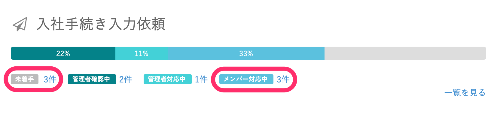
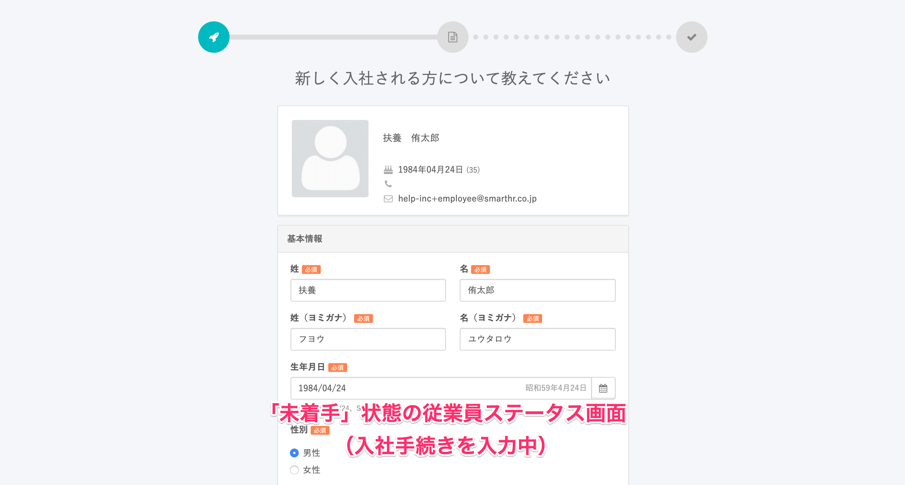
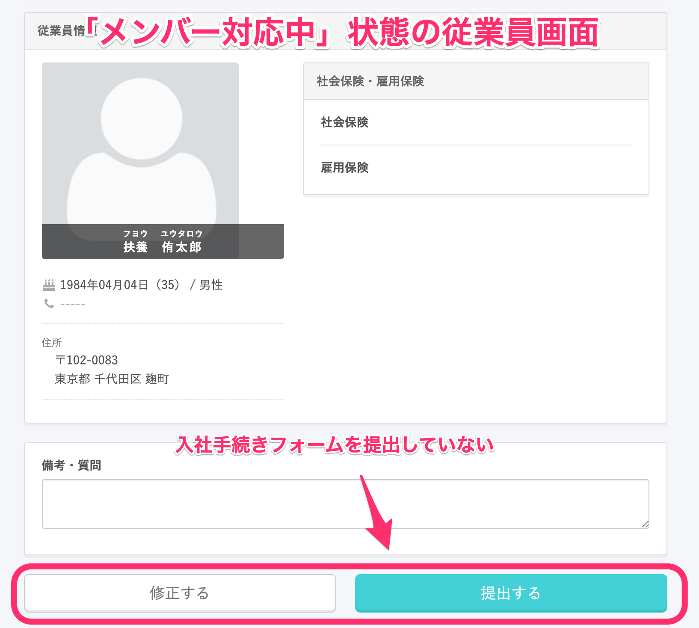
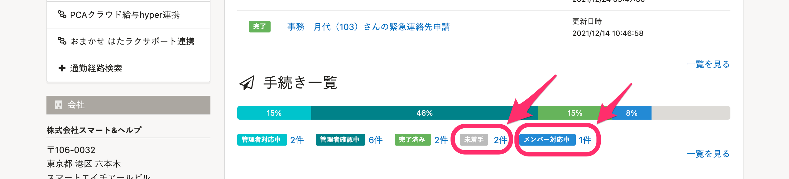
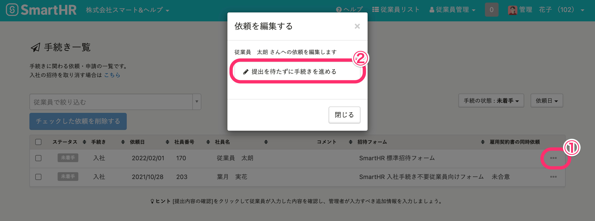
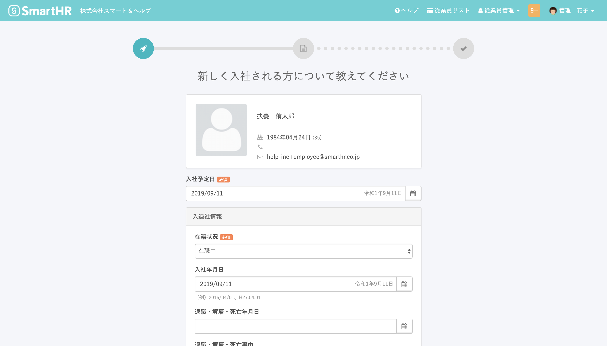

従業員が入社手続きを提出していない場合、手続きのステータスは「未着手」または「メンバー対応中」と表示されます。

従業員さまが「フォームを入力した」と言っているにもかかわらず、「未着手」や「メンバー対応中」になっている場合は、以下のケースに当てはまっているかどうかをご確認ください。

# 「未着手」「メンバー対応中」になっている理由

入社手続き依頼のステータスが「未着手」または「メンバー対応中」と表示される場合、原因として従業員が入社手続きの入力を進めていない、または入力が完了した入社手続きを提出していないことが考えられます。

## ステータスが「未着手」の状態

従業員が入社手続きを記入中で提出の確認画面まで進んでいない場合、ステータスは「未着手」と表示されます。

## ステータスが「メンバー対応中」の状態

従業員が入社手続きフォームを提出せず確認画面で止まっている場合、入社手続き依頼のステータスは「メンバー対応中」と表示されます。

# 従業員の提出を待たずに確認を進める

入社手続き依頼のステータスが「未着手」または「メンバー対応中」の場合でも、管理者は従業員のフォーム提出を待たずに入社手続きを進められます。

## 1\. ［手続き一覧］>［未着手］または［メンバー対応中］をクリック

ログイン後のトップページをスクロールして、 **［手続き一覧］** 下にある **［未着手］** または **［メンバー対応中］** の件数をクリックします。

## 2\. ［...］メニュー >［提出を待たずに手続きを進める］をクリック

進めたい手続きの **［…］** **メニュー** をクリックすると、 **［依頼を編集する］** ダイアログが表示されるので **［提出を待たずに手続きを進める］** をクリックします。

 **［提出を待たずに手続きを進める］** をクリックすると、管理者が入社手続きを進める画面に遷移します。

