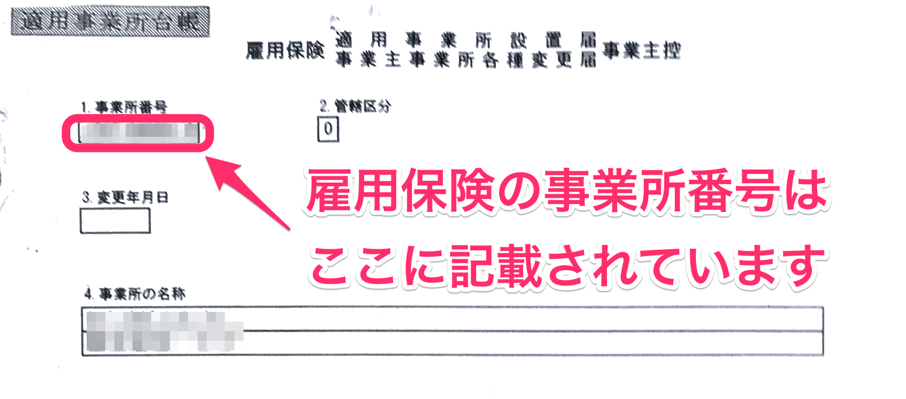

雇用保険の事業所番号についてご説明します。

# どんなもの？

事業所ごとに付与された11桁（4桁-6桁-1桁）の数字です。

（例）1234-567890-1

# どこでわかるの？

以下の書類等で確認できます。

- 雇用保険適用事業所設置手続きの際に交付された
    「適用事業所台帳（雇用保険適用事業所設置届事業主控）」
- 資格取得手続きの際に交付された
    「雇用保険被保険者資格取得等確認通知書（事業主通知用）」

:::tips
厚生年金保険にも「事業所番号（5桁）」がありますが、雇用保険の事業所番号とは別物ですのでご注意ください。
:::

## （補足）事業所番号が10桁の場合

1981年7月6日以前に雇用保険に加入した場合には10桁の事業所番号が採番され、同日以降に安定所から発送されます。

書類には新たに最後の1桁が付与された番号が記されていますので、そちらをご利用ください。
