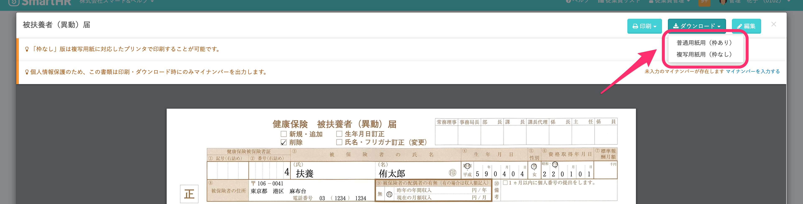

複写式の書類でも、一般的なプリンタで普通紙に印刷し、提出できます。

社会保険労務士さまなど、ドットインパクトプリンタをご利用の場合は、従来通り複写用紙への印刷にも対応しています。

# 用紙のスタイルによって印刷方法を選択します

## 普通用紙に印刷する場合（一般的なプリンタ）

該当書類のプレビュー画面にて、 **\[印刷\]** または **\[ダウンロード\]** をクリック > **\[普通用紙用（枠あり）\]** をご選択ください。

## 複写用紙

該当書類のプレビュー画面にて、 **\[印刷\]** または **\[ダウンロード\]** をクリック > **\[複写用紙用（枠なし）\]** をご選択ください。
