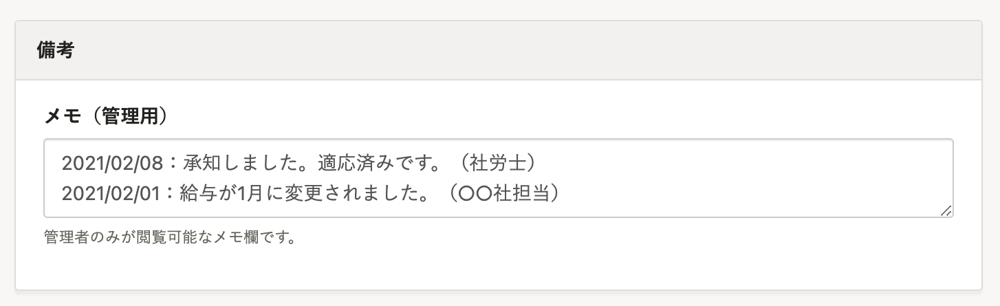

社労士様からよくいただく質問と、質問に対する回答内容をご紹介します。

# 自分のアカウントは従業員として登録されていますか？

SmartHRでは、従業員情報とユーザーアカウントは別々に管理しているため、ユーザーアカウントと従業員情報を紐付けないかぎり、従業員登録はされません。

ユーザーと従業員の区別は下記のとおりです。

| 名称 | 内容 |
| --- | --- |
| ユーザー | 従業員SmartHRにログイン可能なユーザーアカウントを指し、SmartHRを利用するためにはユーザーアカウントの発行が必要です。 ユーザーアカウントの追加手順は、以下のヘルプページをご確認ください。 [従業員以外のアカウント（＝メンバー権限ではないアカウント）をSmartHRに追加・招待する](https://knowledge.smarthr.jp/hc/ja/articles/360026265313) |
| 従業員 |   - SmartHRで管理されている従業員を指し、SmartHRで手続きを行うと自動で作成されます。 - 手続きの有無にかかわらず、従業員の登録・削除を行うことで従業員情報の管理にもご利用いただけます。 - 必ずしも従業員がユーザーアカウントを持つ必要はありませんが、その場合は従業員自身でSmartHRを利用した手続きを行うことはできません。   |

# 入退社等、各種手続きを開始したタイミングで通知を受けとることはできますか？

メールで通知を受けとることができます。

社労士様のユーザーアカウントを**管理者権限**としてご登録いただくと、新しい手続きが作成された時・従業員変更が行われた時に通知が送られます。

# 顧問先とコメントのやり取りはできますか？

従業員情報にある **［備考］** 欄 > **［メモ（管理用）］** を工夫することで、コメントのやり取りができます。

# 勤怠管理機能はありますか？

いいえ、勤怠管理機能は用意していません。

ただし、他社の勤怠管理サービスと連携し、サービス間で従業員情報の同期ができます。

連携できる勤怠管理システムについては、以下のページをご確認ください。

[SmartHR と連携しているサービス一覧](https://knowledge.smarthr.jp/hc/ja/articles/360026105974)

# 給与計算機能はありますか？

いいえ、給与計算機能は用意していません。

ただし、他社の給与計算ソフトと連携し、従業員情報の同期や給与データの取り込みができます。

連携できる給与計算ソフトについては、以下のページをご確認ください。

[SmartHR と連携しているサービス一覧](https://knowledge.smarthr.jp/hc/ja/articles/360026105974)

また、給与明細機能は用意していますので、ご活用ください。

[給与明細機能とは](https://knowledge.smarthr.jp/hc/ja/articles/360026107314)
