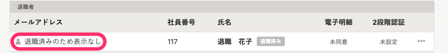

# A. はい、できます。

退職後も、給与明細や源泉徴収票の閲覧など限定した範囲でSmartHRを利用できる、退職者向けの権限を用意しています。

退職後もSmartHRを限定的に利用するには、以下の操作を行なってください。

退職者権限で利用できる機能は、下記のヘルプページをご覧ください。

:::related
[システム標準権限が利用できる機能と操作できる範囲](https://knowledge.smarthr.jp/hc/ja/articles/360026266513)
:::

## 1\. 退職者のSmartHRアカウントを、退職者権限に変更する

退職した従業員の権限を変更する手順は、下記のヘルプページをご覧ください。

:::related
[メールアドレスアカウントに退職者権限を適用する](https://knowledge.smarthr.jp/hc/ja/articles/360026106034)
[社員番号アカウントに退職者権限を適用する](https://knowledge.smarthr.jp/hc/ja/articles/360051434473)
:::

## 2\. 従業員のログイン・通知用メールアドレスを、従業員自身が退職後も利用できるものに変更する

該当従業員のSmartHRアカウントのメールアドレス（ログイン・通知用メールアドレス）を、従業員自身が退職後も利用できるものに変更します。

従業員の転職先の会社でもSmartHRを使用している場合、同じログイン・通知用メールアドレスでいずれのSmartHRにもログインできます。

ログイン・通知用メールアドレスは、従業員自身に変更を依頼してください。

:::related
[ログイン・通知用メールアドレスを設定（変更）する](https://knowledge.smarthr.jp/hc/ja/articles/360026263093)
:::
:::alert
ログイン・通知用メールアドレスは、従業員情報のメールアドレスの項目に登録されている情報とは異なります。
従業員情報のメールアドレスを変更しても、ログイン・通知用メールアドレスは変更されません。
管理者権限があっても、従業員のログイン・通知用メールアドレスは変更できません。
:::
:::tips
在籍状況が **［退職済］** の従業員のログイン・通知用メールアドレスは、個人情報保護のため、 **［アカウント管理］の［閲覧］** 権限があっても確認できません。
アカウントの一覧画面では、 **［退職済みのため表示なし］** と表示されます。

:::

# ログインできない状態にするには？

## SmartHRのアカウントを削除してください。

詳しくは [メールアドレスアカウントを削除する](https://knowledge.smarthr.jp/hc/ja/articles/360026107594) をご覧ください。
