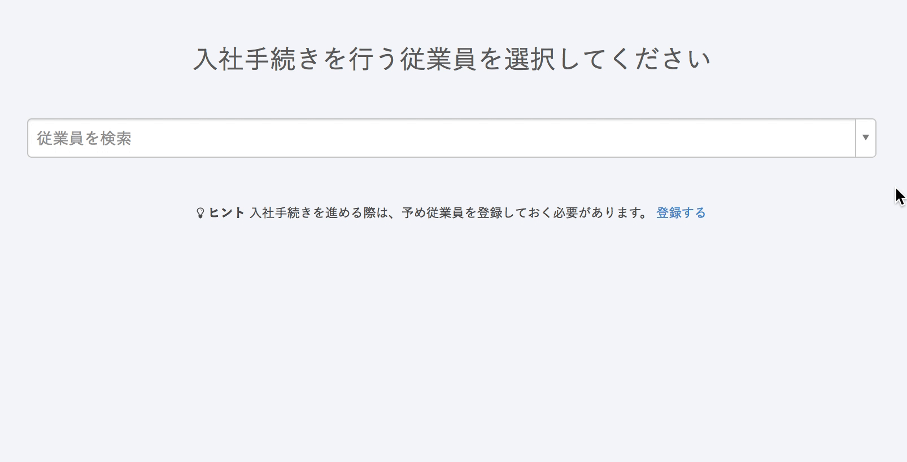

# 検索フィールドに入力をお願いします

ドロップダウンリストには最大10名しか表示されません。

手続き作成時など、ドロップダウンリストに該当従業員が表示されていない時は、検索フィールドに **社員番号** または  **氏名（一部でも可）**  を入力してください。

候補が表示されますので、任意の従業員をクリックし、先へ進んでください。

（▲ こちらの画像は、入社の手続き作成画面です。）

それでも該当従業員が一覧に表示されない場合は、下記のページをご覧ください。

:::related
[Q. 手続き作成時、従業員が対象として表示されないのはどんなとき？](https://knowledge.smarthr.jp/hc/ja/articles/360026105854)
:::
