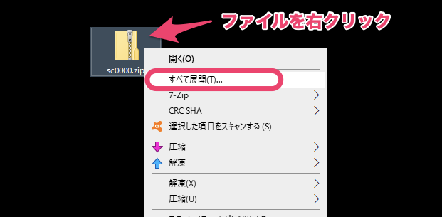

# A. OSの標準の機能で展開してください

展開ソフトではなく、OS標準の機能で展開すると、文字化けしません。

ZIPファイルを右クリックし、 **［すべて展開］** をクリックします。

:::tips
ZIPファイルを右クリックした際に、 **［すべて展開］** が表示されない場合は、下記のページをご覧ください。
[zip形式の圧縮フォルダーを右クリックした際に［すべて展開(T)］が表示されない＜Windows(R)8＞](http://dynabook.com/assistpc/faq/pcdata2/014610.htm)
ご不明点がある場合は、[Microsoft サポート](https://support.microsoft.com/ja-jp/contactus)へお問い合わせください。
:::

なお、Windows7以前のOSの場合、ファイルを解凍した際に文字化けすることがあります。

古いOSは最新のブラウザが使えないため、動作環境外となります。OSのアップデートをご検討ください。

:::related
[SmartHRの動作環境は？](https://knowledge.smarthr.jp/hc/ja/articles/360035170054)
:::
