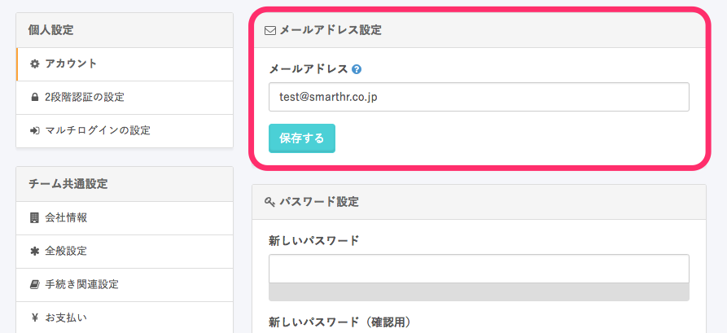

ご利用中のメールアドレスによっては、SmartHRから送信されるメールが受信できない場合があります。

メールが届かない場合は、以下をご確認ください。

1.  入力されたメールアドレスが正しいか確認する
2.  メールの受信設定を確認する

# 1\. 入力されたメールアドレスが正しいか確認する

まずは入力されたメールアドレスが正しいかをご確認ください。
アカウントのメールアドレスは **\[個人設定\] > \[メールアドレス設定\]** で変更・確認が可能です。

# 2\. メールの受信設定を確認する

## キャリアメールの場合

キャリアメールアドレスをご利用中の場合、「PC からのメールの受信拒否」や「URL 付きメールの拒否」などの設定により、正しく受信できない場合がございます。

その場合には受信許可リスト（ホワイトリスト）に「smarthr.jp」ドメインからのメールを受信するよう設定してください。

### docomo

[指定受信／拒否設定 | お知らせ | NTTドコモ](https://www.nttdocomo.co.jp/info/spam_mail/spmode/domain/index.html#p02) へアクセスし、該当する設定方法を参考に \[smarthr.jp\] を受信リストへ追加してください。

### au

[受信リスト設定 | 迷惑メールフィルター機能 | au](https://www.au.com/support/service/mobile/trouble/forestalling/mail/anti-spam/fillter/function-11/) へアクセスし、該当する設定方法を参考に \[smarthr.jp\] を受信リストに追加してください。

上記設定後も受信が出来ない場合は [なりすまし規制 | 迷惑メールフィルター機能 | au](https://www.au.com/support/service/mobile/trouble/forestalling/mail/anti-spam/fillter/function-09/) の設定変更をお試しください。

### Softbank

[迷惑メールの受信許可・拒否設定をする | 迷惑メールでお困りのとき | お客さまサポート | モバイル | ソフトバンク](https://www.softbank.jp/mobile/support/antispam/settings/whiteblack/) へアクセスし、該当する設定方法を参考に \[smarthr.jp\] を受信許可リストへ追加してください。

## キャリアメール以外の場合

### G Suite

[Gmail で IP アドレスをホワイトリストに登録する - G Suite 管理者 ヘルプ](https://support.google.com/a/answer/60751?hl=ja) を参考に送信元 IP アドレス \[168.245.113.131\] をホワイトリストへ追加してください。
