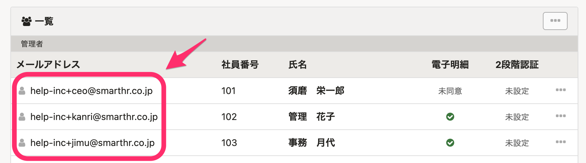
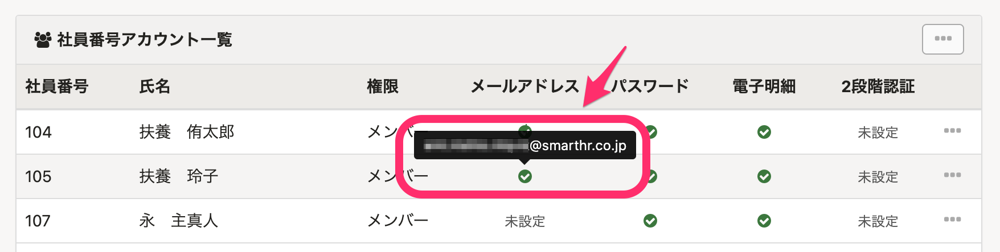
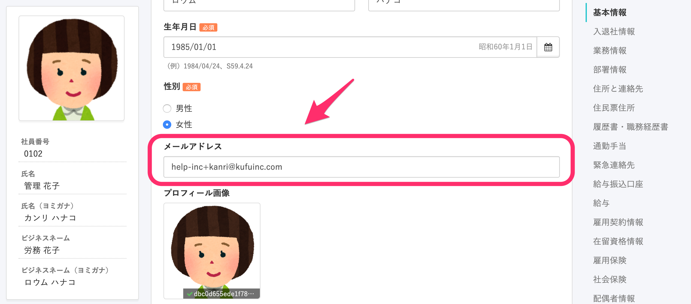

SmartHRから送られる各種通知は、ログイン時に利用するメールアドレスに届きます。

# 通知先メールアドレスの確認方法

## 自身のメールアドレスを確認する場合

**画面右上のアカウント名** \> **［個人設定］** \> **［アカウント］** \> **［メールアドレス設定］** から確認できます。

## 従業員のメールアドレスを確認する場合（管理者向け）

従業員のアカウントの種類によって確認する方法が異なります。

- ### メールアドレスアカウントの従業員
    

**画面右上のアカウント名** > **［共通設定］** \> **［メールアドレスアカウント］** をクリックし、 **［一覧］** から確認できます。

- ### 社員番号アカウントの従業員
    

**画面右上のアカウント名** \> **［共通設定］** \> **［社員番号アカウント］** をクリックし、 **［社員番号アカウント一覧］** の **［メールアドレス］** 列の緑のチェックマークにカーソルを合わせると確認できます。

# 通知先メールアドレスの変更方法

## 自身のメールアドレスを変更する場合

**画面右上のアカウント名 >** **［個人設定］** \> **［アカウント］** \> **［メールアドレス設定］** から変更可能です。

## 従業員のメールアドレスを変更する場合（管理者向け）

下記のページで詳しくご案内しています。

:::related
[既存ユーザーの SmartHR アカウント（メールアドレス）を変更・再招待する](https://knowledge.smarthr.jp/hc/ja/articles/360026265393)
:::

# 従業員情報ページのメールアドレス欄について

 **［従業員リスト］** の従業員情報ページにもメールアドレス欄がありますが、こちらは単なる**情報**としての項目となります。

こちらを変更しても 通知先メールアドレス や ログイン時のメールアドレス は変更されませんのでご留意ください。（変更する場合は、前項の対応を行なってください）
