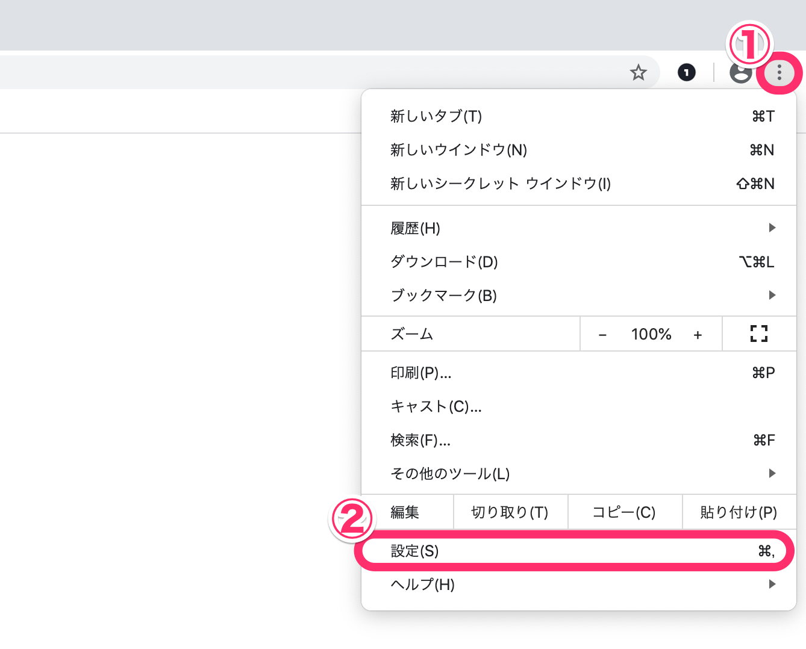
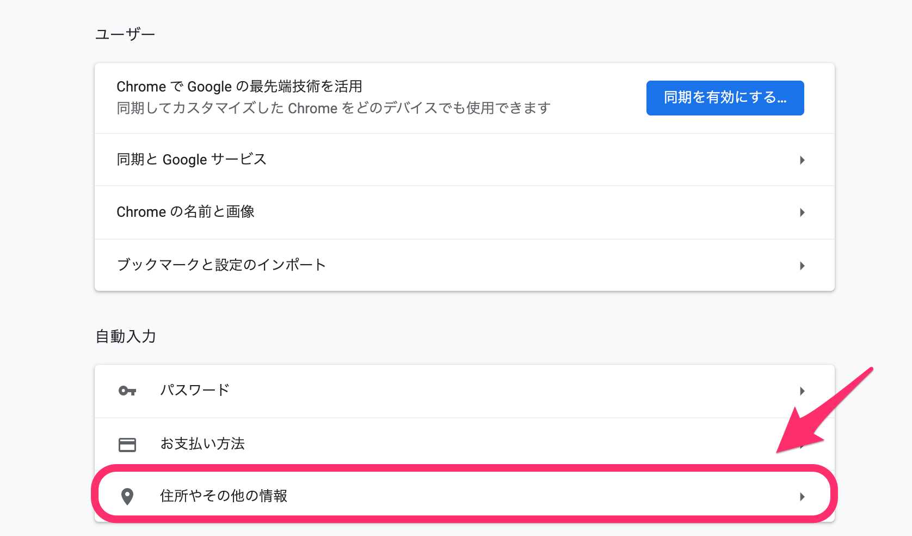
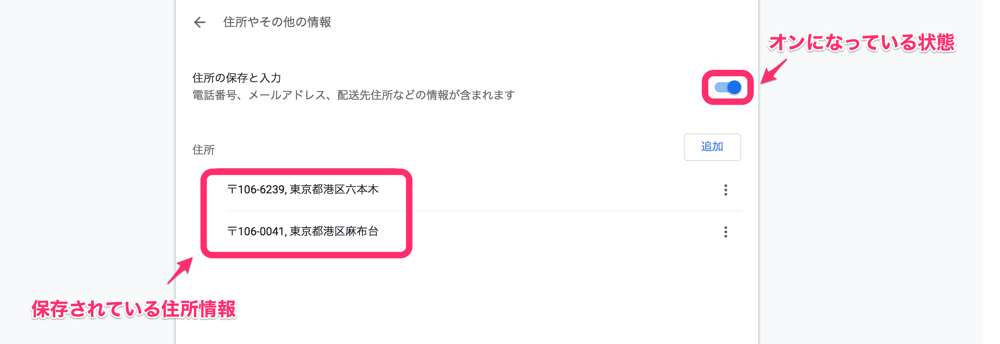
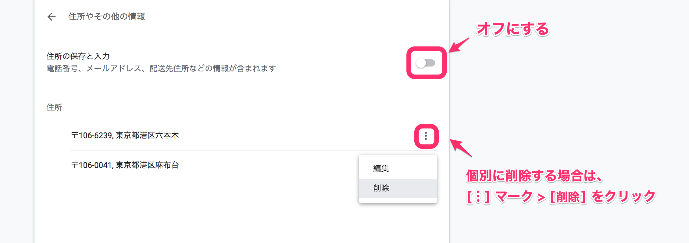

「住所等、登録した覚えがない情報が登録されていた」といった事象があった場合、ブラウザのフォーム自動入力機能がオンになっている可能性があります。

設定をご確認の上、設定をオフにするなどのご対応をご検討ください。

Google Chromeで住所の自動入力を確認・設定する方法を以下に記載します。

# 1\. Google Chromeを開く

Google Chromeのブラウザを開いてください。

# 2\. 画面右上の \[︙\] マーク > \[設定\] をクリック

画面右上の **\[︙\] マーク > \[設定\]** をクリックします。

# 3\. \[自動入力\] の \[住所やその他の情報\] をクリック

**\[設定\]** をクリックすると表示される画面にある、 **\[自動入力\]** 項目で **\[住所やその他の情報\]** をクリックしてください。

**\[住所の保存と入力\]** がオンになっている場合、**\[住所\]** に表示されている住所情報が候補として自動で入力されます。

# 4\. \[住所の保存と入力\] 全体をオフにする、または住所を削除する

住所情報を保存しない場合は **\[住所の保存と入力\]** 全体をオフにし、使用しない住所を個別に削除してください。

