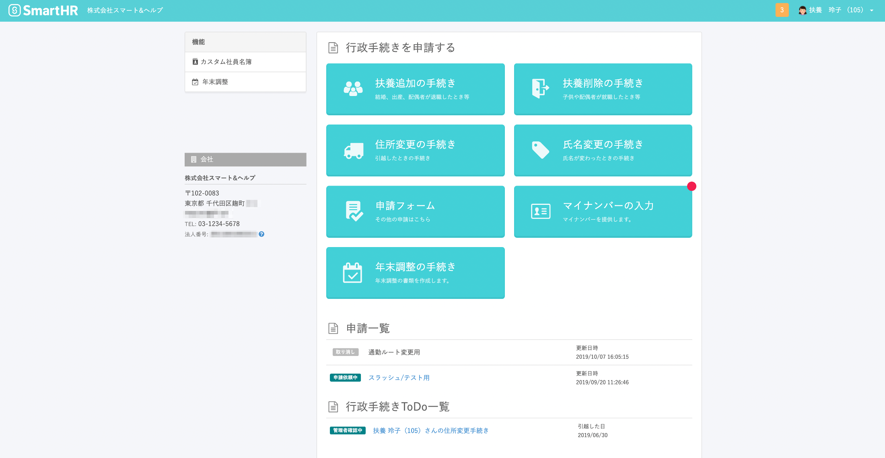

従業員は、扶養の追加・削除や住所変更の申請ができます。

また、配布された給与明細や源泉徴収票の確認も可能です。

# 扶養追加の手続き

結婚や出産等で扶養追加を行う際に必要な手続きを開始します。

[従業員から扶養追加の手続きを申請する](https://knowledge.smarthr.jp/hc/ja/articles/360026262113)

# 扶養削除の手続き

子供や配偶者が、就職などで扶養から抜ける場合に必要な手続きを開始します。

[従業員から扶養削除の手続きを申請する](https://knowledge.smarthr.jp/hc/ja/articles/360026262013)

# 住所変更の手続き

引越しを行った際に必要な手続きを開始します。

[従業員から住所変更の手続きを申請する](https://knowledge.smarthr.jp/hc/ja/articles/360026723753)

# 氏名変更の手続き

氏名が変わったときに必要な手続きを開始します。

[従業員から氏名変更の手続きを申請する](https://knowledge.smarthr.jp/hc/ja/articles/360032251593)

# 申請フォーム

スタンダードプラン以上をご利用の場合は、「申請フォーム」の利用が可能です。

管理者が設定した申請フォームを使って、自分の従業員情報の変更などの申請を提出できます。

[申請機能とは](https://knowledge.smarthr.jp/hc/ja/articles/360026103894)

# マイナンバーの入力

マイナンバーの入力依頼に対して、回答できます。

_※マイナンバー提出依頼が届くまでは、ボタンは表示されません。_

[マイナンバーの提供依頼が届いたら？](https://knowledge.smarthr.jp/hc/ja/articles/360026266313)

# 年末調整の手続き

年末調整の入力依頼に対して、回答できます。

_※年末調整の依頼が届くまでは、ボタンは表示されません。_

# 手続きToDo一覧

申請した手続きの履歴（最新5件）を表示しています。

# 給与明細

配布された給与明細を確認できます。

_※給与明細が配布されるまでは表示されません。_

[発行された給与明細を確認する](https://knowledge.smarthr.jp/hc/ja/articles/360026266213)

# 源泉徴収票

_※源泉徴収票が配布されるまでは表示されません。_

[発行された源泉徴収票を確認する](https://knowledge.smarthr.jp/hc/ja/articles/360041942833)

# 自分の情報の変更

プロフィール画像や連絡先など、自分の情報の一部は **［プロフィールの確認］** から変更できます。

[自分の情報を変更する](https://knowledge.smarthr.jp/hc/ja/articles/360026266333)
