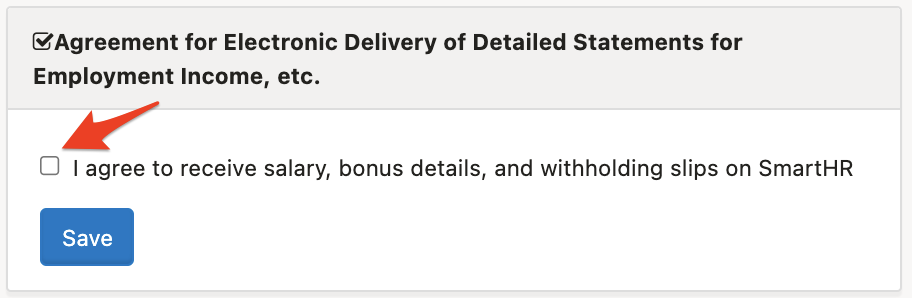
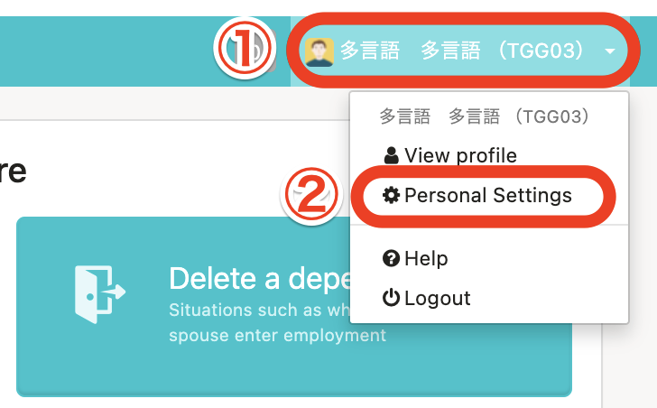
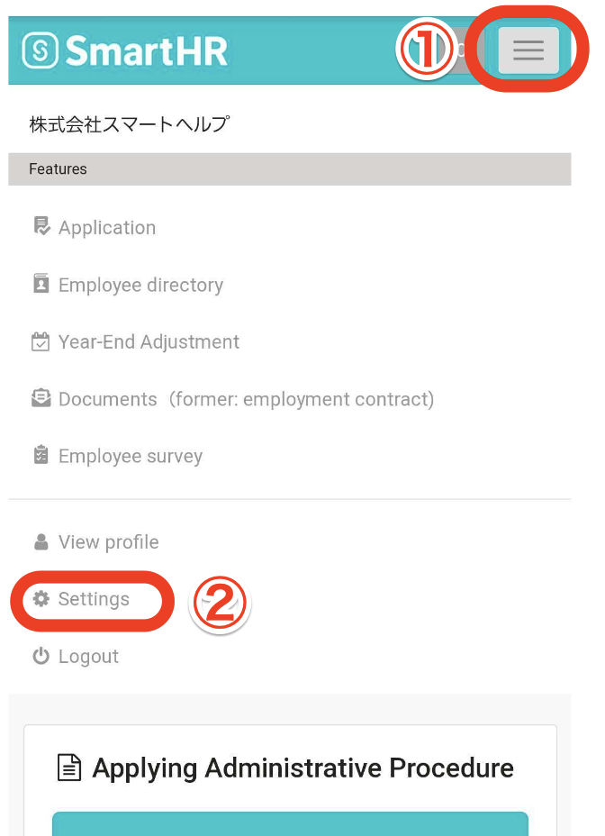
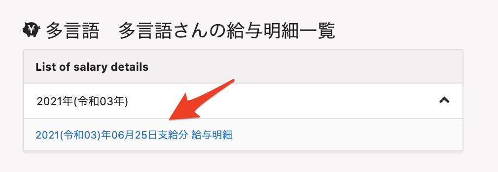
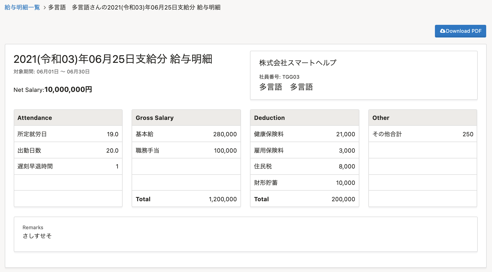
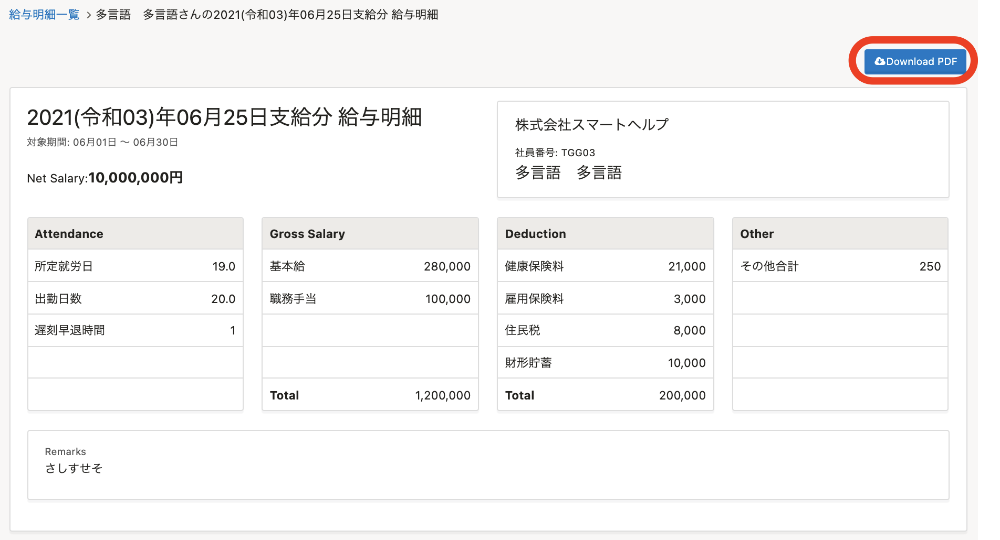

This section explains how to check issued payslips.

# Important points when checking payslips

Employees must have consented to the **Agreement for Electronic Delivery of Detailed Statements for Employment Income, etc.** to check their payslips on SmartHR.

## 1\. Agree to electronic delivery using a computer

If you are using a computer, consent to the agreement from **your account name at the top right corner of the screen > \[Personal Settings\].**

## 2\. Agree to electronic delivery using a smartphone

If you are using a smartphone, consent to the agreement from **the menu bar at the top right of the screen > \[Settings\].**

# How to check your payslips

## 1\. Click on the link in the payslip notification email

Click on the link listed in the payslip notification email and log in to SmartHR.

image

## 2\. Click on the payslip you want to check from the list

Click on the payslip that you want to check from "Payslips" at the bottom of the top screen to display the payslip screen.

:::tips
Click **\[Download PDF\]** on the top right of the payslip screen to download a PDF file of the payslip.

Note that the PDF file will show a truncated version of the remarks section if it exceeds six lines of 75 characters.
To read the full text of a long message, please check it from the SmartHR payslip screen.
:::
