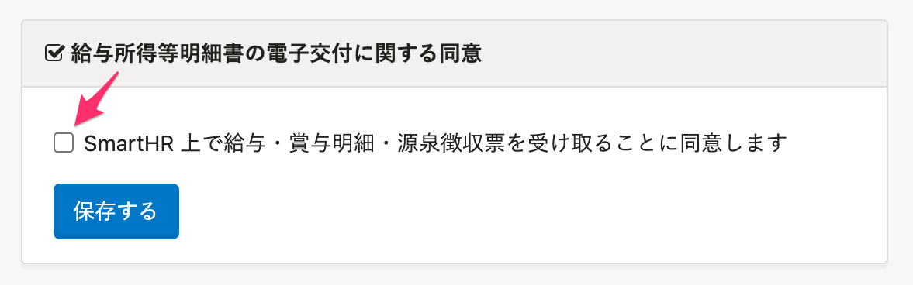
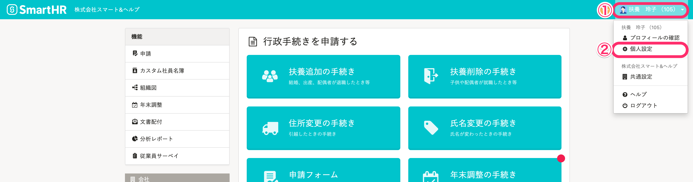
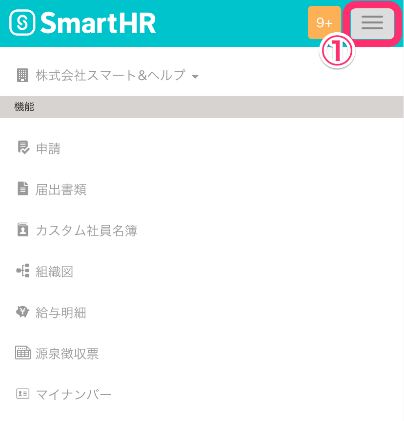
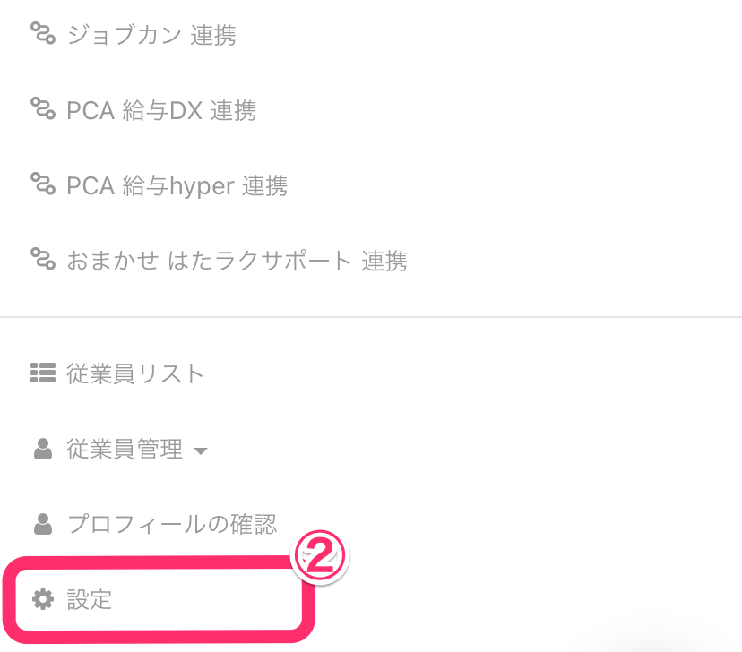
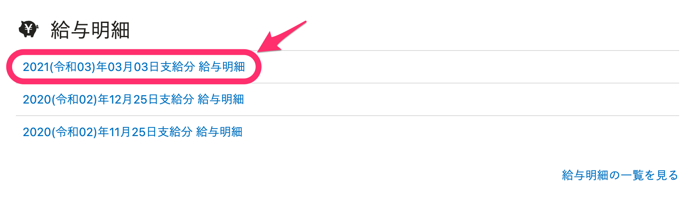
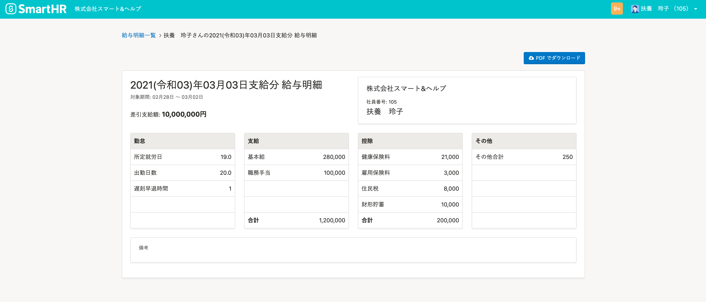
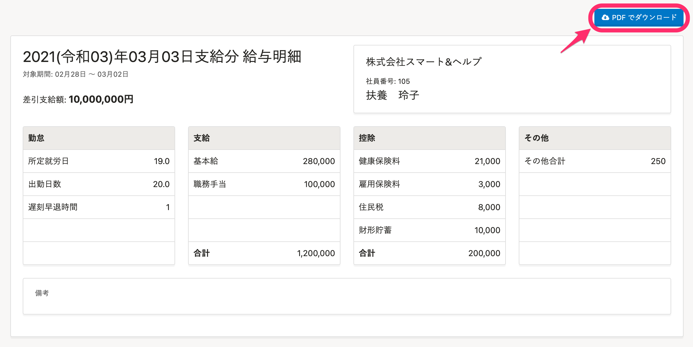

発行された給与明細を確認する方法を説明します。

# 給与明細を確認する際の注意点

従業員が給与明細をSmartHRで確認するには、**給与所得等明細書の電子交付に関する同意**がされている必要があります。

## パソコンで電子交付に同意する場合

パソコンで操作する場合、 **画面右上のアカウント名 >［個人設定］** から同意してください。

## スマートフォンで電子交付に同意する場合

スマートフォンの場合、 **画面右上のバー >［設定］** から同意してください。

# 給与明細の確認方法

## 1\. 給与明細の通知メールに記載のURLをクリック

給与明細の通知メールに記載されたURLをクリックし、SmartHRにログインします。

## 2\. リストから任意の明細をクリック

トップ画面下部の **［給与明細］** より、任意の明細をクリックすると、給与明細画面が表示されます。

:::tips
給与明細画面右上の **［PDFでダウンロード］** をクリックすると、PDF版をダウンロードすることもできます。

ただし、PDF版では75文字×6行以上の備考欄は省略して表示されます。
備考欄の長いメッセージを全文確認したい場合は、SmartHRの給与明細画面でご確認ください。
:::
:::related
[Q. どのくらい過去の給与明細まで閲覧できますか？](https://knowledge.smarthr.jp/hc/ja/articles/4407883948825)
:::
