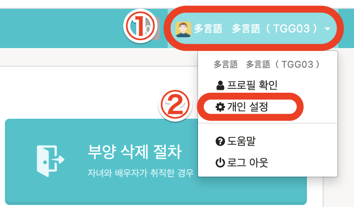

발행된 급여명세를 확인하는 방법을 설명합니다.

# 급여명세를 확인할때의 주의점

직원이 급여명세를 SmartHR에서 확인하기 위해서는 **급여소득 등 명세서의 전자 교부에 관한 동의**가 필요합니다.

## 1\. 컴퓨터에서 전자교부에 동의하기

컴퓨터로 조작하는 경우, **화면오른쪽 윗부분의 어카운트명 > \[개인설정\]** 에서 동의 해 주세요.

## 2\. 스마트폰에서 전자교부에 동의하기

스마트폰의 경우, **화면오른쪽 윗부분의 바 > \[설정\]** 에서 동의해주세요.

# 급여명세의 확인방법

## 1\. 급여명세의 통지메일에 기재되어 있는 URL을 클릭

급여명세의 통지메일에 기재되어 있는 URL을 클릭하여 SmartHR에 로그인 합니다.

## 2\. 리스트에서 임의의 명세를 클릭

톱페이지 아래부분의「급여명세서 목록」에서 임의의 명세를 클릭하면, 급여명세화면이 표시됩니다.

:::tips
급여명세서 화면 오른쪽 윗부분의 **\[PDF 다운로드\]** 를 클릭하면 PDF 파일로 다운로드 할수 있습니다.

단, PDF파일에서는 75문자×6행이상의 비고 란은 생략되어 표시됩니다.
비고 란의 긴 메세지를 전부 확인하고 싶은 경우에는 SmartHR의 급여명세화면에서 확인해 주세요.
:::
