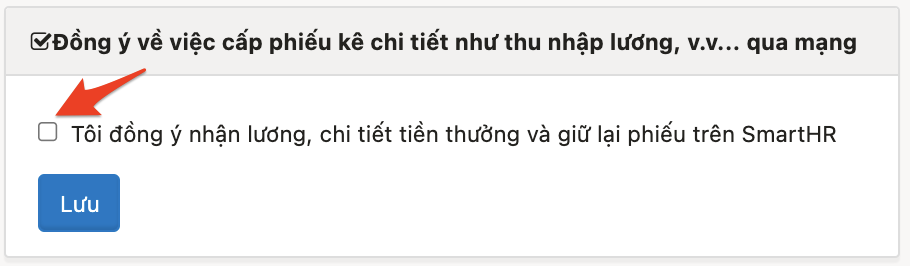
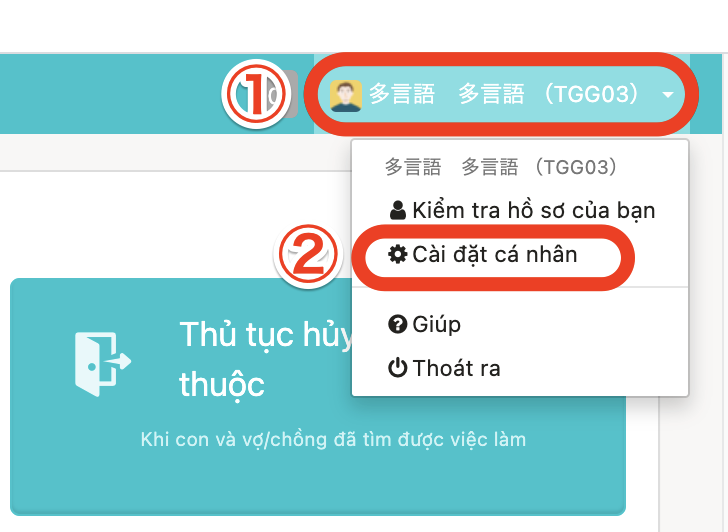
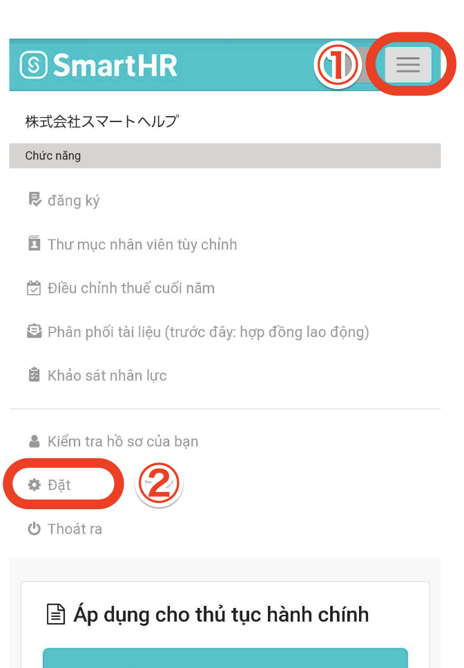
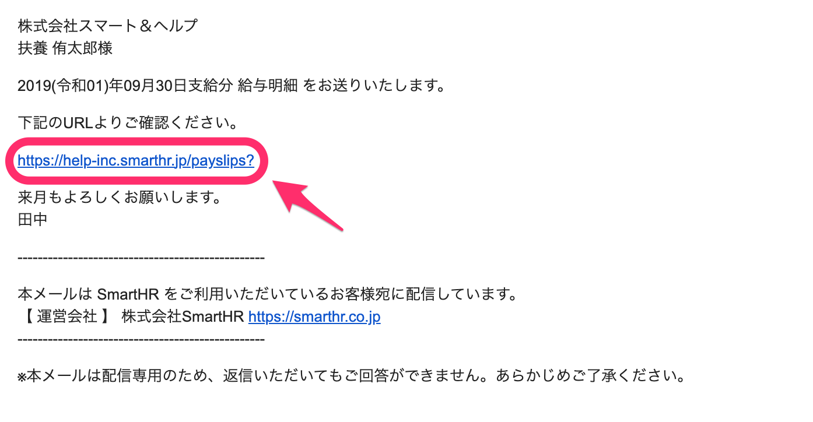
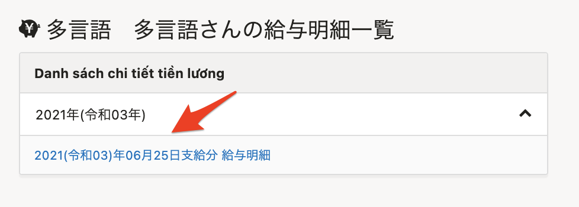
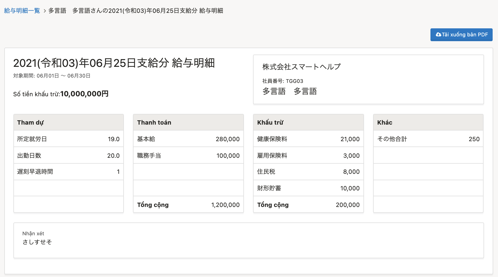
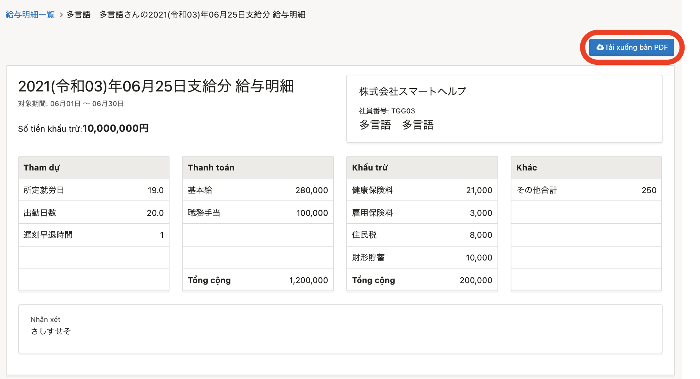

Tài liệu này hướng dẫn cách xem bảng lương chi tiết được phát hành.

# Lưu ý khi xem bảng lương chi tiết

Người lao động cần phải đồng ý về việc phát hành điện tử với các tài liệu như Bảng lương và thu nhập,v.v. để có thể xem bảng lương chi tiết trên SmartHR.

## 1\. Đồng ý phát hành tài liệu điện tử qua máy tính

Nếu bạn thao tác trên máy tính, hãy thiết lập đồng ý trong **Tên tài khoản ở phía trên bên phải màn hình > \[Cài đặt cá nhân\].**

## 2\. Đồng ý phát hành tài liệu điện tử qua điện thoại thông minh

Nếu bạn thao tác trên điện thoại thông minh, vui lòng thiết lập đồng ý trong **Thanh menu phía trên bên phải màn hình > \[Cài đặt\]**

# Cách xem bảng lương chi tiết

## 1\. Nhấn vào đường dẫn trong e-mail thông báo bảng lương chi tiết

Nhấn vào đường dẫn được ghi trong e-mail thông báo bảng lương chi tiết, và đăng nhập vào SmartHR.

## 2\. Nhấn vào chi tiết mà bạn muốn xem trong danh sách

Khi nhấn vào chi tiết mà bạn muốn xem trong “Bảng lương chi tiết” ở phía dưới màn hình đầu trang chủ, màn hình bảng lương chi tiết sẽ được hiển thị.

:::tips
Bạn có thể tải xuống bản PDF bằng cách nhấn vào \[Tải xuống bản PDF\] ở phía trên bên phải của màn hình Bảng lương chi tiết.

Tuy nhiên, trong bản PDF nội dung cột ghi chú có từ 6 dòng trở lên, mỗi dòng 75 ký tự sẽ được hiển thị tóm lược.
Trường hợp bạn muốn xem toàn bộ nội dung đầy đủ trong cột ghi chú, vui lòng kiểm tra ở màn hình Bảng lương chi tiết trên SmartHR.
:::
