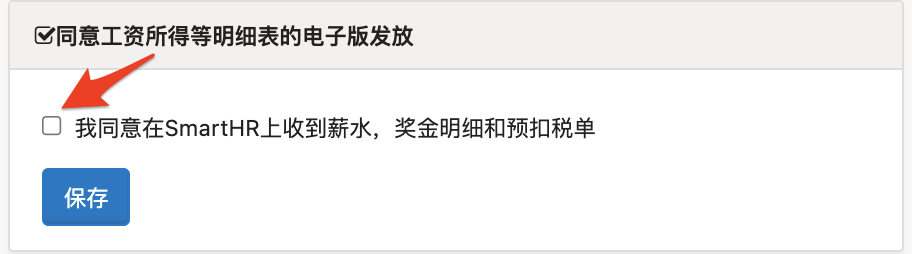
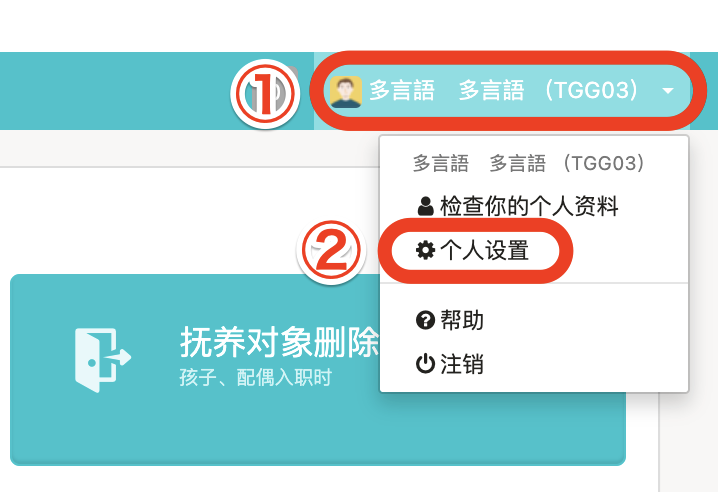
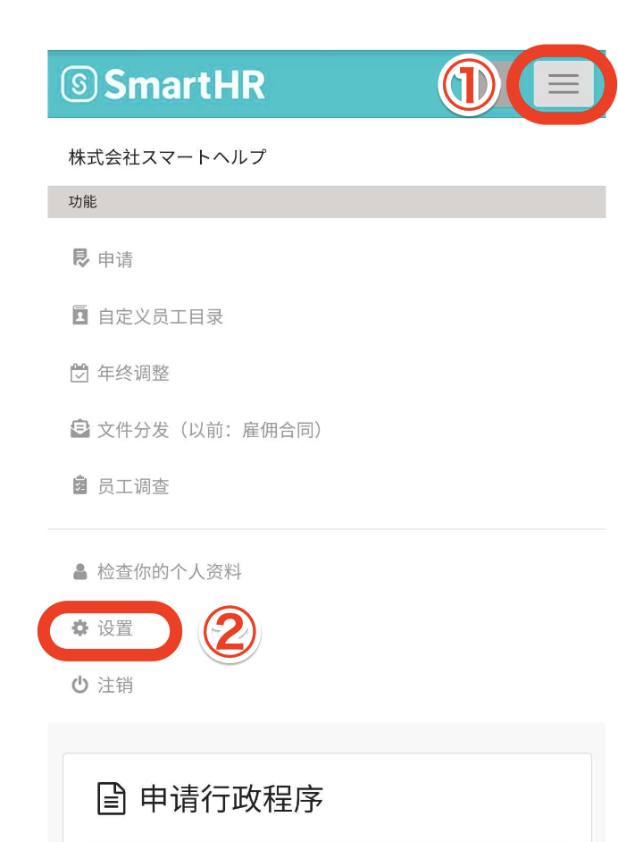
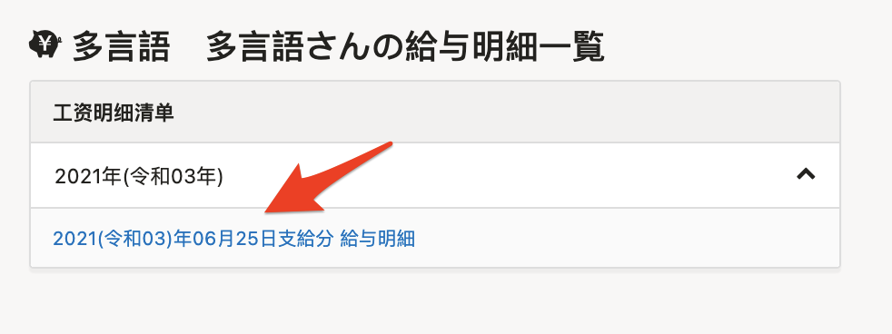
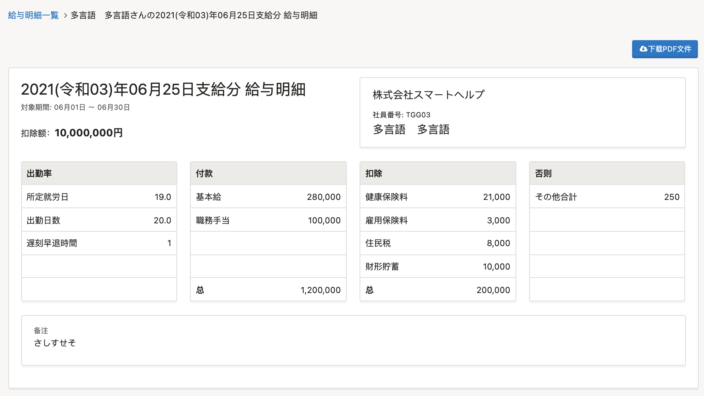
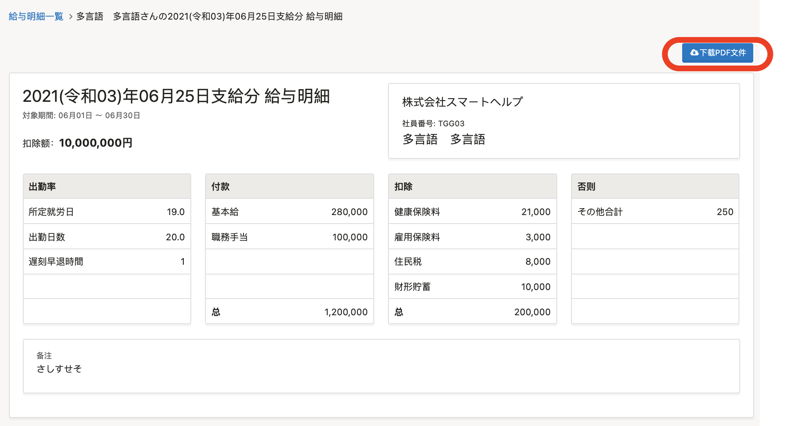

本文将说明查看已发行的工资明细的方法

# 查看工资明细时的注意点

员工想要在SmartHR上查看工资明细时，必须勾选**同意工资所得等明细表的电子**版发行。

## 1\. 在电脑上同意电子版发行

在电脑上操作时，请通过**画面右上方的账户名** **> \[****个人设置****\]** 同意。

## 2\. 在智能手机上同意电子版发行

在智能手机上操作时，请通过**画面右上方的按钮** **> \[****设置****\]** 同意。

# 工资明细的查看方法

## 1\. 点击工资明细通知邮件内的URL

点击工资明细通知邮件内的URL，登录到SmartHR。

## 2\. 在列表中点击任意明细

在首页画面下方的“工资明细”点击任意明细后，显示工资明细画面。

:::tips
点击工资明细画面右上方的 **\[****下载****PDF****文件****\]** 后，也可下载PDF版本。

不过，在显示 PDF 版本时会省略75字符×6行以上的备注栏内容。
如果想要查看备注栏的全部信息，请在SmartHR的工资明细画面中查看
:::
