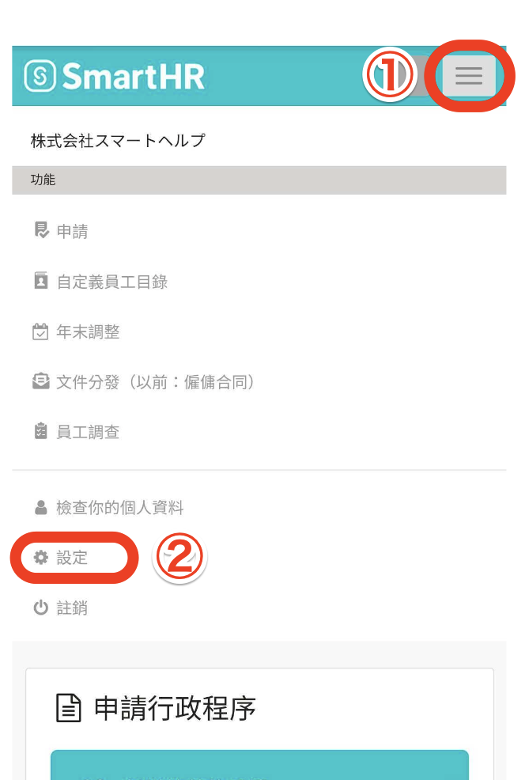
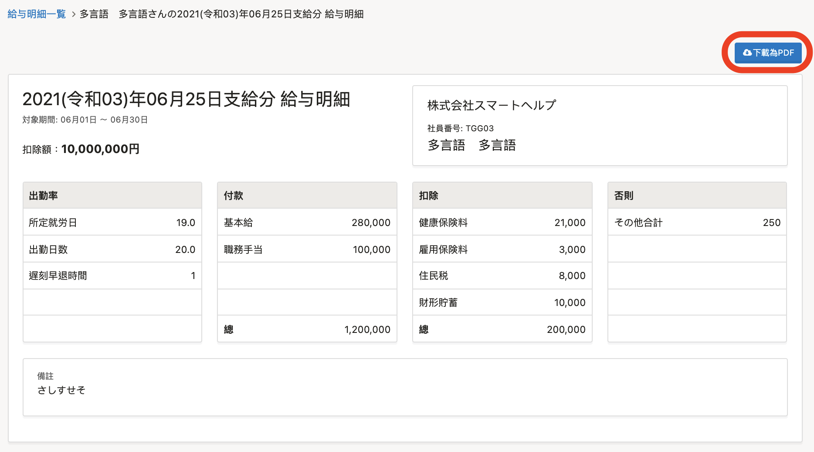

以下說明為已發行薪資明細的確認方法。

# 確認薪資明細時的注意事項

員工如欲於SmartHR確認薪資明細，必須事先交付薪資所得等明細書電子檔相關同意。

## 1\. 透過電腦同意電子提交

若透過電腦操作，請由**畫面右上方的帳號名稱 > \[****個人設定\]** 同意。

## 2\. 透過智慧型手機同意電子提交

若是智慧型手機，請由**畫面右上方的橫線圖示** **\> \[****設定\]**同意。

# 薪資明細確認方法

## 1\. 點選薪資明細通知電子郵件中的網址

點選薪資明細通知電子郵件中的網址，登入SmartHR。

## 2\. 從清單點選任一明細

從首頁畫面下方的「薪資明細」點選任一明細，即會顯示薪資明細畫面。

:::tips
點選薪資明細畫面右上方的 **\[****下載為PDF\]****，**即可下載 PDF版。

PDF版在顯示時將省略75字×6行以上的備註欄，敬請留意。
若要確認備註欄的完整訊息，請於SmartHR的薪資明細畫面確認。
:::
