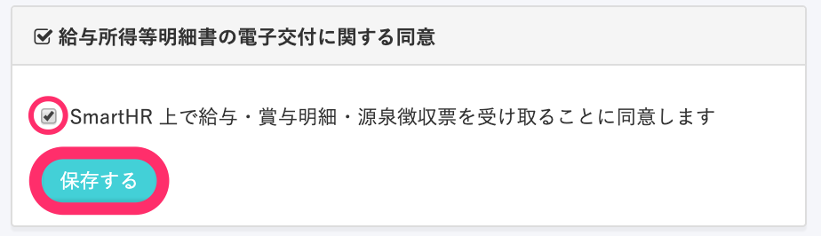
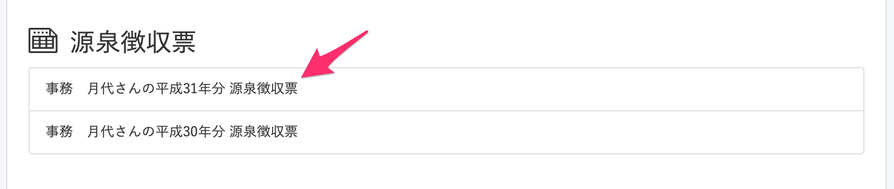
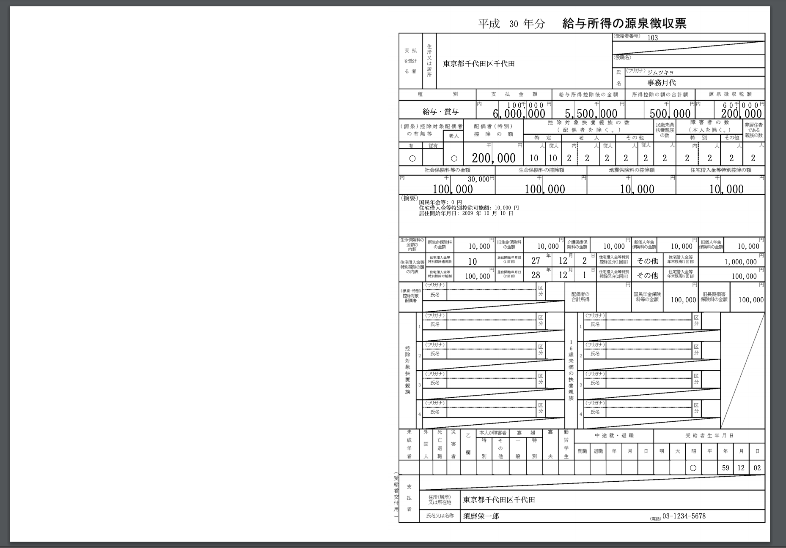

SmartHRで発行された源泉徴収票は、パソコンやスマートフォンで確認できます。

:::tips
従業員が源泉徴収票をSmartHRで確認するには、 **\[給与所得等明細書の電子交付に関する同意\]** がされている必要があります。
1.  画面右上の **\[アカウント名\]** をクリックして、 **\[個人設定\]** に移動します。
2.  **\[給与所得等明細書の電子交付に関する同意\]** 項目のチェックボックスにチェックを入れて、**\[保存する\]** をクリックして同意してください。

:::

# 1\. SmartHRにログイン

源泉徴収票の通知メールに記載されたURLをクリックし、SmartHRにログインします。

# 2\. トップ画面下部に表示される源泉徴収票をクリック

トップ画面下部の **\[源泉徴収票\]** 欄にある任意の明細をクリックします。

ブラウザ上でPDFが表示され、源泉徴収票が確認できます。

:::tips
企業の情報と紐づいたSmartHRのアカウントがあれば、退職後も給与明細や源泉徴収票を確認できます。
詳しくは貴社のSmartHR管理者の方にご確認ください。
:::
