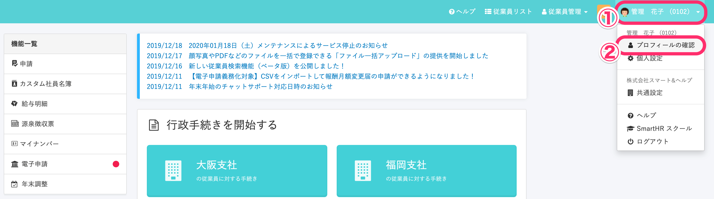
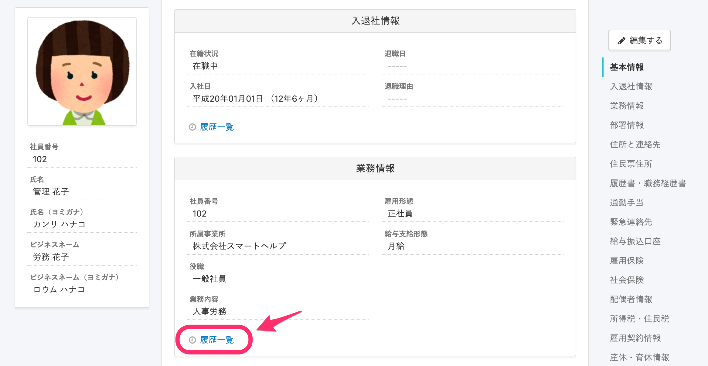
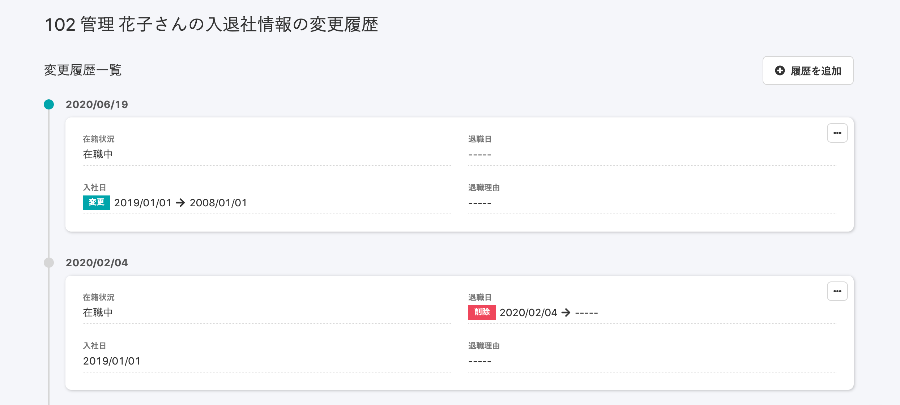

従業員が SmartHR に登録されている自身の従業員情報の変更履歴を閲覧する方法を記載します。

# 1\. 画面右上のアカウント名 > \[プロフィールの確認\]をクリック

画面右上のアカウント名（スマートフォンから閲覧の場合は三本線）をクリックすると、メニューが表示されます。

**\[プロフィールの確認\]** をクリックすると、自分の従業員情報が表示されます。

# 2\. \[履歴一覧\]をクリック

履歴を閲覧したい項目の **\[履歴一覧\]** をクリックすると、選択した項目の変更履歴がタイムライン形式で閲覧できます。

# \[適用日\] と \[登録日\] の違い

## 「適用日」とは？

従業員情報を登録する際に指定できるデータの有効開始日です。

指定しなかった場合は登録日と同日になります。

## 「登録日」とは？

従業員情報を登録した日です。

例：4月1日に3月1日時点の情報を登録した場合、4月1日が登録日、3月1日が適用日になります。
