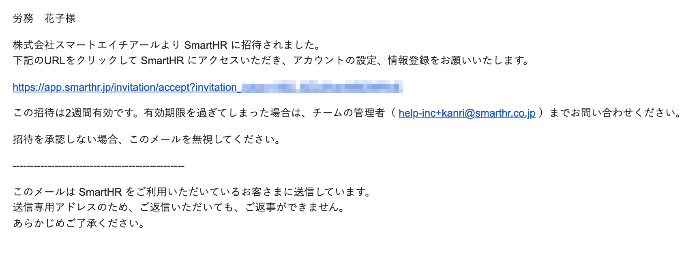
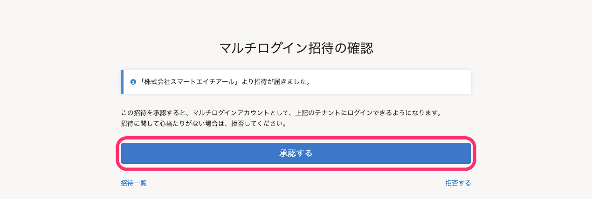
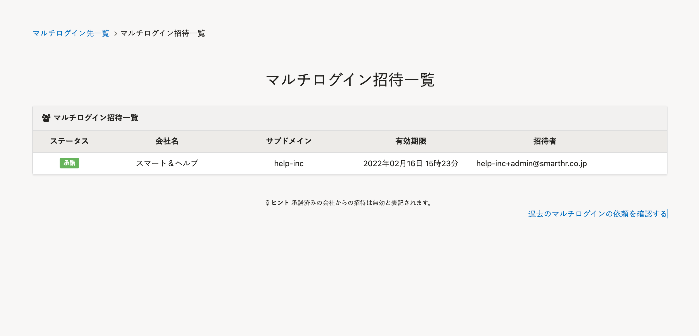
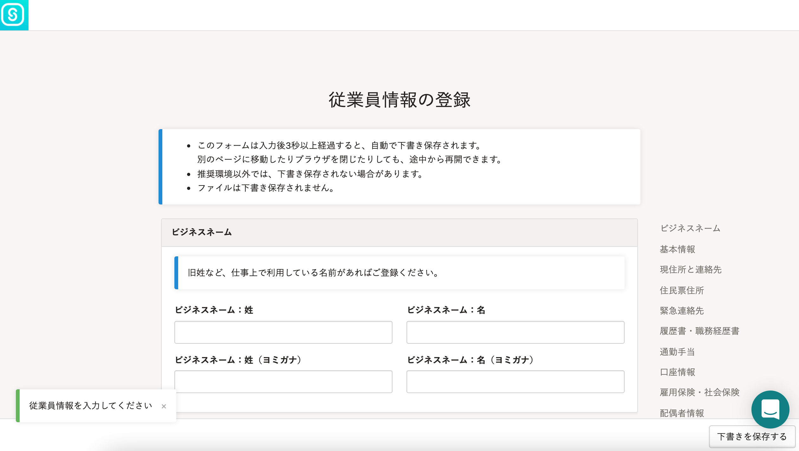

# A. マルチログインの招待を承認し、再度招待メールから手続きを行なってください

SAML SSOを設定した企業アカウントから[マルチログインアカウント](https://knowledge.smarthr.jp/hc/ja/articles/360026262853)の招待メールを受け取った場合は、以下の手順で対応してください。

## 1\. SmartHRにログインした状態で、招待メールに記載されたURLをクリック

既存の企業アカウントでSmartHRにログインした状態で、マルチアカウントの招待メールに添付されているURLをクリックすると、 **［マルチログイン招待の確認］** 画面が表示されます。

## 2.［承認する］をクリック

 **［マルチログイン招待の確認］** 画面の **［承認する］** をクリックします。

 **［マルチログイン招待一覧］** 画面の招待一覧に追加され、マルチログインアカウントとしてログインできるようになります。

**マルチログイン招待一覧**

## 3\. 再度招待メールを開き、メールに記載されたURLをクリック

再度招待メールを開き、メールに記載されたURLをクリックすると、 **［従業員情報の登録］** 画面が表示されます。

## 4\. ［従業員情報の登録］を入力

入力フォームに必要事項を入力し、ページ最下部にある **［登録する］** をクリックして手続きを完了してください。

