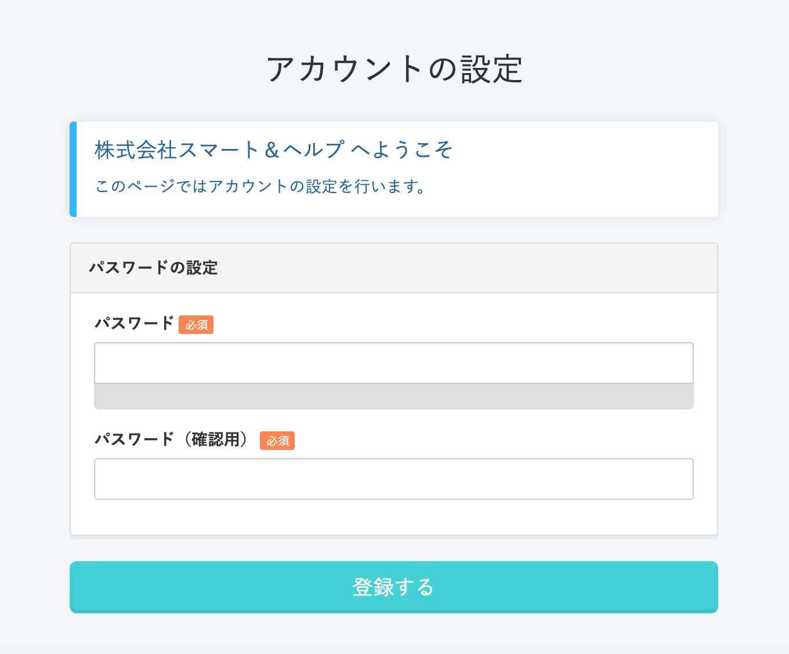
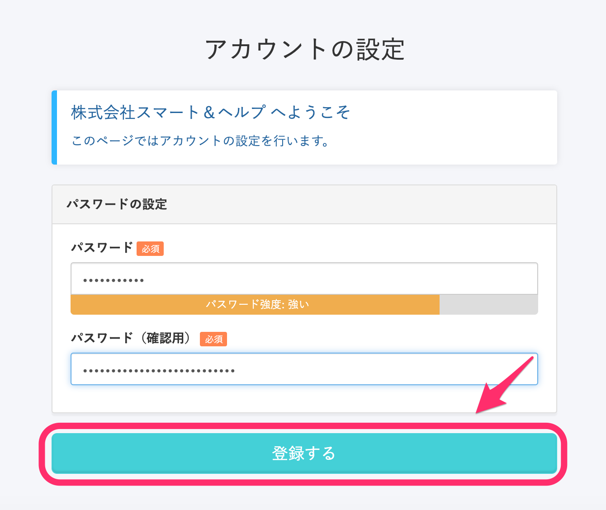
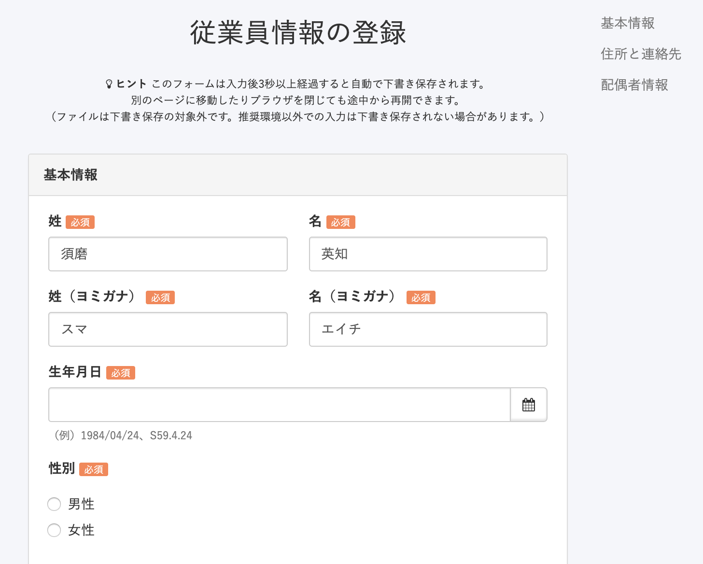
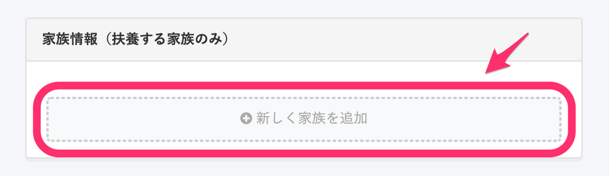

SmartHRを利用開始するときは、まずSmartHRから招待メールが届きます。ここではメールを受信した後の手順を説明します。

# SmartHRにアクセスし、情報を登録する

## 1.招待メールに書かれたURLをクリックする

SmartHRから届いた招待メールに記載のURLをクリックして、SmartHRにアクセスします。

**招待メール例**

| **件名** | 招待のご案内 \|\[会社名\] |
| --- | --- |
| **本文** |   \[会社名\]より SmartHR に招待されました。 下記のURLをクリックして SmartHR にアクセスいただき、アカウントの設定、情報登録をお願いいたします。  https://app.smarthr.jp/invitation/accept?invitation\_token=xxxxxxxxxxxxxxxxx  この招待は2週間有効です。有効期限を過ぎてしまった場合は、チームの管理者（ xxxxxxxx@xxxxxx.com ）までお問い合わせください。  招待を承認しない場合、このメールを無視してください。  \-------------------------------------------------  このメールは SmartHR をご利用いただいているお客さまに送信しています。 送信専用アドレスのため、ご返信いただいても、ご返事ができません。 あらかじめご了承ください。   |

:::alert
### URLは共有できません
メールに記載されているのは、招待時にSmartHRにログインするために作成された固有のURLなので、他の従業員とは共有できません。
万一、メールを紛失してURLがわからなくなってしまった場合には、管理者にメールの再送を依頼してください。
:::
:::alert
スマートフォンでSmartHRを表示する際は、iPhone標準のメールアプリやGmailアプリ、Yahoo!メールアプリなどの**アプリ内のWebブラウザではなく、ChromeやSafariなどのブラウザで直接**開くようにしてください。
アプリ内のWebブラウザでの表示は動作環境外となり、正しく動作しない可能性があります。
:::

URLをクリックすると、SmartHRの **\[アカウントの設定\]** ページに移ります。

## 2.アカウントのパスワードを設定し、［登録する］をクリックする

SmartHRにログインするときに入力するパスワードを設定し、 **［登録する］** をクリックします。

パスワードは8文字以上（72文字以下）で、「¥」と「\\」以外の英数・記号で設定してください。

従業員情報の登録が必要ない場合は、そのままSmartHRのホームに移ります。

従業員情報の登録が必要な場合は、手順3の従業員情報の登録ページに移ります。

## 3.フォームに入力し、［登録する］をクリックする

入力フォームに必要事項を入力し、ページ最下部にある **［登録する］** をクリックして手続きを完了してください。

アップロードできるファイル形式と、1ファイルあたりのサイズ上限は下記のページを参照してください。

[【一覧】アップロードできるファイル形式とサイズ](https://knowledge.smarthr.jp/hc/ja/articles/360026106354)

以降はSmartHR管理者が手続きを進めます。
入社の手続きを兼ねている場合、健康保険証、雇用保険 被保険者証は後日配布されますのでお待ちください。

# 扶養者がいる場合

 **家族情報（扶養する家族のみ）**  の項目に表示されている **［+新しく家族を追加］** をクリックし、フォームに扶養者の情報を入力してください。

扶養者が2名以上の場合は、扶養者として追加したい人数分だけ **［+新しく家族を追加］** をクリックすると、フォームを追加できます。

:::tips
**控除対象でない扶養する家族**も追加してください。
[Q.「控除対象でない16歳未満の扶養家族」も、扶養家族として登録すべきですか？](https://knowledge.smarthr.jp/hc/ja/articles/4412123017369)
:::
