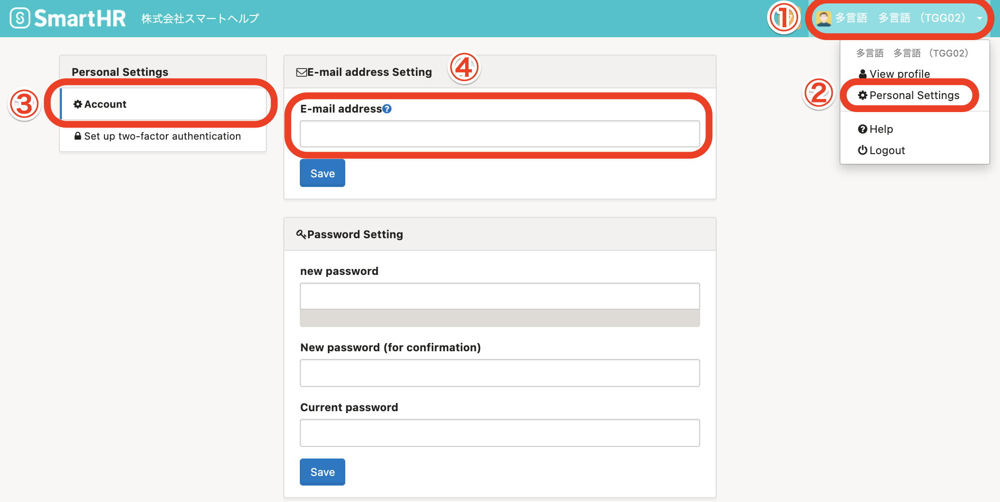

Setting your email address will let you receive a variety of notifications.

- Reissuing your forgotten login password
- Contacting you when payslips and withholding records have been issued
- Requesting you to register your Individual Number
- Year-end adjustment requests, etc.

# 1\. At the top right of the screen, click the account name > \[Personal Settings\] > \[Account\]

Clicking on the **account name at the top right corner of the screen to** display the **\[Personal Settings\]** menu bar on the left side of the screen.

Click **\[Account\]** under the **\[Personal Settings\]** menu and then enter your email address to use for logging in and receiving notifications in the **\[E-mail address\]** field.

When you have finished entering the email address, click the **\[Save\]** button below the **\[E-mail address\]** field.

# 2\. Click the link in the authentication email

After clicking **\[Save\]**, you will receive an authentication email.

Please click the "Authenticate email address（メールアドレスを認証する）" link listed in the authentication email to complete the email address setting (or change).

| 件名 | メールアドレスの認証｜**\[会社名\]** |
| --- | --- |
| 本文 |   SmartHRにご登録いただいたメールアドレスを確認します。  以下のリンクをクリックして、 メールアドレスの認証を完了させてください。 メールアドレスを認証する メールアドレスの認証には事前にログインが必要です。 メールアドレス変更の場合は変更前のメールアドレスでログインして認証をお願いします。  ※確認用リンクは 72 時間有効です。 有効期間が過ぎた場合にはお手数ですが以下より再度確認用メールの再送信を行ってください。 確認用メールを再送信する  \------------------------------ \-------------------  本メールは SmartHR をご利用いただいているお客様宛に配信しています。 【 運営会社 】 株式会社SmartHR https://smarth.co.jp \------------------------------ \-------------------  ※本メールは配信専用のため、 返信いただいてもご回答ができません。 あらかじめご了承ください。   |

If you do not click the link listed in the authentication email, the email address will not be set (or changed).

Please be sure to check the email that was sent to you and open the link.

Changing the email address used for logging in to SmartHR will not change the email address listed under the employee information.

Similarly, changing the email address listed under the employee information will not change the email address used for logging in to SmartHR.

To change the email address listed under the employee information, please edit the email address on the Employee Information page.
