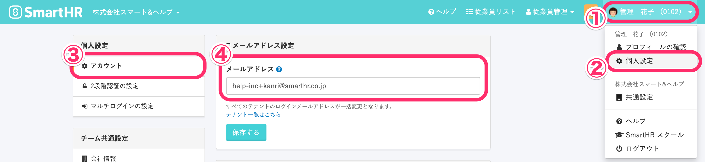

メールアドレスを設定すると、各種通知を受信できます。

- ログインパスワードを失念した際の再発行
- 給与明細、源泉徴収票の発行連絡
- マイナンバーの登録依頼
- 年末調整の依頼　など

# 1\. 画面右上のアカウント名 >［個人設定］>［アカウント］をクリック

 **画面右上のアカウント名 >［個人設定］** をクリックすると、画面左に **［個人設定］** メニューが表示されます。

****

 **［個人設定］** のメニューで **［アカウント］** をクリックして、 **［メールアドレス］** の欄にログイン・通知用メールアドレスを入力してください。

メールアドレスの入力が終わったら、 **［メールアドレス］** 欄の下にある **［保存する］** をクリックします。

# 2\. 認証メールのリンクをクリックする

 **［保存する］** をクリックすると、認証メールが送信されます。

メールに記載されている「メールアドレスを認証する」と書かれたリンクをクリックし、設定（変更）を完了してください。

| 件名 | メールアドレスの認証｜ **［会社名］**  |
| --- | --- |
| 本文 |   SmartHRにご登録いただいたメールアドレスを確認します。  以下のリンクをクリックして、 メールアドレスの認証を完了させてください。 メールアドレスを認証する メールアドレスの認証には事前にログインが必要です。 メールアドレス変更の場合は変更前のメールアドレスでログインして認証をお願いします。  ※確認用リンクは 72 時間有効です。 有効期間が過ぎた場合にはお手数ですが以下より再度確認用メールの再送信を行ってください。 確認用メールを再送信する  \------------------------------ \-------------------  本メールは SmartHR をご利用いただいているお客様宛に配信しています。 【 運営会社 】 株式会社SmartHR https://smarthr.co.jp \------------------------------ \-------------------  ※本メールは配信専用のため、 返信いただいてもご回答ができません。 あらかじめご了承ください。   |

認証メールに記載されているリンクをクリックしないと、メールアドレスの設定（変更）が完了しません。

必ず送られてきたメールを確認し、リンクをクリックしてください。

:::tips
SmartHRにログインする際のメールアドレスを変更しても、従業員情報のメールアドレスは変更されません。
同様に、従業員情報のメールアドレスを変更しても、SmartHRにログインする際のメールアドレスは変更されません。
従業員情報のメールアドレスを変更する場合は、従業員情報のページから編集してください。
:::
