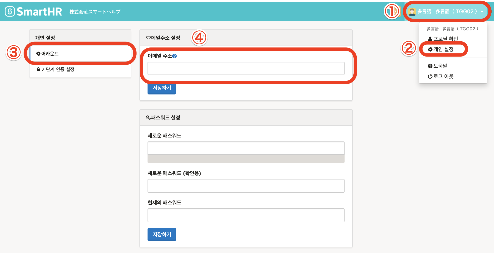

메일주소를 설정하면 각종 통지를 수신할수 있습니다.

- 로그인 패스워드를 잊어버렸을 경우의 재발행
- 급여명세, 원천징수표의 발행연락
- 마이넘버의 등록의뢰
- 연말정산의 의뢰 등

# 1\. 화면 오른쪽 위의 어카운트명 > \[개인설정\] > \[어카운트\] 를 클릭

**화면 오른쪽 위의 어카운트명 > \[개인설정\]** 을 클릭하면 화면왼쪽에 **\[개인설정\]** 메뉴가 표시됩니다.

**\[개인설정\]** 의 메뉴에서 **\[어카운트\]** 를 클릭하여 **\[이메일 주소\]** 의 란에 로그인・통지용 이메일주소를 입력해주세요.

이메일 주소의 입력 후 **\[이메일 주소\]** 란의 밑에 있는 **\[저장하기\]** 를 클릭해주세요.

# 2\. 인증메일의 링크를 클릭하기

**\[저장하기\]** 를 클릭하면 인증메일이 송신됩니다.

메일에 기재되어있는「이메일 주소를 인증하기(メールアドレスを認証する)」라고 기재되어있는 링크를 클릭하여 설정(변경)을 완료해주세요.

| 件名 | メールアドレスの認証｜**\[会社名\]** |
| --- | --- |
| 本文 |   SmartHRにご登録いただいたメールアドレスを確認します。  以下のリンクをクリックして、 メールアドレスの認証を完了させてください。 メールアドレスを認証する メールアドレスの認証には事前にログインが必要です。 メールアドレス変更の場合は変更前のメールアドレスでログインして認証をお願いします。  ※確認用リンクは 72 時間有効です。 有効期間が過ぎた場合にはお手数ですが以下より再度確認用メールの再送信を行ってください。 確認用メールを再送信する  \------------------------------ \-------------------  本メールは SmartHR をご利用いただいているお客様宛に配信しています。 【 運営会社 】 株式会社SmartHR https://smarth.co.jp \------------------------------ \-------------------  ※本メールは配信専用のため、 返信いただいてもご回答ができません。 あらかじめご了承ください。   |

인증메일에 기재되어있는 링크를 클릭하지 않을경우, 이메일 주소의 설정(변경)이 완료되지 않습니다.

반드시 송신된 메일을 확인하여 링크를 클릭해주세요.

:::tips
SmartHR에 로그인 할 경우의 이메일 주소를 변경하여도 직원정보의 이메일 주소는 변경되지 않습니다.
또한 직원정보의 이메일 주소를 변경할 경우에도 SmartHR에 로그인 할때 사용하는 이메일 주소는 변경되지 않습니다.
직원정보의 이메일 주소를 변경할 경우에는 **\[프로필 확인\]**의 직원정보 페이지에서 편집해주세요.
:::
